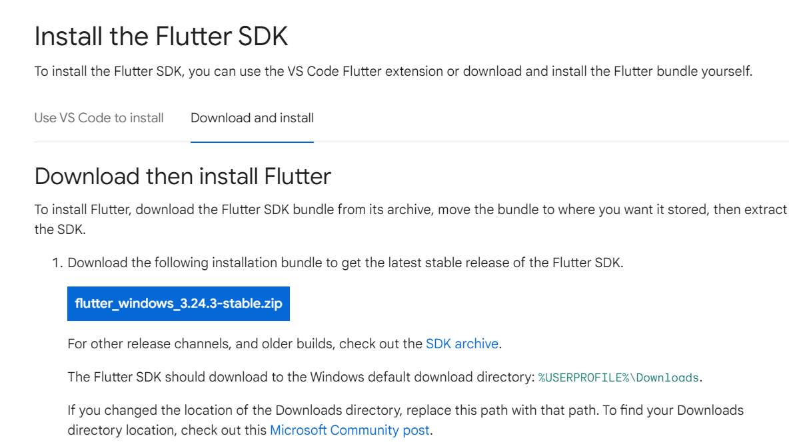
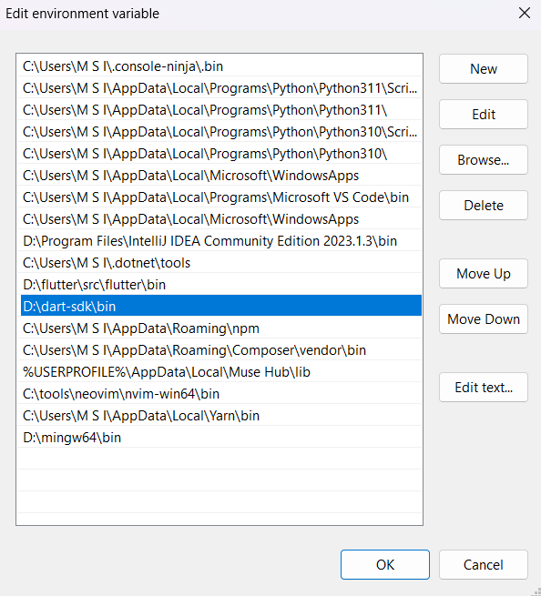

html
<div>
  <h3 align="center">
  Laporan Hasil Belajar <br>
  Mobile & Web Service
  </h3>

  <br>
  <br>
  <br>

  <p align="center">
    
  </p>

   <br>
  <br>
  <br>

  <p align="center">
    Disusun oleh: <br>
    TITO ZAKI SAPUTRO
  </p>

   <br>
  <br>
  <br>

  <h3 align="center">
  Program Studi Informatika <br>
  Fakultas Sains Dan Teknologi <br>
  Universitas Teknologi Yogyakarta <br>
  2024
  </h3>
</div>


# 📝 Laporan Minggu Pertama - Minggu Keenam Mobile & Web Service Praktik Kelas IX

**Nama**: Tito Zaki Saputro  
**NPM**: 5220411045

---

# DAFTAR ISI 

- [📝 Laporan Minggu Pertama - Minggu Keenam Mobile \& Web Service Praktik Kelas IX](#-laporan-minggu-pertama---minggu-keenam-mobile--web-service-praktik-kelas-ix)
- [DAFTAR ISI](#daftar-isi)
- [MINGGU 1](#minggu-1)
  - [🌐 Review Bahasa Pemrograman](#-review-bahasa-pemrograman)
    - [Review](#review)
      - [Aplikasi Mobile](#aplikasi-mobile)
      - [Aplikasi Website](#aplikasi-website)
      - [Web Server](#web-server)
    - [Bahasa Pemrograman yang Saya Pelajari](#bahasa-pemrograman-yang-saya-pelajari)
      - [1.1. **Python**](#11-python)
      - [1.2. **JavaScript**](#12-javascript)
      - [1.3. **PHP**](#13-php)
      - [1.4. **Dart**](#14-dart)
  - [3. 🚀 Menginstal Flutter di Laptop Saya](#3--menginstal-flutter-di-laptop-saya)
    - [3.1. **Informasi Sistem**](#31-informasi-sistem)
    - [3.2. **Proses Instalasi**](#32-proses-instalasi)
      - [Langkah 1: Mengunduh Flutter SDK](#langkah-1-mengunduh-flutter-sdk)
      - [Langkah 2: Menyetel Variabel Lingkungan](#langkah-2-menyetel-variabel-lingkungan)
      - [Langkah 3: Memverifikasi Instalasi](#langkah-3-memverifikasi-instalasi)
      - [Langkah 4: Menginstal Android Studio](#langkah-4-menginstal-android-studio)
  - [4. Membuat Hello World dan Penjelasanya](#4-membuat-hello-world-dan-penjelasanya)
- [MINGGU 2](#minggu-2)
  - [Pendahuluan 2](#pendahuluan-2)
  - [🤔 Apa itu WIDGET ?](#-apa-itu-widget-)
  - [Stateless Widget dan Stateful Widget](#stateless-widget-dan-stateful-widget)
    - [Stateless Widget 🗿](#stateless-widget-)
    - [Stateful Widget 🧩](#stateful-widget-)
    - [MaterialApp Widget 🌐](#materialapp-widget-)
    - [Scaffold Widget 🏗️](#scaffold-widget-️)
    - [AppBar 📜](#appbar-)
    - [Row \& Column 📐](#row--column-)
      - [Row](#row)
      - [Column](#column)
    - [ElevatedButton ⏫](#elevatedbutton-)
    - [Text](#text)
- [MINGGU 3](#minggu-3)
  - [Pendahuluan 3](#pendahuluan-3)
  - [Penjelasan Widget yang Digunakan](#penjelasan-widget-yang-digunakan)
    - [MaterialApp](#materialapp)
      - [Contoh Kode:](#contoh-kode)
    - [StatelessWidget](#statelesswidget)
      - [Contoh Kode:](#contoh-kode-1)
    - [StatefulWidget](#statefulwidget)
      - [Contoh Kode:](#contoh-kode-2)
    - [AppBar](#appbar)
      - [Contoh Kode:](#contoh-kode-3)
    - [Scaffold](#scaffold)
      - [Contoh Kode:](#contoh-kode-4)
    - [TextField](#textfield)
      - [Contoh Kode:](#contoh-kode-5)
    - [ListView dan GridView](#listview-dan-gridview)
      - [Contoh Kode:](#contoh-kode-6)
    - [Slidable](#slidable)
      - [Contoh Kode:](#contoh-kode-7)
    - [Checkbox](#checkbox)
      - [Contoh Kode:](#contoh-kode-8)
- [Dokumentasi Error](#dokumentasi-error)
    - [Error 1: Kesalahan pada Implementasi `TextField` Controller](#error-1-kesalahan-pada-implementasi-textfield-controller)
      - [Deskripsi Error:](#deskripsi-error)
      - [Kode saat Error:](#kode-saat-error)
      - [Solusi Perbaikan:](#solusi-perbaikan)
      - [Kode setelah Perbaikan:](#kode-setelah-perbaikan)
    - [Error 2: Kesalahan pada Implementasi `ListView.builder`](#error-2-kesalahan-pada-implementasi-listviewbuilder)
      - [Deskripsi Error:](#deskripsi-error-1)
      - [Kode saat Error:](#kode-saat-error-1)
      - [Solusi Perbaikan:](#solusi-perbaikan-1)
      - [Kode setelah Perbaikan:](#kode-setelah-perbaikan-1)
    - [Error 3: Kesalahan pada Fungsi `toggleViewMode`](#error-3-kesalahan-pada-fungsi-toggleviewmode)
      - [Deskripsi Error:](#deskripsi-error-2)
      - [Kode saat Error:](#kode-saat-error-2)
      - [Solusi Perbaikan:](#solusi-perbaikan-2)
      - [Kode setelah Perbaikan:](#kode-setelah-perbaikan-2)
- [Penutup](#penutup)
- [Referensi](#referensi)
- [MINGGU 4](#minggu-4)
- [Pendahuluan 4](#pendahuluan-4)
- [Penjelasan](#penjelasan)
  - [1. Struktur](#1-struktur)
  - [2. main function](#2-main-function)
    - [main](#main)
    - [Penjelasan](#penjelasan-1)
  - [3. models](#3-models)
    - [data](#data)
    - [Penjelasan](#penjelasan-2)
  - [4. Pages](#4-pages)
    - [home\_screen.dart](#home_screendart)
      - [controller](#controller)
      - [error dialog](#error-dialog)
      - [Widget Tree](#widget-tree)
    - [main\_screen.dart](#main_screendart)
      - [Widget Tree](#widget-tree-1)
        - [`Scaffold`](#scaffold-1)
        - [`AppBar`](#appbar-1)
        - [`SingleChildScrollView`](#singlechildscrollview)
        - [`Column`](#column-1)
        - [`SizedBox(height: 24)`](#sizedboxheight-24)
        - [`Padding`](#padding)
        - [`Row`](#row-1)
        - [`CircleAvatar`](#circleavatar)
        - [`SizedBox(width: 16)`](#sizedboxwidth-16)
        - [`Expanded`](#expanded)
        - [`Text`](#text-1)
        - [`Container`](#container)
        - [`ClipRRect`](#cliprrect)
        - [`ListView`](#listview)
        - [`ListTile`](#listtile)
        - [`SizedBox(height: 24)`](#sizedboxheight-24-1)
- [Referensi week 4](#referensi-week-4)
- [MINGGU 5](#minggu-5)
- [Pendahuluan 5](#pendahuluan-5)
- [1. Tugas Widget dibuat Menggunakan Figma](#1-tugas-widget-dibuat-menggunakan-figma)
- [2. Review Materi REST API](#2-review-materi-rest-api)
  - [Karakteristik REST API](#karakteristik-rest-api)
  - [Konsep Penting dalam REST API](#konsep-penting-dalam-rest-api)
  - [Struktur Permintaan dan Respons REST API](#struktur-permintaan-dan-respons-rest-api)
  - [Keamanan dalam REST API](#keamanan-dalam-rest-api)
  - [Praktik Terbaik dalam Penggunaan REST API](#praktik-terbaik-dalam-penggunaan-rest-api)
- [3. Membuat API CRUD](#3-membuat-api-crud)
  - [Inisialisasi](#inisialisasi)
  - [`.env`](#env)
  - [`config/db.js`](#configdbjs)
  - [`models/Product.js`](#modelsproductjs)
  - [`controllers/productController.js`](#controllersproductcontrollerjs)
  - [`routes/productRoutes.js`](#routesproductroutesjs)
  - [`server.js`](#serverjs)
- [4. Testing API CRUD](#4-testing-api-crud)
  - [`POST`](#post)
  - [`GET`](#get)
  - [`PUT`](#put)
  - [`DELETE`](#delete)
- [Referensi 5](#referensi-5)
- [MINGGU 6](#minggu-6)
  - [Dokumentasi Hasil Belajar Minggu ke-06](#dokumentasi-hasil-belajar-minggu-ke-06)
    - [1. Membuat Tutorial Konversi Desain Figma ke Flutter](#1-membuat-tutorial-konversi-desain-figma-ke-flutter)
      - [Design Figma](#design-figma)
      - [Konversi ke FLutter](#konversi-ke-flutter)
    - [2. Melanjutkan Pembuatan API untuk OTP (contoh: WhatsApp) dan Payment Gateway](#2-melanjutkan-pembuatan-api-untuk-otp-contoh-whatsapp-dan-payment-gateway)
      - [OTP](#otp)
      - [Payment Gateway](#payment-gateway)
    - [3. Mengintegrasikan Desain Figma (Flutter) dengan API](#3-mengintegrasikan-desain-figma-flutter-dengan-api)
  - [Kesimpulan](#kesimpulan)
  - [ERROR](#error)
  - [Referensi 6](#referensi-6)


---
# MINGGU 1

## 🌐 Review Bahasa Pemrograman
### Review
Terdapat banyak sekali bahasa pemrograman ataupun framework yang digunakan dalam keperluan untuk mendevelop sebuah mobile atau web service .
#### Aplikasi Mobile 
Aplikasi Mobile adalah aplikasi yang beroperasi di perangkat mobile, menampilkan antarmuka dan memungkinkan pengguna berinteraksi melalui Android atau iOS. Beberapa bahasa pemrograman yang sering digunakan antara lain:  
- **Java**  
- **Kotlin**  
- **Dart** (melalui **Flutter**)  
- **JavaScript** (melalui **React Native**)  
#### Aplikasi Website
Aplikasi web adalah aplikasi berbasis browser yang digunakan untuk menampilkan konten atau layanan kepada pengguna. JavaScript mendominasi teknologi ini karena dapat berjalan langsung di browser. Meskipun demikian, bahasa lain seperti PHP masih banyak digunakan. Beberapa teknologi populer adalah:  
- **PHP**  
- **Laravel**
- **CodeIgniter**
- **JavaScript**  
- **Svelte**  
- **Angular**  
- **React**  
- **NextJs**  
- **DLL**  
#### Web Server
Web server berfungsi untuk menangani permintaan dari client (mobile/web) dan mengelola data serta logika backend. Beberapa bahasa pemrograman dan framework yang sering digunakan antara lain:  
- **JavaScript/TypeScript**  
- **Node.js**  
- **Deno**  
- **Bun**  
- **Express.js**
- **Nest.js**)  
- **Go**  

### Bahasa Pemrograman yang Saya Pelajari
#### 1.1. **Python** 
<br>  
Python merupakan bahasa pemrograman pertama yang saya pelajari. Awalnya, saya ingin mempelajari **C++**, namun saya kesulitan memahami konsep-konsepnya. Akhirnya, saya beralih ke Python, yang dikenal lebih mudah dipahami oleh pemula.

Saya mulai belajar Python ketika masih duduk di bangku SMA. Meskipun saya tidak mendalaminya secara intensif, saya memahami dasar-dasar sintaks Python seperti variabel, kondisi, dan perulangan. Pengalaman ini menjadi fondasi yang kuat untuk belajar bahasa pemrograman lain di masa depan.

---

#### 1.2. **JavaScript**
<br>
JavaScript adalah bahasa pemrograman kedua yang saya pelajari, dan saya mulai menggunakannya saat kuliah. Saya menggunakan JavaScript terutama untuk menambah interaktivitas pada halaman web, dan sejak saat itu, JavaScript menjadi bagian dari perjalanan saya dalam pengembangan web.

Selain mempelajari JavaScript murni, saya juga mempelajari beberapa **library** dan **framework** populer yang terkait dengan JavaScript:
- ***React***: Library untuk membangun UI yang dinamis dan interaktif.
- ***Next.js***: Framework berbasis React untuk pengembangan aplikasi web yang lebih efisien dan ramah SEO.
- ***Node.js***: Runtime environment yang memungkinkan penggunaan JavaScript di server-side.

Belajar JavaScript dan framework terkait ini telah membuka banyak pintu bagi saya dalam pengembangan web modern.

---

#### 1.3. **PHP**
 <br>
Saya mulai mempelajari PHP pada semester 3, karena pada saat itu, saya mengikuti mata kuliah Pemrograman Web. PHP adalah bahasa pemrograman server-side yang sering digunakan untuk membangun website dinamis.

Meskipun saya tidak terlalu mendalami PHP, saya sempat mempelajari framework **Laravel** yang cukup populer dalam pengembangan aplikasi web dengan arsitektur MVC (Model-View-Controller). PHP menjadi pengalaman pertama saya dalam mengelola back-end dari sebuah aplikasi web.

---

#### 1.4. **Dart**
 <br>
Saya mulai mempelajari Dart setelah semester 4 berakhir, tepatnya saat liburan semester genap. Alasan utama saya mempelajari Dart adalah untuk persiapan mata kuliah semester 5 yang akan membahas pengembangan aplikasi mobile, mengingat saya mengambil penjurusan web dan mobile.

Dart adalah bahasa pemrograman yang digunakan bersama framework **Flutter** untuk membangun aplikasi mobile lintas platform. Saat ini, saya masih mempelajari dasar-dasar sintaks Dart seperti variabel, fungsi, dan kontrol alur, sebagai persiapan untuk mendalami Flutter lebih lanjut.

---
 
## 3. 🚀 Menginstal Flutter di Laptop Saya

### 3.1. **Informasi Sistem**

- **Sistem Operasi**: Windows 11
- **Model Laptop**: MSI GF63 thin

### 3.2. **Proses Instalasi**

#### Langkah 1: Mengunduh Flutter SDK
- Saya mengunjungi [Website Flutter](https://docs.flutter.dev/get-started/install) 
- Pilih sistem operasi yang digunakan, saya menggunakan Windows 11<br>

- Pilih Android karena kita akan menggunakan flutter dalam pengembangan aplikasi Android<br>

- Setelah itu download `flutter_windows_3.24.3-stable`<br>

- Buat folder untuk menyimpan flutter, misalnya di dalam `C:flutter/src/`
- Pindahkan file yang sudah di-download ke dalam 
- Ekstrak file yang sudah di-download, dalam hal ini `flutter_windows_3.24.3-stable`
- Setelah ekstrak maka direktorinya menjadi seperti ini `C:flutter/src/flutter`

#### Langkah 2: Menyetel Variabel Lingkungan
- Pada menu search di taskbar, cari edit environment<br>
<br>
- Lalu pilih Edit Environment Variable<br>
<br>
- Klik Path dan edit<br>

- Tambahkan `C:flutter\src\flutter\bin` ke variabel lingkungan `Path` <br>
<br>

#### Langkah 3: Memverifikasi Instalasi
- Jalankan perintah berikut di PowerShell untuk memverifikasi instalasi:

    ```bash
    flutter doctor
    ```

- Hasilnya akan keluar seperti ini :<br>
<br>
- Masih ada error dan peringatan untuk mengatasi hal tersebut kita perlu menginstal Android Studio dan hal pertama yang dapat kita lakukan adalah mengatasi 
>  Flutter (Channel stable, 3.24.3, on Microsoft Windows [Version 10.0.22631.4169], locale en-US)
    ! Warning: `dart` on your path resolves to D:\dart-sdk\bin\dart.exe, which is not inside your current Flutter SDK
      checkout at D:\flutter\src\flutter. Consider adding D:\flutter\src\flutter\bin to the front of your path.
- Untuk mengatasi hal tersebut kita perlu mengubah urutan dari environment flutter agar berada di atas dari path environment dart<br>
<br>
#### Langkah 4: Menginstal Android Studio
- Saya mengunduh dan menginstal [Android Studio](https://developer.android.com/studio) serta menginstal plugin Flutter dan Dart.<br>
<br>
- Android Studio setelah selesai menginstal<br>
<br>
- Saya juga mengonfigurasi Android SDK.
- Karena saya mengonfigurasi Android SDK di lokasi custom maka masih terjadi error <br>
<br>
- Hal tersebut terjadi karena command line tools tidak ada dalam folder. Untuk menginstalnya, berikut langkah-langkahnya:
- Buka Android Studio dan pilih seperti pada gambar.<br>
<br>
- Centang cmd tools latest untuk menginstalnya<br>
<br>
- Apply lalu buka terminal anda dan run `flutter doctor`
- Kalau masih kuning dan muncul 
> Android toolchain - develop for Android devices (Android SDK version 34.0.0)
    ! Some Android licenses not accepted. To resolve this, run: flutter doctor --android-licenses
- Jalankan `flutter doctor --android-licenses` dan terima semua syarat dengan klik y dan enter.
- Untuk mengatasi bagian 'visual studio install is incomplete', maka kita harus menyelesaikan penginstalan dalam visual studio installer.
- Setelah menyelesaikan instalasi, buka terminal dan jalankan `flutter doctor` dan pastikan sudah centang semua.<br>


## 4. Membuat Hello World dan Penjelasanya
Berikut adalah bagaimana cara membuat program sederhana "Hello World" di beberapa bahasa pemrograman terutama flutter.
  1. **Flutter**
  - Buka terminal di proyek flutter dan jalankan perintah berikut:

      ```bash
      flutter create hello_world
      cd hello_world
      ```
      
  - Buka file `lib/main.dart` dan ketik kode di bawah ini:
    ```dart
      import 'package:flutter/material.dart';

      void main() {
        runApp(const MyApp());
      }

      class MyApp extends StatelessWidget {
        const MyApp({super.key});

        @override
        Widget build(BuildContext context) {
          return const MaterialApp(
            home: Scaffold(
              body: Center(
                child: Text('Hello, World!'),
              ),
            ),
          );
        }
      }
      ```
      
  - Simpan perubahan dan jalankan aplikasi menggunakan command 
      ```bash
      flutter run
      ```
  
  

  2. **Python**   

      ```python
      print("hello dunia")
      ```
      **Penjelasan :**
    - Print() adalah fungsi bawaan Python yang digunakan untuk menampilkan teks atau hasil ke terminal.
   - Teks yang ingin ditampilkan harus berada di dalam tanda kutip, seperti "hello dunia"

  3. **JavaScript**
      ```javascript
      console.log("hello gais");
      ```
      **Penjelasan :**
  -  Di JavaScript, untuk menampilkan output ke konsol, kita menggunakan fungsi console.log().
  -  Seperti pada Python, teks harus berada di dalam tanda kutip. console.log() akan mencetak teks "hello gais" ke konsol browser atau Node.js.
  4. **PHP**
      ```PHP
      <?php
      echo "Hello, World!";
      ?>
      ```
      **Penjelasan :**
  - Untuk menampilkan teks di PHP, kita menggunakan perintah echo.
  - Teks harus berada di dalam tanda kutip, dan setiap pernyataan diakhiri dengan titik koma.

  4. **Dart**
      ```Dart
      void main(){
          print('hello dunia');
      }
      ```
      **Penjelasan :**
  - Fungsi main() adalah titik masuk utama dari program Dart, dan di dalamnya kita menggunakan print() untuk menampilkan teks ke konsol.
  - Teks yang ditampilkan berada di dalam tanda kutip tunggal atau ganda.

--- 

# MINGGU 2
HASIL PERTEMUAN 2
## Pendahuluan 2

Pada minggu kedua ini, saya mempelajari framework **Flutter** untuk pengembangan aplikasi mobile. untuk **IDE** yang saya gunakan adalah **Visual Studio Code** dan untuk virtual device nya saya menggunakan *Pixel 8 Pro* dari **Android Studio**

## 🤔 Apa itu WIDGET ?
Widget merupakan komponen yang sangat penting dalam Flutter. Setiap elemen dalam antarmuka pengguna Flutter adalah sebuah widget. Dari tombol sederhana hingga seluruh layar aplikasi, semuanya dibangun menggunakan widget.

## Stateless Widget dan Stateful Widget 
Ada dua widget utama di dalam flutter yaitu Stateless Widget dan Stateful Widget
###  Stateless Widget 🗿
Widget ini bersifat tidak dapat berubah atau static, artinya setelah dibangun, mereka tidak dapat mengubah tampilan mereka sebagai respons terhadap peristiwa atau interaksi pengguna. Widget ini cocok digunakan untuk komponen UI yang tidak perlu berubah secara dinamis.
### Stateful Widget 🧩
Widget ini dapat mengubah tampilan mereka sebagai respons terhadap peristiwa atau interaksi pengguna. Mereka mempertahankan status yang dapat berubah seiring waktu. Widget ini cocok untuk komponen UI yang merespons interaksi pengguna atau perubahan data.

### MaterialApp Widget 🌐
MaterialApp adalah widget inti dalam aplikasi Flutter yang menyediakan beberapa fitur penting seperti tema, routing, dan pengaturan navigasi. MaterialApp secara default mendukung Material Design, yang merupakan standar desain dari Google.
```dart
MaterialApp(
  title: 'Belajar App',
  theme: ThemeData(
    primarySwatch: Colors.blue, // Menentukan tema aplikasi
  ),
  home: const BelajarHomePage(title: 'Belajar Widget Flutter'), // Halaman utama
)

```
MaterialApp menyediakan elemen-elemen inti untuk tampilan aplikasi, termasuk tema dan navigasi halaman.
### Scaffold Widget 🏗️
Scaffold adalah widget yang menyediakan struktur dasar aplikasi, seperti bagian untuk **AppBar**, **Drawer**, dan **FloatingActionButton**. Ini sangat berguna untuk membangun tata letak aplikasi berbasis **Material Design**. dibawah ini merupakan contoh dari **Widget Scaffold**.
```dart
Scaffold(
  appBar: AppBar(
    title: Text(widget.title), // Bar atas aplikasi
  ),
  body: ListView(
    padding: const EdgeInsets.all(16.0),
    children: <Widget>[
      const Text('Isi aplikasi di sini!'), // Bagian utama aplikasi
    ],
  ),
  floatingActionButton: FloatingActionButton(
    onPressed: _incrementCounter, // Tombol aksi mengambang
    child: const Icon(Icons.add),
  ),
)
```

### AppBar 📜
**AppBar** adalah widget di bagian atas aplikasi yang biasanya berisi **judul** , **icon** , atau tindakan penting (misalnya , tombol pencarian atau menu).dibawah ini merupakan contoh dari **Widget AppBar**.

```dart
AppBar(
  title: Text('Belajar Widget Flutter'),
  actions: [
    IconButton(
      icon: const Icon(Icons.search),
      onPressed: () {
        // Tindakan pencarian
      },
    ),
  ],
)

```
<br>

### Row & Column 📐
Row dan Column adalah widget tata letak yang mengatur widget anak secara horizontal atau vertikal.
#### Row
```dart
Row(
  mainAxisAlignment: MainAxisAlignment.spaceEvenly, // Menata widget secara horizontal
  children: <Widget>[
    ElevatedButton(
      onPressed: () {},
      child: const Text('ini tombol 1'),
    ),
    ElevatedButton(
      onPressed: () {},
      child: const Text('ini tombol 2'),
    ),
  ],
)
```
#### Column
```dart
Column(
  mainAxisAlignment: MainAxisAlignment.center, // Menata widget secara vertikal
  children: <Widget>[
    const Text('teks ini berada di atas'),
    ElevatedButton(
      onPressed: () {},
      child: const Text('tombol ini dibawah'),
    ),
  ],
)

```

### ElevatedButton ⏫
**ElevatedButton** merupakan widget untuk membuat tombol yang ada bayangan dibawahnya.
```dart
ElevatedButton(
  onPressed: _incrementCounter, // Fungsi yang dijalankan saat tombol ditekan
  child: const Text('Tambah'),
)

```

### Text 
**Text** adalah widget untuk menampilkan teks.
```dart
Text(
  'Ini adalah teks', // Teks yang ditampilkan
  style: const TextStyle(fontSize: 18), // Menentukan gaya teks
)

```


# MINGGU 3

## Pendahuluan 3
-----------

Aplikasi Flutter yang saya bangun adalah aplikasi To-do sederhana dengan fitur pengeditan, penghapusan, dan penambahan tugas. Aplikasi ini menggunakan berbagai widget dari Flutter untuk membangun antarmuka pengguna yang interaktif dan responsif. Dalam laporan ini, saya akan menjelaskan setiap widget yang digunakan dalam kode aplikasi saya.

* * * * *

Penjelasan Widget yang Digunakan
--------------------------------

### MaterialApp

`MaterialApp` adalah widget utama dalam Flutter yang mengatur pengaturan global aplikasi, seperti rute, tema, dan pengaturan navigasi. Pada aplikasi ini, `MaterialApp` digunakan untuk mendefinisikan struktur dan rute aplikasi.

#### Contoh Kode:

```dart
return MaterialApp(
      debugShowCheckedModeBanner:
          false, // Menyembunyikan label debug di pojok kanan atas
      initialRoute: '/', // Rute awal atau halaman pertama saat aplikasi dibuka
      routes: {
        '/': (context) => const HomePage(), // Rute ke halaman HomePage
        '/edit': (context) =>
            const EditTaskPage(), // Rute ke halaman EditTaskPage
      },
    );
```

Pada contoh di atas, `MaterialApp` digunakan untuk menentukan halaman awal dan mendefinisikan rute ke halaman lain, seperti `HomePage` dan `EditTaskPage`.

### StatelessWidget

`StatelessWidget` adalah widget yang tidak memiliki state dan bersifat statis. Aplikasi saya menggunakan `StatelessWidget` untuk beberapa widget yang tidak memerlukan perubahan data, seperti widget `MyApp` dan `TodoList`.

#### Contoh Kode:

```dart
class MyApp extends StatelessWidget {
  const MyApp({super.key}); // Constructor dengan key opsional

  @override
  Widget build(BuildContext context) {
    // Menggunakan MaterialApp untuk mengatur tema dan struktur aplikasi
    return MaterialApp(
      debugShowCheckedModeBanner:
          false, // Menyembunyikan label debug di pojok kanan atas
      initialRoute: '/', // Rute awal atau halaman pertama saat aplikasi dibuka
      routes: {
        '/': (context) => const HomePage(), // Rute ke halaman HomePage
        '/edit': (context) =>
            const EditTaskPage(), // Rute ke halaman EditTaskPage
      },
    );
  }
}

```

Di sini, `MyApp` adalah `StatelessWidget` yang hanya mendefinisikan rute tanpa ada perubahan state.

### StatefulWidget

`StatefulWidget` digunakan ketika widget perlu menyimpan atau mengubah state. Dalam aplikasi ini, `StatefulWidget` digunakan pada halaman `HomePage` dan `EditTaskPage`, yang membutuhkan interaksi pengguna untuk mengubah daftar to-do.

#### Contoh Kode:

```dart
// HomePage adalah widget Stateful yang menampilkan halaman utama dari aplikasi To-do
class HomePage extends StatefulWidget {
  const HomePage({super.key}); // Konstruktor dengan key opsional

  @override
  State<HomePage> createState() =>
      _HomePageState(); // Menghubungkan HomePage dengan state
}
```

Pada contoh di atas, `HomePage` adalah `StatefulWidget` yang mengelola state dari daftar to-do dan mengatur interaksi dengan pengguna.

### AppBar

`AppBar` adalah bagian atas dari aplikasi yang biasanya berisi judul dan ikon tindakan. Pada aplikasi ini, `AppBar` digunakan untuk menampilkan judul aplikasi dan tombol untuk mengganti mode tampilan.

#### Contoh Kode:

```dart
appBar: AppBar(
        title: const Text('Simple Todo'), // Judul di AppBar
        backgroundColor: Colors.deepPurple, // Warna latar belakang AppBar
        actions: [
          // Tombol untuk mengganti mode tampilan antara GridView dan ListView
          IconButton(
            icon: Icon(isGridView
                ? Icons.list
                : Icons.grid_view), // Ikon berubah sesuai mode tampilan
            onPressed:
                toggleViewMode, // Memanggil fungsi toggleViewMode saat ditekan
          ),
        ],
      ),
```

`AppBar` di atas menampilkan judul aplikasi dan ikon yang berfungsi untuk mengubah tampilan antara `ListView` dan `GridView`.

### Scaffold

`Scaffold` adalah widget dasar dalam Flutter yang menyediakan struktur dasar untuk halaman seperti AppBar, Body, dan FloatingActionButton. Aplikasi ini menggunakan `Scaffold` untuk mengatur tata letak halaman, termasuk menampilkan `AppBar`, daftar to-do, dan tombol aksi.

#### Contoh Kode:

```dart
return Scaffold(
      backgroundColor:
          Colors.deepPurple.shade300, // Mengatur warna latar belakang
      appBar: AppBar(
        title: const Text('Simple Todo'), // Judul di AppBar
        backgroundColor: Colors.deepPurple, // Warna latar belakang AppBar
        actions: [
          // Tombol untuk mengganti mode tampilan antara GridView dan ListView
          IconButton(
            icon: Icon(isGridView
                ? Icons.list
                : Icons.grid_view), // Ikon berubah sesuai mode tampilan
            onPressed:
                toggleViewMode, // Memanggil fungsi toggleViewMode saat ditekan
          ),
        ],
      ),
```

Pada contoh ini, `Scaffold` digunakan untuk membungkus seluruh elemen halaman, termasuk AppBar, body (yang berisi daftar to-do), dan `FloatingActionButton`.

### TextField

`TextField` digunakan untuk mengambil input teks dari pengguna. Pada aplikasi ini, `TextField` digunakan untuk menambahkan tugas baru dan mengedit tugas yang sudah ada.

#### Contoh Kode:
```dart
child: TextField(
    controller:
        _controller, // Menghubungkan controller dengan input teks
    decoration: InputDecoration(
    hintText: 'tambahkan to do list kamu', // Placeholder input
    filled: true,
    fillColor: Colors
        .deepPurple.shade200, // Warna latar belakang input
    enabledBorder: OutlineInputBorder(
        borderSide: const BorderSide(
        color:
            Colors.deepPurple, // Warna border saat tidak fokus
        ),
        borderRadius:
            BorderRadius.circular(15), // Membuat sudut melengkung
    ),
    focusedBorder: OutlineInputBorder(
        borderSide: const BorderSide(
        color: Colors.deepPurple, // Warna border saat fokus
        ),
        borderRadius:
            BorderRadius.circular(15), // Membuat sudut melengkung
    ),
    ),
),
```

Pada contoh ini, `TextField` mengambil input dari pengguna, misalnya untuk menambahkan tugas baru ke daftar to-do.

### ListView dan GridView

`ListView` dan `GridView` digunakan untuk menampilkan daftar item. Aplikasi ini menyediakan dua mode tampilan: `ListView` untuk menampilkan tugas dalam satu kolom dan `GridView` untuk menampilkan tugas dalam dua kolom.

#### Contoh Kode:
contoh dari listview : 
```dart
ListView.builder(
    itemCount: toDoList.length, // Jumlah item dalam ListView
    itemBuilder: (BuildContext context, int index) {
    // Menampilkan setiap tugas dalam bentuk TodoList di dalam ListView
    return TodoList(
        taskName: toDoList[index][0], // Nama tugas
        taskCompleted: toDoList[index]
            [1], // Status penyelesaian tugas
        onChanged: (value) => checkBoxChanged(
            index), // Fungsi untuk mengubah status checkbox
        deleteFunction: (context) =>
            deleteTask(index), // Fungsi untuk menghapus tugas
        editFunction: () =>
            navigateToEditTask(index), // Fungsi untuk mengedit tugas
    );
    },
),
```
contoh dari gridview : 
```dart
child: GridView.builder(
    itemCount: toDoList.length, // Jumlah item dalam GridView
    gridDelegate: const SliverGridDelegateWithFixedCrossAxisCount(
        crossAxisCount: 2, // Jumlah item per baris
        crossAxisSpacing: 4, // Jarak antar item secara horizontal
        mainAxisSpacing: 4, // Jarak antar item secara vertikal
        childAspectRatio:
            2, // Mengatur rasio lebar dan tinggi item agar lebih lebar
    ),
    itemBuilder: (BuildContext context, int index) {
        // Menampilkan setiap tugas dalam bentuk Card di dalam GridView
        return Card(
        elevation: 4, // Mengatur ketinggian bayangan Card
        shape: RoundedRectangleBorder(
            borderRadius: BorderRadius.circular(
                10), // Membuat sudut Card melengkung
        ),
        color:
            Colors.deepPurple.shade100, // Warna latar belakang Card
        child: Padding(
            padding: const EdgeInsets.all(8.0), // Padding dalam Card
            child: TodoList(
            taskName: toDoList[index][0], // Nama tugas
            taskCompleted: toDoList[index]
                [1], // Status penyelesaian tugas
            onChanged: (value) => checkBoxChanged(
                index), // Fungsi untuk mengubah status checkbox
            deleteFunction: (context) =>
                deleteTask(index), // Fungsi untuk menghapus tugas
            editFunction: () => navigateToEditTask(
                index), // Fungsi untuk mengedit tugas
            ),
        ),
        );
    },
),
```

`ListView.builder` menampilkan daftar to-do secara vertikal, sedangkan `GridView.builder` menampilkan daftar tersebut dalam dua kolom.

### Slidable

`Slidable` adalah widget yang memungkinkan pengguna untuk menggeser item dan menampilkan opsi aksi seperti mengedit atau menghapus. Aplikasi ini menggunakan `Slidable` untuk memberikan opsi penghapusan dan pengeditan pada setiap tugas di daftar to-do.

#### Contoh Kode:
```dart
child: Slidable(
    // Bagian aksi geser (slide) di bagian akhir (kanan) dari item
    endActionPane: ActionPane(
        motion: const StretchMotion(), // Efek geser dengan animasi "stretch"
        children: [
        // Tombol geser untuk menghapus tugas
        SlidableAction(
            onPressed:
                deleteFunction, // Fungsi yang akan dijalankan saat tombol di klik
            icon: Icons.delete, // Ikon untuk tombol hapus
            backgroundColor: Colors.red, // Warna latar belakang tombol hapus
            borderRadius:
                BorderRadius.circular(15), // Membuat ujung tombol melengkung
        ),
        // Tombol geser untuk mengedit tugas
        SlidableAction(
            onPressed: (context) =>
                editFunction!(), // Fungsi edit dipanggil saat tombol di klik
            icon: Icons.edit, // Ikon untuk tombol edit
            backgroundColor: Colors.green, // Warna latar belakang tombol edit
            borderRadius:
                BorderRadius.circular(15), // Membuat ujung tombol melengkung
        ),
        ],
    ),
```

Dengan `Slidable`, pengguna dapat menggeser item tugas dan memilih untuk menghapus atau mengedit tugas tersebut.

### Checkbox

`Checkbox` adalah widget yang digunakan untuk menandai apakah tugas sudah selesai atau belum. Pada aplikasi ini, setiap tugas memiliki `Checkbox` untuk menandai statusnya.

#### Contoh Kode:
```dart
children: [
        // Checkbox untuk menandai apakah tugas sudah selesai
        Checkbox(
        value: taskCompleted, // Status penyelesaian tugas
        onChanged:
            onChanged, // Fungsi yang dipanggil saat checkbox diubah
        checkColor: Colors.black, // Warna centang
        activeColor: Colors.white, // Warna checkbox saat aktif
        side: const BorderSide(
            color: Colors.white, // Warna border pada checkbox
        ),
        ),
```

`Checkbox` di atas memungkinkan pengguna untuk mengubah status selesai atau belum dari suatu tugas.

* * * * *

# Dokumentasi Error
### Error 1: Kesalahan pada Implementasi `TextField` Controller

#### Deskripsi Error:

Pada saat saya mencoba menjalankan aplikasi, aplikasi saya tidak dapat menambahkan tugas baru dari input pengguna. Setelah ditelusuri, kesalahan ini disebabkan oleh tidak adanya inisialisasi `TextEditingController` pada `TextField`, sehingga input tidak dapat dibaca dan disimpan dengan benar.

#### Kode saat Error:
```dart
child: TextField(
    decoration: InputDecoration(
        hintText: 'tambahkan to do list kamu', // Placeholder input
        filled: true,
        fillColor: Colors.deepPurple.shade200, // Warna latar belakang input
    ),
),
```

Pada kode di atas, `TextField` tidak memiliki controller yang mengatur input, sehingga nilai yang dimasukkan oleh pengguna tidak bisa diambil dan todo list tidak akan diatambahkan.


#### Solusi Perbaikan:

Untuk memperbaiki kesalahan ini, saya menambahkan `TextEditingController` agar input dapat dikontrol dan digunakan dalam aplikasi.

#### Kode setelah Perbaikan:
```dart
final TextEditingController _controller = TextEditingController(); // Inisialisasi controller

child: TextField(
    controller: _controller, // Menambahkan controller untuk mengatur input
    decoration: InputDecoration(
        hintText: 'tambahkan to do list kamu', // Placeholder input
        filled: true,
        fillColor: Colors.deepPurple.shade200, // Warna latar belakang input
    ),
),
```

Setelah menambahkan `TextEditingController`, input dari pengguna dapat dibaca dan digunakan untuk menambahkan tugas ke daftar to-do.

* * * * *

### Error 2: Kesalahan pada Implementasi `ListView.builder`

#### Deskripsi Error:

Saat mencoba menampilkan daftar to-do menggunakan `ListView.builder`, aplikasi menampilkan error berupa "RangeError (index): Invalid value: Not in range 0..X, inclusive: Y", yang artinya saya mencoba mengakses indeks yang tidak valid di dalam list.

#### Kode saat Error:
```dart
ListView.builder(
    itemCount: toDoList.length + 1, // Kesalahan: Menambahkan 1 menyebabkan ListView mencoba mengakses indeks yang tidak ada
    itemBuilder: (BuildContext context, int index) {
        return TodoList(
            taskName: toDoList[index][0],
            taskCompleted: toDoList[index][1],
        );
    },
),
```

Pada kode di atas, kesalahan terletak pada penggunaan `itemCount: toDoList.length + 1`. Penambahan ini menyebabkan `ListView` mencoba mengakses indeks yang melebihi panjang dari `toDoList`.

#### Solusi Perbaikan:

Saya memperbaiki kesalahan ini dengan mengubah `itemCount` menjadi `toDoList.length` tanpa penambahan apapun.

#### Kode setelah Perbaikan:
```dart
ListView.builder(
    itemCount: toDoList.length, // Menghapus penambahan 1 sehingga hanya menampilkan jumlah item yang valid
    itemBuilder: (BuildContext context, int index) {
        return TodoList(
            taskName: toDoList[index][0],
            taskCompleted: toDoList[index][1],
        );
    },
),
```

Dengan menghapus penambahan pada `itemCount`, aplikasi dapat menampilkan daftar to-do tanpa error indeks.

* * * * *

### Error 3: Kesalahan pada Fungsi `toggleViewMode`

#### Deskripsi Error:

Ketika mencoba mengubah tampilan antara `ListView` dan `GridView`, aplikasi mengalami error dengan pesan "setState() or markNeedsBuild() called during build".

#### Kode saat Error:
```dart
void toggleViewMode() {
    isGridView = !isGridView; // Mengubah mode tampilan
}
```

Pada kode di atas, saya hanya mengubah nilai `isGridView`, namun tidak memanggil `setState()` untuk memberitahu Flutter bahwa ada perubahan state.

#### Solusi Perbaikan:

Saya memperbaikinya dengan menambahkan `setState()` di dalam fungsi `toggleViewMode()`.

#### Kode setelah Perbaikan:
```dart
void toggleViewMode() {
    setState(() {
        isGridView = !isGridView; // Mengubah mode tampilan dengan memanggil setState
    });
}
```

Setelah menambahkan `setState()`, aplikasi dapat mengubah mode tampilan antara `ListView` dan `GridView` tanpa mengalami error.

* * * * *

# Penutup
-------
untuk kode keseluruhan dari simple todo akan ada di folder [simple_app](https://github.com/eveeze/uty-mobile-web-service/tree/week3/week_3/simple_app)


# Referensi
-------
- Flutter Documentation: [flutter.dev](https://flutter.dev/)
- ListView.builder Widget: [ListView.builder Docs](https://api.flutter.dev/flutter/widgets/ListView-class.html)
- GridView.builder Widget: [GridView.builder Doc](https://api.flutter.dev/flutter/widgets/GridView-class.html)


# MINGGU 4

# Pendahuluan 4
Pada minggu-4 diberikan tugas untuk slicing ui bertema food app . terdapat login section dan home section. berikut laporan dari tugas minggu-4.

# Penjelasan
## 1. Struktur 
<br>
Dari struktur diatas saya membedakan dua direktori yang pertama direktori **models** untuk menyimpan data dan direktori **pages** untuk halaman-halaman dari app.
## 2. main function
### main
```dart
// lib/main.dart

import 'package:flutter/material.dart';
import 'package:minggu_4/pages/home_screen.dart';

void main() {
  runApp(const MyApp());
}

class MyApp extends StatelessWidget {
  const MyApp({super.key});

  @override
  Widget build(BuildContext context) {
    return MaterialApp(
        title: 'Widget App Demo',
        theme: ThemeData(
          // Ubah warna tema utama menjadi kuning
          colorScheme: ColorScheme.fromSeed(seedColor: Colors.yellow),
          useMaterial3: true,
        ),
        debugShowCheckedModeBanner: false,
        home: const HomeScreen());
  }
}

```

### Penjelasan
**`class MyApp`**:

-   Entry point utama aplikasi, dengan `MaterialApp` yang mengatur tema aplikasi dan halaman awal.
-   **`theme`**:
    -   Menggunakan `ColorScheme.fromSeed` dengan warna kuning sebagai tema utama, yang memberikan nuansa konsisten pada UI.
-   **`home`**:
    -   Mengarahkan ke halaman `HomeScreen` sebagai halaman pertama yang dilihat pengguna.
## 3. models
### data
```dart
// lib/models/data.dart
class Data {
  String? nama; //untuk menyimpan nama
  String? npm; //untuk menyimpan npm
  String? password; //untuk menyimpan passsowrd

  Data({this.nama, this.npm, this.password});
}
```
### Penjelasan
**`class Data`**:

-   Model yang digunakan untuk menyimpan data pengguna, seperti `nama`, `npm`, dan `password`.
-   Constructor `Data({this.nama, this.npm, this.password})` memungkinkan inisialisasi dari ketiga field tersebut.
-   **Fields**:
    -   `String? nama`: Menyimpan nama pengguna.
    -   `String? npm`: Menyimpan NPM pengguna.
    -   `String? password`: Menyimpan password pengguna.

## 4. Pages
### home_screen.dart
Pada halaman ini adalah halaman unttuk login
#### controller
```dart
class _HomeScreenState extends State<HomeScreen> {
  final npmController = TextEditingController();
  final nameController = TextEditingController();
  final passwordController = TextEditingController(); 

  @override
  void dispose() {
    npmController.dispose();
    nameController.dispose();
    passwordController.dispose(); 
    super.dispose();
  }
```
**`npmController`, `nameController`, `passwordController`**:
controller tersebut menggunakan `TextEditingController` yang digunakan untuk menangkap input pengguna dari text fields.

#### error dialog
```dart
 // Method untuk menampilkan pesan kesalahan
  void showErrorDialog(String message) {
    showDialog(
      context: context,
      builder: (BuildContext context) {
        return AlertDialog(
          title: const Text('Error'),// text error
          content: Text(message),
          actions: [
            TextButton(
              onPressed: () {
                Navigator.of(context).pop(); // Menutup dialog
              },
              child: const Text('OK'),
            ),
          ],
        );
      },
    );
  }

```
Method untuk menampilkan dialog error ketika ada input yang kosong. Menggunakan showDialog bawaan dari Flutter.

#### Widget Tree
<br> <br>

```dart
 @override
  Widget build(BuildContext context) {
    return Scaffold(
      body: SingleChildScrollView(
        child: Column(
          children: [
            const SizedBox(height: 50),
            // Text Selamat Datang di Angkringan Podomoro
            const Padding(
              padding: EdgeInsets.symmetric(horizontal: 24),
              child: Text(
                "Selamat Datang di Angkringan Podomoro",
                textAlign: TextAlign.center,
                style: TextStyle(
                  fontSize: 28,
                  fontWeight: FontWeight.bold,
                  color: Color(0xFFFFC107), // Warna kuning
                ),
              ),
            ),
            const SizedBox(height: 20),
            // Gambar ilustrasi login
            Padding(
              padding: const EdgeInsets.symmetric(horizontal: 24),
              child: Image.asset(
                './public/password.png', // Ganti dengan path gambar ilustrasi
                height: 400,
                fit: BoxFit.cover,
              ),
            ),
            const SizedBox(height: 16),
            // Form Input Nama
            Padding(
              padding: const EdgeInsets.symmetric(horizontal: 24),
              child: Container(
                width: MediaQuery.of(context).size.width,
                decoration: BoxDecoration(
                  borderRadius: BorderRadius.circular(12),
                  color: Colors.yellow.shade50, // Warna input jadi kuning
                  boxShadow: [
                    BoxShadow(
                      color: Colors.grey.withOpacity(0.3),
                      spreadRadius: 2,
                      blurRadius: 5,
                      offset: const Offset(0, 3), // Shadow positioning
                    ),
                  ],
                ),
                child: Padding(
                  padding: const EdgeInsets.symmetric(horizontal: 12),
                  child: TextField(
                    decoration: const InputDecoration(
                      labelText: "Nama",
                      labelStyle: TextStyle(
                        fontWeight: FontWeight.bold,
                        color: Colors.grey,
                      ),
                      hintText: "Masukkan nama...",
                      border: UnderlineInputBorder(
                        borderSide: BorderSide.none,
                      ),
                    ),
                    controller: nameController,
                  ),
                ),
              ),
            ),
            const SizedBox(height: 16),
            // Form Input NPM
            Padding(
              padding: const EdgeInsets.symmetric(horizontal: 24),
              child: Container(
                width: MediaQuery.of(context).size.width,
                decoration: BoxDecoration(
                  borderRadius: BorderRadius.circular(12),
                  color: Colors.yellow.shade50,
                  boxShadow: [
                    BoxShadow(
                      color: Colors.grey.withOpacity(0.3),
                      spreadRadius: 2,
                      blurRadius: 5,
                      offset: const Offset(0, 3), // Shadow positioning
                    ),
                  ],
                ),
                child: Padding(
                  padding: const EdgeInsets.symmetric(horizontal: 12),
                  child: TextField(
                    decoration: const InputDecoration(
                      labelText: "NPM",
                      labelStyle: TextStyle(
                        fontWeight: FontWeight.bold,
                        color: Colors.grey,
                      ),
                      hintText: "Masukkan NPM...",
                      border: UnderlineInputBorder(
                        borderSide: BorderSide.none,
                      ),
                    ),
                    controller: npmController,
                  ),
                ),
              ),
            ),
            const SizedBox(height: 16),
            // Form Input Password
            Padding(
              padding: const EdgeInsets.symmetric(horizontal: 24),
              child: Container(
                width: MediaQuery.of(context).size.width,
                decoration: BoxDecoration(
                  borderRadius: BorderRadius.circular(12),
                  color: Colors.yellow.shade50,
                  boxShadow: [
                    BoxShadow(
                      color: Colors.grey.withOpacity(0.3),
                      spreadRadius: 2,
                      blurRadius: 5,
                      offset: const Offset(0, 3), // Shadow positioning
                    ),
                  ],
                ),
                child: Padding(
                  padding: const EdgeInsets.symmetric(horizontal: 12),
                  child: TextField(
                    obscureText: true, // Mengatur text menjadi tersembunyi
                    decoration: const InputDecoration(
                      labelText: "Password",
                      labelStyle: TextStyle(
                        fontWeight: FontWeight.bold,
                        color: Colors.grey,
                      ),
                      hintText: "Masukkan password...",
                      border: UnderlineInputBorder(
                        borderSide: BorderSide.none,
                      ),
                    ),
                    controller: passwordController,
                  ),
                ),
              ),
            ),
            const SizedBox(height: 24),
            // Tombol Login
            Padding(
              padding: const EdgeInsets.symmetric(horizontal: 24),
              child: Container(
                width: MediaQuery.of(context).size.width,
                decoration: BoxDecoration(
                  borderRadius: BorderRadius.circular(12),
                  color:
                      Colors.yellow.shade700, // Warna tombol jadi kuning gelap
                  boxShadow: [
                    BoxShadow(
                      color: Colors.yellow.shade600.withOpacity(0.5),
                      spreadRadius: 2,
                      blurRadius: 7,
                      offset: const Offset(0, 3), // Shadow positioning
                    ),
                  ],
                ),
                child: TextButton(
                  onPressed: () {
                    // Validasi apakah input kosong
                    if (nameController.text.isEmpty ||
                        npmController.text.isEmpty ||
                        passwordController.text.isEmpty) {
                      showErrorDialog(
                          "Nama, NPM, dan Password tidak boleh kosong!"); // Tampilkan pesan error jika ada yang kosong
                    } else {
                      // Buat objek Data dengan nama dan NPM yang diinput
                      Data userData = Data(
                        nama: nameController.text,
                        npm: npmController.text,
                        password: passwordController
                            .text, // Include password in the Data object
                      );

                      // Navigasi ke MainScreen dengan mengirimkan objek Data
                      Navigator.of(context).push(
                        MaterialPageRoute(
                          builder: (context) => MainScreen(data: userData),
                        ),
                      );

                      // Clear input setelah login
                      npmController.clear();
                      nameController.clear();
                      passwordController
                          .clear(); // Clear password setelah login
                    }
                  },
                  child: const Row(
                    mainAxisAlignment: MainAxisAlignment.center,
                    children: [
                      Icon(
                        Icons.login,
                        color: Colors.white,
                      ),
                      SizedBox(width: 8),
                      Text(
                        "Login",
                        style: TextStyle(color: Colors.white, fontSize: 16),
                      ),
                    ],
                  ),
                ),
              ),
            ),
            const SizedBox(height: 24),
          ],
        ),
      ),
    );
  }
}
```
Berikut Penjelasan mengenai widget tree pada **home_screen Widget Tree**:

1.  **`Scaffold`**:
    -   Menjadi layout utama halaman ini, dengan `body` berupa `SingleChildScrollView` untuk memungkinkan halaman di-scroll.
2.  **`Column`**:
    -   Mengorganisasi elemen-elemen UI seperti teks, gambar, dan input field dalam bentuk kolom secara vertikal.
3.  **`Padding`**:
    -   Menambahkan jarak sekitar elemen-elemen seperti teks dan input field untuk tata letak yang lebih rapi.
4.  **`TextField`**:
   <br>  <br>
    -   Input form untuk `Nama`, `NPM`, dan `Password` dengan masing-masing `controller` untuk menangkap input pengguna.
    -   **Decorations**:
        -   Menggunakan warna kuning untuk menunjukkan gaya branding halaman.
5.  **`TextButton`**:
   <br> <br>
    -   Tombol untuk login. Ketika ditekan, akan memvalidasi input dan mengarahkan pengguna ke `MainScreen` jika berhasil.
6.  **`Text`**:
   <br> <br>
    -   Merupakan widget untuk menampilkan text `Selamat Datang di Angkringan Podomoro `
7. **`Image`** : 
   <br> <br>
    - Untuk menampilkan gambar

### main_screen.dart
Merupakan halaman utama setelah login. Menggunakan `StatelessWidget` karena datanya sudah diterima dari `HomeScreen` dan tidak berubah.-   Menerima parameter `Data` untuk menampilkan nama pengguna.

```dart
// lib/pages/main_screen.dart

import 'package:flutter/material.dart';
import 'package:minggu_4/models/data.dart'; // Import model Data

class MainScreen extends StatelessWidget {
  final Data data; // Terima objek Data

  const MainScreen({
    super.key,
    required this.data,
  });

  @override
  Widget build(BuildContext context) {
    const Color primaryYellow = Color(0xFFFFC107); // Define yellow color

    return Scaffold(
      backgroundColor: Colors.white, // Light background for better contrast
      appBar: AppBar(
        backgroundColor: primaryYellow,
        title: const Text('Angkringan Podomoro',
            style: TextStyle(color: Colors.white)),
        centerTitle: true,
      ),
      body: SingleChildScrollView(
        child: Column(
          children: [
            const SizedBox(height: 24),
            // Profile Picture and Greeting in a Row layout
            Padding(
              padding: const EdgeInsets.symmetric(horizontal: 16),
              child: Row(
                crossAxisAlignment: CrossAxisAlignment.center,
                children: [
                  // Avatar image with shadow
                  const CircleAvatar(
                    radius: 40,
                    backgroundImage: AssetImage(
                      './public/gigachad.jpg', // Replace with your profile image path
                    ),
                    backgroundColor: Colors.transparent,
                  ),
                  const SizedBox(width: 16),
                  // Text greeting with yellow accent
                  Expanded(
                    child: Column(
                      crossAxisAlignment: CrossAxisAlignment.start,
                      children: [
                        Text(
                          'Hallo, ${data.nama}', // Use data.nama
                          style: const TextStyle(
                            fontSize: 24,
                            fontWeight: FontWeight.bold,
                            color: primaryYellow,
                          ),
                        ),
                        const Text(
                          'Selamat Pagi.',
                          style: TextStyle(
                            fontSize: 20,
                            color: Colors.grey,
                          ),
                        ),
                      ],
                    ),
                  ),
                ],
              ),
            ),
            const SizedBox(height: 24),
            // Large food image with rounded corners and shadow
            Padding(
              padding: const EdgeInsets.symmetric(horizontal: 16),
              child: Container(
                decoration: BoxDecoration(
                  boxShadow: [
                    BoxShadow(
                      color: Colors.grey.withOpacity(0.3),
                      spreadRadius: 3,
                      blurRadius: 7,
                      offset: const Offset(0, 3),
                    ),
                  ],
                  borderRadius: BorderRadius.circular(16),
                ),
                child: ClipRRect(
                  borderRadius: BorderRadius.circular(16),
                  child: Image.asset(
                    './public/foods.png', // Replace with your food image path
                    height: 400,
                    width: double.infinity,
                    fit: BoxFit.cover,
                  ),
                ),
              ),
            ),
            const SizedBox(height: 24),
            // List of food with images and prices
            Padding(
              padding: const EdgeInsets.symmetric(horizontal: 16),
              child: Column(
                crossAxisAlignment: CrossAxisAlignment.start,
                children: [
                  const Text(
                    'Daftar Makanan:',
                    style: TextStyle(
                      fontSize: 22,
                      fontWeight: FontWeight.bold,
                      color: primaryYellow,
                    ),
                  ),
                  const SizedBox(height: 12),
                  ListView(
                    shrinkWrap: true,
                    physics: const NeverScrollableScrollPhysics(),
                    children: const [
                      ListTile(
                        leading: Image(
                          image: AssetImage(
                              './public/burger.jpeg'), // Replace with food icon
                          width: 40,
                          height: 40,
                        ),
                        title: Text(
                          'Burger',
                          style: TextStyle(
                            fontSize: 18,
                            fontWeight: FontWeight.bold,
                          ),
                        ),
                        subtitle: Text('Rp23.000'),
                        trailing:
                            Icon(Icons.arrow_forward_ios, color: primaryYellow),
                      ),
                      ListTile(
                        leading: Image(
                          image: AssetImage(
                              './public/bakso.png'), // Replace with food icon
                          width: 40,
                          height: 40,
                        ),
                        title: Text(
                          'Bakso',
                          style: TextStyle(
                            fontSize: 18,
                            fontWeight: FontWeight.bold,
                          ),
                        ),
                        subtitle: Text('Rp15.000'),
                        trailing:
                            Icon(Icons.arrow_forward_ios, color: primaryYellow),
                      ),
                      ListTile(
                        leading: Image(
                          image: AssetImage(
                              './public/mie.png'), // Replace with food icon
                          width: 40,
                          height: 40,
                        ),
                        title: Text(
                          'Mie Ayam',
                          style: TextStyle(
                            fontSize: 18,
                            fontWeight: FontWeight.bold,
                          ),
                        ),
                        subtitle: Text('Rp17.000'),
                        trailing:
                            Icon(Icons.arrow_forward_ios, color: primaryYellow),
                      ),
                    ],
                  ),
                ],
              ),
            ),
            const SizedBox(height: 24),
            // Button to explore more food options

            const SizedBox(height: 24),
          ],
        ),
      ),
    );
  }
}
```

#### Widget Tree
##### `Scaffold`

-   Widget dasar yang digunakan untuk membuat struktur layar. Di dalamnya terdapat `AppBar` dan `body`, yang membentuk kerangka dasar halaman.
    -   **`backgroundColor: Colors.white`**: Mengatur warna latar belakang layar menjadi putih untuk memberikan kontras yang lebih baik.

##### `AppBar`
<br><br>
-   Menampilkan bilah di bagian atas layar yang berisi judul dan branding aplikasi.
    -   **`backgroundColor: primaryYellow`**: Mengatur warna latar belakang AppBar menjadi kuning, sesuai dengan tema aplikasi.
    -   **`title: Text('Angkringan Podomoro')`**: Menampilkan teks judul berwarna putih.
    -   **`centerTitle: true`**: Menempatkan judul di tengah AppBar.

##### `SingleChildScrollView`

-   Membuat seluruh konten di layar dapat digulir (scroll), sehingga jika konten lebih panjang dari tinggi layar, pengguna bisa menggulir untuk melihat semua elemen.

##### `Column`

-   Widget tata letak yang mengatur widget anaknya dalam urutan vertikal. Ini adalah wadah utama yang memuat seluruh konten halaman ini.

##### `SizedBox(height: 24)`

-   Menambahkan jarak vertikal antara widget, menciptakan ruang antara `AppBar` dan bagian profil.

##### `Padding`

-   Menambahkan padding (jarak) di sekitar widget anaknya. Pada contoh ini, padding digunakan untuk memberikan jarak horizontal di sekitar `Row` dan daftar makanan.
    -   **`padding: EdgeInsets.symmetric(horizontal: 16)`**: Menambahkan padding horizontal sebesar 16 piksel di kiri dan kanan.

##### `Row`

-   Menata widget anaknya (foto profil dan teks sapaan) dalam susunan horizontal.
    -   **`crossAxisAlignment: CrossAxisAlignment.center`**: Menyelaraskan widget secara vertikal di tengah baris.

##### `CircleAvatar`
<br><br>

-   Widget berbentuk lingkaran yang digunakan untuk menampilkan gambar profil pengguna.
    -   **`radius: 40`**: Mengatur ukuran lingkaran sebesar 40 piksel.
    -   **`backgroundImage: AssetImage('./public/gigachad.jpg')`**: Menampilkan gambar dari berkas lokal sebagai foto profil.

##### `SizedBox(width: 16)`

-   Menambahkan jarak horizontal antara gambar profil dan teks sapaan.

##### `Expanded`

-   Memungkinkan kolom teks mengambil sisa ruang horizontal di dalam `Row`, sehingga teks tidak tumpang tindih dengan foto profil.

##### `Text`
<br><br>
-   Menampilkan pesan sapaan kepada pengguna.
    -   **`Text('Hallo, ${data.nama}')`**: Menampilkan sapaan personal dengan nama yang diambil dari variabel `data.nama`.
    -   **`Text('Selamat Pagi.')`**: Menampilkan teks sapaan "Selamat Pagi" dengan warna abu-abu.

##### `Container`

-   Wadah yang digunakan untuk menambahkan dekorasi (seperti bayangan dan sudut melengkung) di sekitar gambar.
    -   **`decoration: BoxDecoration`**: Menambahkan bayangan dan sudut melengkung pada wadah.
        -   **`borderRadius: BorderRadius.circular(16)`**: Membuat sudut gambar menjadi melengkung.
        -   **`BoxShadow`**: Menambahkan bayangan di sekitar wadah untuk memberikan efek kedalaman.

##### `ClipRRect`
<br><br>

-   Memotong gambar agar sesuai dengan bentuk sudut yang melengkung.
    -   **`borderRadius: BorderRadius.circular(16)`**: Memastikan gambar yang dipotong memiliki sudut melengkung.
    -   **`Image.asset('./public/foods.png')`**: Menampilkan gambar makanan utama yang disesuaikan untuk memenuhi lebar layar dengan sudut melengkung.

##### `ListView`
<br><br>

-   Daftar bergulir yang berisi item makanan. `shrinkWrap: true` memastikan tinggi daftar disesuaikan dengan kontennya.
    -   **`physics: NeverScrollableScrollPhysics()`**: Menonaktifkan kemampuan daftar untuk digulir karena seluruh halaman sudah bisa digulir.

##### `ListTile`
<br><br>

-   Mewakili setiap item makanan dalam daftar dengan gambar, judul, subjudul (harga), dan ikon navigasi.
    -   **`leading: Image.asset()`**: Menampilkan ikon makanan di sebelah kiri.
    -   **`title: Text()`**: Menampilkan nama makanan dalam teks tebal.
    -   **`subtitle: Text()`**: Menampilkan harga makanan.
    -   **`trailing: Icon()`**: Menampilkan ikon panah berwarna kuning yang menunjukkan lebih banyak detail.

##### `SizedBox(height: 24)`

-   Menambahkan jarak di bagian bawah halaman untuk memisahkan daftar makanan dari bagian bawah layar atau widget lainnya.

<br><br>


# Referensi week 4
-------
- Flutter Documentation: [flutter.dev](https://flutter.dev/)
- ListView.builder Widget: [ListView.builder Docs](https://api.flutter.dev/flutter/widgets/ListView-class.html)
- GridView.builder Widget: [GridView.builder Doc](https://api.flutter.dev/flutter/widgets/GridView-class.html)


# MINGGU 5


---
# Pendahuluan 5
Pada minggu kelima kali ini tuntutan hasil belajar untuk minggu ini ada 
1. Dari tugas widget, dibuat menggunakan figma
2. Review materi Rest API
3. Membuat API CRUD dan berikan penjelasan lengkap (misalnya, Form Login)

# 1. Tugas Widget dibuat Menggunakan Figma
Hasil Pembelajaran minggu ini salah satunya ada pembuatan design figma dari **[tugas widget](https://elearning.uty.ac.id/mod/assign/view.php?id=3370)** seperti gambar dibawah :
<br><br>
Berikut merupakan hasil design dari figma saya :
<br><br>


# 2. Review Materi REST API
REST API (Representational State Transfer Application Programming Interface) adalah arsitektur yang menggunakan prinsip-prinsip REST untuk membangun layanan web. REST adalah pendekatan berbasis arsitektur yang memanfaatkan HTTP untuk memungkinkan komunikasi antara klien dan server. REST API memungkinkan aplikasi untuk saling berkomunikasi dan bertukar data melalui internet dengan menggunakan berbagai metode HTTP.

## Karakteristik REST API
REST API memiliki beberapa karakteristik yang membedakannya dari jenis API lainnya:
- **Stateless**: Setiap permintaan dari klien ke server harus mencakup semua informasi yang diperlukan untuk memahami dan memproses permintaan tersebut. Server tidak menyimpan konteks permintaan sebelumnya.
- **Cacheable**: Data yang dikirimkan dalam respons dapat ditandai sebagai cacheable atau tidak, untuk meningkatkan kinerja dengan menyimpan respons sementara di sisi klien.
- **Layered System**: REST memungkinkan arsitektur sistem yang berlapis, di mana komponen di satu lapisan tidak perlu mengetahui detail di lapisan lainnya.
- **Uniform Interface**: REST mengandalkan penggunaan serangkaian prinsip yang seragam untuk semua API, seperti menggunakan URL yang mudah dibaca dan metode HTTP yang umum.

## Konsep Penting dalam REST API
REST API dibangun di atas beberapa konsep inti yang memungkinkan pertukaran data dan komunikasi antara klien dan server secara efektif.

1. **Endpoint**<br>
   Endpoint adalah URL (Uniform Resource Locator) yang digunakan untuk mengakses sumber daya di server. Setiap sumber daya diidentifikasi oleh endpoint unik, dan melalui endpoint ini klien dapat melakukan operasi seperti **GET**, **POST**, **PUT**, dan **DELETE**. Berikut merupakan contoh endpoint lokal saat membuat **REST API**

   Contoh endpoint:`https://localhost:3000/users`


 2. **HTTP Methods**<br>
    Metode HTTP mendefinisikan tindakan yang akan dilakukan terhadap sumber daya. REST API menggunakan beberapa metode HTTP standar:
    - **GET**: Digunakan untuk mengambil atau membaca data dari server. Biasanya tidak mengubah data di server.
    - **POST**: Digunakan untuk mengirim data ke server, biasanya untuk membuat sumber daya baru.
    - **PUT**: Digunakan untuk memperbarui sumber daya yang ada di server dengan data baru.
    - **DELETE**: Digunakan untuk menghapus sumber daya dari server.
    - **PATCH**: Digunakan untuk melakukan pembaruan sebagian pada sumber daya yang ada.

3. **Resources**<br>
Sumber daya dalam konteks REST API adalah entitas yang dapat diakses melalui URL dan dioperasikan dengan metode HTTP. Sumber daya dapat berupa objek atau data yang diakses dan dimodifikasi.
    Contoh sumber daya:
    - `/users` untuk mengakses data pengguna.
    - `/products` untuk mengakses data produk.

4. **URI (Uniform Resource Identifier)**<br>
URI digunakan untuk mengidentifikasi sumber daya di REST API. URI biasanya berbentuk URL yang dapat menunjukkan lokasi sumber daya di server.Contoh URI: `https://localhost:3000/users/123`
5. **Status Code**<br>
Setiap permintaan HTTP akan menerima respons berupa status code, yang memberikan informasi mengenai keberhasilan atau kegagalan permintaan tersebut. Beberapa kode status HTTP umum dalam REST API antara lain:
- **200 OK**: Permintaan berhasil dan respons berisi data yang diminta.
- **201 Created**: Permintaan berhasil dan sumber daya baru telah dibuat.
- **400 Bad Request**: Permintaan yang dikirimkan salah atau tidak valid.
- **401 Unauthorized**: Klien tidak memiliki otorisasi yang tepat untuk mengakses sumber daya.
- **404 Not Found**: Sumber daya yang diminta tidak ditemukan.
- **500 Internal Server Error**: Terjadi kesalahan pada server saat memproses permintaan.

6. **Headers**<br>
Headers adalah bagian dari setiap permintaan dan respons HTTP. Header memberikan metadata tentang permintaan atau respons, seperti format data, otorisasi, dan jenis konten yang dikirimkan. Contoh header penting:
   - **Content-Type**: Menentukan format data yang dikirimkan, misalnya `application/json`.
   - **Authorization**: Header ini digunakan untuk otorisasi, biasanya dengan token atau kunci API.
7. **JSON (JavaScript Object Notation)**<br>
JSON adalah format data yang sering digunakan untuk mengirim dan menerima data melalui REST API. JSON berbentuk sederhana dan mudah dibaca oleh manusia serta mesin. Contoh format JSON:
    ```json
    {
    "id": 123,
    "name": "Prabowo Widodo",
    "email": "Pradodo@example.com"
    }
    ```

## Struktur Permintaan dan Respons REST API

1.  **Permintaan (Request)** Setiap permintaan REST API terdiri dari beberapa bagian:

    -   **Method**: Metode HTTP yang digunakan (GET, POST, PUT, DELETE, PATCH).
    -   **URI**: Alamat endpoint untuk sumber daya yang diakses.
    -   **Headers**: Informasi tambahan, seperti jenis konten dan otorisasi.
    -   **Body**: Isi dari permintaan, digunakan terutama pada POST, PUT, dan PATCH untuk mengirim data ke server.

    Contoh permintaan untuk membuat data baru (POST):
    ```http
    POST /api/users HTTP/1.1
    Host: api.example.com
    Content-Type: application/json
    Authorization: Bearer your_token_here

    {
       "name": "Jane Doe",
       "email": "janedoe@example.com"
    }
    ```

2.  **Respons (Response)** Respons dari server terdiri dari:

    -   **Status Line**: Menyatakan hasil dari permintaan dengan kode status HTTP.
    -   **Headers**: Metadata tentang respons, misalnya jenis konten yang dikembalikan.
    -   **Body**: Isi dari respons, berisi data yang diminta oleh klien (jika ada).

    Contoh respons untuk permintaan GET:

    ```http
    HTTP/1.1 200 OK
    Content-Type: application/json

    {
       "id": 123,
       "name": "John Doe",
       "email": "johndoe@example.com"
    }
    ```

## Keamanan dalam REST API

Keamanan adalah aspek penting dalam REST API. Beberapa mekanisme keamanan yang umum digunakan adalah:

1.  **Authentication (Otentikasi)**:<br>
    Proses verifikasi identitas pengguna, biasanya dilakukan dengan menggunakan token (misalnya JWT - JSON Web Token) atau kunci API.
2.  **Authorization (Otorisasi)**::<br>
    Proses menentukan apakah pengguna yang telah diotentikasi memiliki hak akses ke sumber daya tertentu.
3.  **HTTPS**: :<br>
   REST API harus diakses melalui HTTPS untuk memastikan komunikasi aman dengan enkripsi data yang dikirimkan antara klien dan server.
4.  **Rate Limiting**: :<br>
   Pembatasan jumlah permintaan dari klien dalam jangka waktu tertentu untuk melindungi server dari serangan berlebihan (misalnya DDoS).

## Praktik Terbaik dalam Penggunaan REST API

1.  **Penggunaan Verb HTTP yang Tepat**::<br>
    Gunakan metode HTTP yang sesuai dengan aksi yang diinginkan (GET untuk membaca, POST untuk membuat, PUT untuk memperbarui, DELETE untuk menghapus).
2.  **Statelessness**::<br>
    Pastikan API tidak menyimpan status klien, dan setiap permintaan berisi semua informasi yang diperlukan.
3.  **Versioning**: :<br>
   Gunakan versi API untuk mengelola perubahan tanpa merusak aplikasi klien. Contohnya, tambahkan versi dalam URL seperti `/api/v1/users`.
4.  **Paginasi**: :<br>
   Saat mengembalikan daftar besar data, gunakan paginasi untuk menghindari masalah kinerja dan memastikan bahwa respons tetap cepat.

* * * * *

# 3. Membuat API CRUD
## Inisialisasi 
Pada hasil pembelajaran saya minggu ini saya akan membuat API yang melakukan CRUD untuk aplikasi Warung dimana saya akan membuat API untuk **Product** aplikasi **Warung Mbah Manto**. Berikut merupakan langkah-langkah bagaimana saya Membuat API CRUD untuk Product.

Membuat direktori dengan nama yang diinginkan dalam kasus saya , saya membuat dan menamainya sebagai beriku :
> Saya menggunakan terminal powershell
```bash
mkdir backend
cd backend
```
API CRUD yang akan kita buat kali ini kita akan membuatnya menggunakan **Node Js** dan **Express Js**. Pastikan anda sudah menginstall **Node Js**. [Install Node Js](https://nodejs.org/en/download/prebuilt-installer)


Setelah memastikan sudah menginstall **Node Js** , di dalam direktori backend kita lakukan inisialisasi **Node Js**
```bash
npm init -y
```
atau yang terlihat seperti pada gambar<br>
<br>

Setelah itu kita perlu menginstall package-package yang diperlukan berikut merupakan package.json saya saat membuat API ini
```json
{
  "name": "auth-api",
  "version": "1.0.0",
  "description": "Authentication API with WhatsApp OTP",
  "main": "server.js",
  "scripts": {
    "start": "node server.js",
    "dev": "nodemon server.js"
  },
  "dependencies": {
    "axios": "^1.6.2",
    "bcryptjs": "^2.4.3",
    "cors": "^2.8.5",
    "dotenv": "^16.3.1",
    "express": "^4.18.2",
    "jsonwebtoken": "^9.0.2",
    "mongoose": "^7.6.3",
    "twilio": "^5.3.4"
  },
  "devDependencies": {
    "nodemon": "^3.0.1"
  }
}

```

package yang diperlukan untuk membuat API CRUD seperti **express**, **mongoose**, **cors** ,**dotenv**
```bash
npm install express mongoose cors dotenv
```
Penjelasan package yang diinstall:
- express: Framework web untuk Node.js yang memudahkan pembuatan API
- mongoose: Library untuk berinteraksi dengan MongoDB
- cors: Middleware untuk menangani Cross-Origin Resource Sharing
- dotenv: Untuk mengelola environment variables


Berikut adalah struktur folder yang digunakan dalam API ini:
```tree
backend/
├── config/
│   └── db.js           # Konfigurasi konek database MongoDB
├── models/
│   └── Product.js      # Schema model untuk product
├── controllers/
│   └── productController.js  # Logic handling untuk product
├── routes/
│   └── productRoutes.js      # Definisi routing product
├── .env                # Environment variables
└── server.js          # Entry point aplikasi
```

Sebelumnya kita akan melakukan setup database dan deploy database untuk **MongoDB** , berikut contoh untuk membuat sebuah cluster database MongoDB step stepnya : 
1. Membuat akun dan login di **MongoDB**<br>
   <br>
2. membuat project baru atau cluster baru <br>
   <br>
3. Menamai dan membuat project nya<br>
   <br>
4. create project dengan memberikan siapa saja yang dapat permision<br>
   <br>
5. buat cluster<br>
   <br>
6. Deploy cluster menggunakan yang free dan layanan google cloud , lalu pilih server yang berada di jakarta.<br>
   <br>
7. lalu akan ada menu tampilan untuk koneksi , simpan password yang diberikan lalu create database user<br>
   <br>
8. setting network acces dengan melakukan , `add ip addres` dan `klik allow acces from anywhere` lalu simpan<br>
   <br>
9.  lalu pilih koneksi method `driver`<br>
   <br>
10. pilih driver yang mau dipakai dalam kasus saya `Node Js`  lalu simpan `connection stringnya` <br>
   <br>

11. lalu copy string koneksinya ke `.env`

Berikut merupakan kode kode yang digunakan untuk API CRUD

## `.env`
```bash
MONGODB_URI=koneksion_string_dari_database_mongodb_deploy_atlas
PORT=3000
```
**MONGODB_URI** digunakan untuk koneksi kepada database **MongoDB** yang sudah saya deploy di Atlas **MongoDB**

## `config/db.js`
```javascript
// backend/config/db.js
// Mengimpor library mongoose untuk berinteraksi dengan MongoDB
const mongoose = require("mongoose");

// Membuat fungsi asinkron untuk menghubungkan aplikasi ke MongoDB
const connectDB = async () => {
  try {
    // Mencoba menghubungkan ke MongoDB menggunakan URI dari variabel lingkungan (env)
    await mongoose.connect(process.env.MONGODB_URI);
    // Jika berhasil terhubung, tampilkan pesan sukses ke konsol
    console.log("MongoDB connected successfully");
  } catch (error) {
    // Jika terjadi kesalahan saat mencoba menghubungkan, tampilkan pesan error ke konsol
    console.error("MongoDB connection error:", error);
    // Keluar dari proses aplikasi dengan kode status 1 yang menunjukkan error
    process.exit(1);
  }
};

// Mengekspor fungsi connectDB agar dapat digunakan di file lain
module.exports = connectDB;


```

## `models/Product.js`<br>
Berikut merupakan kode untuk schema atau model product yang akan digunakan.
```javascript
// Mengimpor library mongoose untuk membuat model dan skema MongoDB
const mongoose = require("mongoose");

// Membuat skema untuk model Product
const productSchema = new mongoose.Schema(
  {
    // Mendefinisikan field "name" yang tipe datanya String dan wajib diisi (required)
    name: { type: String, required: true },
    
    // Mendefinisikan field "stock" yang tipe datanya Number dan wajib diisi (required)
    stock: { type: Number, required: true },
    
    // Mendefinisikan field "producerPrice" (Harga produsen) yang tipe datanya Number dan wajib diisi
    producerPrice: { type: Number, required: true },
    
    // Mendefinisikan field "salePrice" (Harga jual) yang tipe datanya Number dan wajib diisi
    salePrice: { type: Number, required: true },
  },
  
  // Menambahkan opsi timestamps untuk otomatis menambahkan field "createdAt" dan "updatedAt"
  { timestamps: true }
);

// Mengekspor model Product agar dapat digunakan di file lain, dengan menggunakan skema productSchema
module.exports = mongoose.model("Product", productSchema);

```
Schema product memiliki field:

- name: Nama produk (String, required)
- stock: Jumlah stok produk (Number, required)
- producerPrice: Harga dari produsen (Number, required)
- salePrice: Harga jual ke konsumen (Number, required)
- timestamps: Secara otomatis menambahkan createdAt dan updatedAt

## `controllers/productController.js`<br>
Untuk kode dalam kontroller digunakan untuk melakukan logika CRUD yang akan dilakukan pada produk
```javascript
// Mengimpor model Product dari file Product.js
const Product = require("../models/Product");

// Mendapatkan semua produk
exports.getAllProducts = async (req, res) => {
  try {
    // Mengambil semua data produk dari database
    const products = await Product.find();
    // Mengirim respon dengan status 200 dan data produk dalam format JSON
    res.status(200).json(products);
  } catch (error) {
    // Jika terjadi error, cetak pesan error di konsol
    console.error("Error fetching products:", error);
    // Mengirim respon dengan status 500 (Server error) dan pesan kesalahan
    res.status(500).json({ message: "Server error" });
  }
};

// Mendapatkan produk berdasarkan ID
exports.getProductById = async (req, res) => {
  try {
    // Mencari produk berdasarkan ID yang dikirim di parameter request
    const product = await Product.findById(req.params.id);
    // Jika produk tidak ditemukan, kirim respon dengan status 404 (Tidak ditemukan)
    if (!product) {
      return res.status(404).json({ message: "Product not found" });
    }
    // Jika produk ditemukan, kirim respon dengan status 200 dan produk dalam format JSON
    res.status(200).json(product);
  } catch (error) {
    // Jika terjadi error, cetak pesan error di konsol
    console.error("Error fetching product:", error);
    // Mengirim respon dengan status 500 (Server error) dan pesan kesalahan
    res.status(500).json({ message: "Server error" });
  }
};

// Membuat produk baru
exports.createProduct = async (req, res) => {
  try {
    // Mendapatkan data produk dari body request
    const { name, stock, producerPrice, salePrice } = req.body;
    // Membuat instance produk baru menggunakan data yang diberikan
    const newProduct = new Product({ name, stock, producerPrice, salePrice });
    // Menyimpan produk baru ke database
    await newProduct.save();
    // Mengirim respon dengan status 201 (Created) dan informasi produk yang baru dibuat
    res
      .status(201)
      .json({ message: "Product created successfully", product: newProduct });
  } catch (error) {
    // Jika terjadi error, cetak pesan error di konsol
    console.error("Error creating product:", error);
    // Mengirim respon dengan status 500 (Server error) dan pesan kesalahan
    res.status(500).json({ message: "Server error" });
  }
};

// Memperbarui produk
exports.updateProduct = async (req, res) => {
  try {
    // Mendapatkan data produk yang diperbarui dari body request
    const { name, stock, producerPrice, salePrice } = req.body;
    // Mencari dan memperbarui produk berdasarkan ID dengan data yang baru, 
    // opsi "new: true" mengembalikan data produk yang sudah diperbarui
    // dan "runValidators: true" memastikan data valid sesuai skema
    const updatedProduct = await Product.findByIdAndUpdate(
      req.params.id,
      { name, stock, producerPrice, salePrice },
      { new: true, runValidators: true }
    );
    // Jika produk tidak ditemukan, kirim respon dengan status 404 (Tidak ditemukan)
    if (!updatedProduct) {
      return res.status(404).json({ message: "Product not found" });
    }
    // Mengirim respon dengan status 200 dan informasi produk yang sudah diperbarui
    res
      .status(200)
      .json({
        message: "Product updated successfully",
        product: updatedProduct,
      });
  } catch (error) {
    // Jika terjadi error, cetak pesan error di konsol
    console.error("Error updating product:", error);
    // Mengirim respon dengan status 500 (Server error) dan pesan kesalahan
    res.status(500).json({ message: "Server error" });
  }
};

// Menghapus produk
exports.deleteProduct = async (req, res) => {
  try {
    // Mencari dan menghapus produk berdasarkan ID
    const product = await Product.findByIdAndDelete(req.params.id);
    // Jika produk tidak ditemukan, kirim respon dengan status 404 (Tidak ditemukan)
    if (!product) {
      return res.status(404).json({ message: "Product not found" });
    }
    // Mengirim respon dengan status 200 dan pesan sukses setelah produk dihapus
    res.status(200).json({ message: "Product deleted successfully" });
  } catch (error) {
    // Jika terjadi error, cetak pesan error di konsol
    console.error("Error deleting product:", error);
    // Mengirim respon dengan status 500 (Server error) dan pesan kesalahan
    res.status(500).json({ message: "Server error" });
  }
};

```

## `routes/productRoutes.js`<br>
Berikut merupakan kode untuk mendefinisikan endpoint untuk setiap operasi CRUD.
```javascript
// Mengimpor library express untuk membuat router
const express = require("express");
// Membuat instance router dari express
const router = express.Router();
// Mengimpor controller produk dari file productController.js
const productController = require("../controllers/productController");

// Rute untuk operasi CRUD

// Rute untuk mendapatkan semua produk
router.get("/", productController.getAllProducts); // Mendapatkan semua produk

// Rute untuk mendapatkan produk berdasarkan ID
router.get("/:id", productController.getProductById); // Mendapatkan produk berdasarkan ID

// Rute untuk membuat produk baru
router.post("/", productController.createProduct); // Membuat produk baru

// Rute untuk memperbarui produk berdasarkan ID
router.put("/:id", productController.updateProduct); // Memperbarui produk berdasarkan ID

// Rute untuk menghapus produk berdasarkan ID
router.delete("/:id", productController.deleteProduct); // Menghapus produk berdasarkan ID

// Mengekspor router agar dapat digunakan di file lain
module.exports = router;

```

## `server.js`<br>
lalu kita setup server nya
```javascript
// Mengimpor library express untuk membuat server
const express = require("express");
// Mengimpor library cors untuk mengatasi masalah CORS (Cross-Origin Resource Sharing)
const cors = require("cors");
// Mengimpor library mongoose untuk berinteraksi dengan MongoDB
const mongoose = require("mongoose");
// Memuat variabel lingkungan dari file .env
require("dotenv").config();
// Mengimpor fungsi connectDB untuk menghubungkan ke MongoDB
const connectDB = require("./config/db");

// Mengimpor rute autentikasi, transaksi, dan produk
const authRoutes = require("./routes/authRoutes");
const transactionRoutes = require("./routes/transactionRoutes");
const productRoutes = require("./routes/productRoutes");

// Membuat instance aplikasi express
const app = express();

// Middleware

// Mengaktifkan CORS agar server bisa menerima permintaan dari domain lain
app.use(cors());
// Middleware untuk mengurai (parsing) JSON dalam request body
app.use(express.json());

// Menghubungkan ke MongoDB menggunakan fungsi connectDB
connectDB();

// Rute

// Mengatur rute untuk autentikasi
app.use("/api/auth", authRoutes);
// Mengatur rute untuk transaksi
app.use("/api/transaction", transactionRoutes);
// Mengatur rute untuk produk
app.use("/api/products", productRoutes); // <-- Menambahkan rute untuk produk

// Mendefinisikan port dari variabel lingkungan atau menggunakan port 3000 secara default
const PORT = process.env.PORT || 3000;
// Menjalankan server dan mencetak pesan saat server sudah aktif
app.listen(PORT, () => {
  console.log(`Server is running on port ${PORT}`);
});

```

Berikut merupakan seluruh endpoint nya:
| Method | Endpoint          | Deskripsi                        |
| ------ | ----------------- | -------------------------------- |
| GET    | /api/products     | Mengambil semua produk           |
| GET    | /api/products/:id | Mengambil produk berdasarkan ID  |
| POST   | /api/products     | Membuat produk baru              |
| PUT    | /api/products/:id | Mengupdate produk berdasarkan ID |
| DELETE | /api/products/:id | Menghapus produk berdasarkan ID  |

# 4. Testing API CRUD
saya akan melakukan testing menggunakan Postman, nyalakan server di lokal server dengan command.
```bash
node server.js
```
yang terlihat seperti pada gambar , jika berhasil maka akan ada text seperti pada gambar


jika ada kesalahan maka akan muncul seperti ini


Berikut merupakan hasil testing postman : 
## `POST`
Create Product (POST /api/products) , Setting pada Headers dan body seperti pada gambar lakuan pada setiap metode.
<br>
setting untuk body dan isikan message dalam format **JSON**
<br>

```http
Endpoint: /api/products
Method: POST
Request Body (JSON):
```
```json
{
  "name": "Laptop MSI GF63",
  "stock": 50,
  "producerPrice": 500,
  "salePrice": 700
}
```
jika berhasil maka akan masuk ke database MongoDB yang telah di deploy .
<br>


Response:

Status 201 (Created) jika berhasil, dengan detail produk yang baru dibuat.
<br>
Status 404 (Not Found) jika tidak ditemukan , karena salah dalam endpoint
<br>

## `GET`
GET Product (GET /api/products) untuk menampilkan seluruh data produk , Setting pada Headers dan body seperti pada gambar lakuan pada setiap metode.
<br>
setting untuk body dan isikan message dalam format **JSON**
<br>

```http
Endpoint: /api/products
Method: get
```
Tidak perlu ada body karena hanya akan menampilkan semua produk yang telah ditambahkan.

jika berhasil maka akan menampilkan seluruh produk.
<br>


Response:
Status 200 (OK) jika berhasil, dengan detail produk yang baru dibuat berhasil menampilkan seluruh data product.

Get Product by ID (GET) digunakan untuk menampilkan produk berdasarkan id. copy id yang ingin di cek lalu masukan ke endpointnya.
```http
Endpoint: /api/products/:id
Method: GET
Request Body: Tidak diperlukan
Parameter: ID produk (misalnya, ganti :id dengan ID produk yang sudah dibuat sebelumnya, misalnya 64b8c43d50c3f521a9c8c123)
```
Response:

Status 200 jika produk ditemukan, dengan detail produk.
<br>
Status 404 jika ID produk tidak ditemukan.

## `PUT`
Put digunakan untuk mengedit product
```http
Update Product (PUT /api/products/:id)
Endpoint: /api/products/:id
Method: PUT
Request Body (JSON):
```
```JSON
{
        "_id": "671a05099231c102403a2a6a",
        "name": "Laptop HP Pavilion ",
        "stock": 39,
        "producerPrice": 500,
        "salePrice": 1000,
        "createdAt": "2024-10-24T08:27:53.151Z",
        "updatedAt": "2024-10-24T08:30:25.970Z"
}
```
Parameter: ID produk (ganti :id dengan ID produk yang ingin di-update).
<br>

Response:

Status 200 jika produk berhasil di-update, dengan detail produk yang diperbarui.
<br>
setelah terupdate dan di cek lagi di get by id sudah berubah di database juga sudah berubah.
<br>
<br>

Status 404 jika ID produk tidak ditemukan.

## `DELETE`
Untuk menghapus product berdasarkan id.
```http
Delete Product (DELETE /api/products/:id)
Endpoint: /api/products/:id
Method: DELETE
Request Body: Tidak diperlukan
Parameter: ID produk (ganti :id dengan ID produk yang ingin dihapus).
```
<br>
Response:

Status 200 jika produk berhasil dihapus.
<br>
di database sudah terhapus
<br>

Status 404 jika ID produk tidak ditemukan.

# Referensi 5
-------
- Express Js Documentation: [expressjs.com](https://expressjs.com/en/5x/api.html)
- Postman Documentation: [learning.postman.com](https://learning.postman.com/docs/introduction/overview/)
- Node Js Documentation: [nodejs.org](https://nodejs.org/docs/latest/api/)


# MINGGU 6

---

## Dokumentasi Hasil Belajar Minggu ke-06

### 1. Membuat Tutorial Konversi Desain Figma ke Flutter
Membuat design figmanya terlebih dahulu , berikut screenshot design figma yang saya buat untuk  :
#### Design Figma
- design splash , intro , sign in , sign up<br>
<br>
- design halaman produk dan detail produk
<br>
- design halaman tambah dan edit produk 
<br>
- design untuk pembayaran dengan mode cash dan qris<br>
<br>
- design verify otp<br>
<br>

#### Konversi ke FLutter
Karena keterbatasan waktu saya tidak bisa menjelaskan satu persatu, karena kebanyakan waktu saya habiskan untuk mengembangkan api dan flutter nya . berikut hasil konersinya. 
- Splash<br>
<br>
- Intro<br>
<br>
- Sign In<br>
<br>
- Sign Up<br>
<br>
- Verifikasi<br>
<br>
- Kelola Produk<br>
<br>
- Tambah Produk<br>
<br>
- Edit Produk<br>
<br>
- Cart<br>
<br>
- Cash Payment<br>
<br>
- QRIS Payment<br>
<br>
- Payment Berhasil<br>
<br>


Hasil konversi tersebut dapat berjalan karena pembuatan API untuk CRUD , OTP , dan Payment Gateway.
### 2. Melanjutkan Pembuatan API untuk OTP (contoh: WhatsApp) dan Payment Gateway
membuat api otp dan payment gateway
#### OTP
- `config/db.js`
```javascript
// Mengimpor library mongoose untuk menghubungkan Node.js dengan MongoDB
const mongoose = require("mongoose");

// Membuat fungsi asinkron untuk menghubungkan ke database MongoDB
const connectDB = async () => {
  try {
    // Mencoba menghubungkan ke database MongoDB menggunakan URI dari variabel lingkungan
    await mongoose.connect(process.env.MONGODB_URI);
    // Jika berhasil, menampilkan pesan "MongoDB connected successfully" ke konsol
    console.log("MongoDB connected successfully");
  } catch (error) {
    // Jika terjadi kesalahan, menampilkan pesan kesalahan ke konsol
    console.error("MongoDB connection error:", error);
    // Menghentikan proses aplikasi dengan kode status 1, menandakan ada kesalahan
    process.exit(1);
  }
};

// Mengekspor fungsi connectDB agar bisa digunakan di file lain
module.exports = connectDB;

```
- `controllers/authController.js`
```javascript
// Mengimpor model User dari file User.js
const User = require("../models/User");
// Mengimpor fungsi generateOTP dan sendWhatsAppOTP dari utils/fonnte
const { generateOTP, sendWhatsAppOTP } = require("../utils/fonnte");
// Mengimpor library jwt untuk membuat token JWT
const jwt = require("jsonwebtoken");
// Mengimpor library bcrypt untuk menangani hashing password
const bcrypt = require("bcryptjs");

// Fungsi register untuk registrasi pengguna baru
exports.register = async (req, res) => {
  try {
    const { phone, name, password } = req.body;

    // Mengecek apakah pengguna sudah ada
    let user = await User.findOne({ phone });
    if (user && user.isVerified) {
      return res.status(400).json({ message: "User already exists" });
    }

    // Membuat OTP
    const otp = generateOTP();
    const otpExpiry = new Date();
    otpExpiry.setMinutes(otpExpiry.getMinutes() + 5); // OTP berlaku selama 5 menit

    // Membuat atau memperbarui data pengguna
    if (!user) {
      user = new User({
        phone,
        name,
        password,
        otp: {
          code: otp,
          expiresAt: otpExpiry,
        },
      });
    } else {
      user.name = name;
      user.password = password;
      user.otp = {
        code: otp,
        expiresAt: otpExpiry,
      };
    }

    // Hash password dilakukan oleh pre-save hook pada model User
    await user.save();

    // Mengirim OTP melalui WhatsApp menggunakan Fonnte
    await sendWhatsAppOTP(phone, otp);

    res.status(200).json({ message: "OTP sent successfully" });
  } catch (error) {
    console.error("Registration error:", error);
    res.status(500).json({ message: "Server error" });
  }
};

// Fungsi untuk memverifikasi OTP pengguna
exports.verifyOTP = async (req, res) => {
  try {
    const { phone, otp } = req.body;

    // Mencari pengguna berdasarkan nomor telepon
    const user = await User.findOne({ phone });
    if (!user) {
      return res.status(400).json({ message: "User not found" });
    }

    // Memeriksa apakah OTP cocok dan masih berlaku
    if (user.otp.code !== otp || user.otp.expiresAt < new Date()) {
      return res.status(400).json({ message: "Invalid or expired OTP" });
    }

    // Menandai pengguna sebagai terverifikasi
    user.isVerified = true;
    user.otp = undefined; // Menghapus OTP setelah verifikasi
    await user.save();

    // Membuat token JWT
    const token = jwt.sign({ userId: user._id }, process.env.JWT_SECRET, {
      expiresIn: "1h",
    });

    res.status(200).json({ message: "User verified successfully", token });
  } catch (error) {
    console.error("Error in verifying OTP:", error);
    res.status(500).json({ message: "Server error" });
  }
};

// Fungsi untuk mengirim ulang OTP
exports.resendOTP = async (req, res) => {
  try {
    const { phone } = req.body;

    // Mencari pengguna berdasarkan nomor telepon
    const user = await User.findOne({ phone });
    if (!user) {
      return res.status(400).json({ message: "User not found" });
    }

    // Jika pengguna sudah terverifikasi, tidak perlu mengirim OTP ulang
    if (user.isVerified) {
      return res.status(400).json({ message: "User is already verified" });
    }

    // Membuat OTP baru
    const otp = generateOTP();
    const otpExpiry = new Date();
    otpExpiry.setMinutes(otpExpiry.getMinutes() + 5); // OTP berlaku selama 5 menit

    // Memperbarui OTP pengguna
    user.otp = {
      code: otp,
      expiresAt: otpExpiry,
    };
    await user.save();

    // Mengirim OTP melalui WhatsApp menggunakan Fonnte
    await sendWhatsAppOTP(phone, otp);

    res.status(200).json({ message: "OTP resent successfully" });
  } catch (error) {
    console.error("Error in resending OTP:", error);
    res.status(500).json({ message: "Server error" });
  }
};

// Fungsi login untuk pengguna
exports.login = async (req, res) => {
  try {
    const { phone, password } = req.body;

    // Mencari pengguna berdasarkan nomor telepon
    const user = await User.findOne({ phone });

    if (!user) {
      return res.status(400).json({ message: "User not found" });
    }

    // Memeriksa apakah pengguna dalam kondisi terkunci
    if (user.isLocked()) {
      const lockUntil = new Date(user.lockUntil);
      return res.status(403).json({
        message: `User is banned until ${lockUntil.toLocaleTimeString()}`,
      });
    }

    // Memeriksa apakah password cocok dengan yang disimpan
    const isPasswordMatch = await user.matchPassword(password);
    if (!isPasswordMatch) {
      // Menambah jumlah percobaan login yang gagal
      user.failedLoginAttempts += 1;

      if (user.failedLoginAttempts >= 5) {
        // Mengunci pengguna selama 15 menit
        user.lockUntil = new Date(Date.now() + 15 * 60 * 1000); // 15 menit
        await user.save();
        return res.status(403).json({
          message:
            "User is temporarily banned for 15 minutes due to multiple failed login attempts",
        });
      }

      await user.save();
      return res.status(401).json({ message: "Invalid password" });
    }

    // Mengatur ulang jumlah percobaan login yang gagal pada login sukses
    user.failedLoginAttempts = 0;
    user.lockUntil = undefined;

    // Menghasilkan dan mengirim OTP untuk verifikasi login
    const otp = generateOTP();
    const otpExpiry = new Date();
    otpExpiry.setMinutes(otpExpiry.getMinutes() + 5);

    user.otp = {
      code: otp,
      expiresAt: otpExpiry,
    };
    await user.save();

    // Mengirim OTP melalui WhatsApp
    await sendWhatsAppOTP(phone, otp);

    res.status(200).json({
      message: "OTP sent for login verification",
      name: user.name,
    });
  } catch (error) {
    console.error("Login error:", error);
    res.status(500).json({ message: "Server error" });
  }
};

// Fungsi untuk memverifikasi OTP login
exports.verifyLoginOTP = async (req, res) => {
  try {
    const { phone, password, otp } = req.body;

    // Mencari pengguna berdasarkan nomor telepon
    const user = await User.findOne({ phone });
    if (!user) {
      return res.status(400).json({ message: "User not found" });
    }

    // Memverifikasi password
    const isPasswordMatch = await user.matchPassword(password);
    if (!isPasswordMatch) {
      return res.status(401).json({ message: "Invalid credentials" });
    }

    // Memeriksa apakah OTP cocok dan masih berlaku
    if (user.otp.code !== otp || user.otp.expiresAt < new Date()) {
      return res.status(400).json({ message: "Invalid or expired OTP" });
    }

    // Menghapus OTP
    user.otp = undefined;
    await user.save();

    // Membuat token JWT
    const token = jwt.sign({ userId: user._id }, process.env.JWT_SECRET, {
      expiresIn: "1h",
    });

    res.status(200).json({
      message: "Login successful",
      token,
      isVerified: true,
      name: user.name,
    });
  } catch (error) {
    console.error("Login OTP verification error:", error);
    res.status(500).json({ message: "Server error" });
  }
};

// Fungsi untuk mengirim ulang OTP login
exports.resendLoginOTP = async (req, res) => {
  try {
    const { phone, password } = req.body;

    // Mencari pengguna berdasarkan nomor telepon
    const user = await User.findOne({ phone });
    if (!user) {
      return res.status(400).json({ message: "User not found" });
    }

    // Memverifikasi password
    const isPasswordMatch = await user.matchPassword(password);
    if (!isPasswordMatch) {
      return res.status(401).json({ message: "Invalid credentials" });
    }

    // Membuat OTP baru
    const otp = generateOTP();
    const otpExpiry = new Date();
    otpExpiry.setMinutes(otpExpiry.getMinutes() + 5);

    user.otp = {
      code: otp,
      expiresAt: otpExpiry,
    };
    await user.save();

    // Mengirim OTP melalui WhatsApp
    await sendWhatsAppOTP(phone, otp);

    res.status(200).json({ message: "Login OTP resent successfully" });
  } catch (error) {
    console.error("Error in resending login OTP:", error);
    res.status(500).json({ message: "Server error" });
  }
};

// Fungsi untuk mendapatkan profil pengguna
exports.getUserProfile = async (req, res) => {
  try {
    const user = await User.findById(req.user._id).select("name");
    if (!user) {
      return res.status(404).json({ message: "User not found" });
    }
    res.status(200).json(user);
  } catch (error) {
    console.error("Error fetching user profile:", error);
    res.status(500).json({ message: "Server error" });
  }
};

```
- `middleware/authMiddleware.js`
```javascript
// backend/middleware/authMiddleware.js
const jwt = require("jsonwebtoken");
const User = require("../models/User");

const protect = async (req, res, next) => {
  try {
    let token;

    if (
      req.headers.authorization &&
      req.headers.authorization.startsWith("Bearer")
    ) {
      token = req.headers.authorization.split(" ")[1];
    }

    if (!token) {
      return res.status(401).json({ message: "Not authorized, no token" });
    }

    const decoded = jwt.verify(token, process.env.JWT_SECRET);
    req.user = await User.findById(decoded.userId).select("-otp");
    next();
  } catch (error) {
    console.error("Auth middleware error:", error);
    res.status(401).json({ message: "Not authorized, token failed" });
  }
};

module.exports = { protect };

```
- `models/User.js`
```javascript
// backend/models/User.js
const mongoose = require("mongoose");
const bcrypt = require("bcryptjs");

const userSchema = new mongoose.Schema(
  {
    phone: { type: String, required: true, unique: true },
    name: { type: String, required: true },
    password: { type: String, required: true },
    otp: { 
      code: String, 
      expiresAt: Date 
    },
    isVerified: { type: Boolean, default: false },
    failedLoginAttempts: { type: Number, default: 0 }, // Track failed login attempts
    lockUntil: { type: Date }, // Lock user until this date if necessary
  },
  { timestamps: true }
);

// Method to check if the user is currently locked
userSchema.methods.isLocked = function () {
  return this.lockUntil && this.lockUntil > Date.now();
};

// Compare the entered password with the hashed password
userSchema.methods.matchPassword = async function (enteredPassword) {
  return await bcrypt.compare(enteredPassword, this.password);
};

// Pre-save hook to hash the password before saving
userSchema.pre("save", async function (next) {
  // Only hash the password if it has been modified (or is new)
  if (!this.isModified("password")) {
    return next();
  }
  
  // Generate salt and hash password
  const salt = await bcrypt.genSalt(10);
  this.password = await bcrypt.hash(this.password, salt);
  next();
});

module.exports = mongoose.model("User", userSchema);

```
Penjelasan tambahan:

-   **Kolom `failedLoginAttempts` dan `lockUntil`**: Kolom ini digunakan untuk melacak jumlah percobaan login yang gagal dan menentukan waktu penguncian jika pengguna mencapai batas percobaan yang diizinkan.
-   **Method `isLocked`**: Method ini mengembalikan `true` jika pengguna terkunci dan waktu penguncian (`lockUntil`) masih belum lewat.
-   **Method `matchPassword`**: Method ini membandingkan password yang dimasukkan pengguna dengan password yang tersimpan di database.
-   **Hook `pre("save")`**: Hook ini meng-hash password pengguna sebelum data disimpan, jika password tersebut telah dimodifikasi.
- `routes/authRoutes.js`
```javascript
// backend/routes/authRoutes.js
const express = require("express");
const router = express.Router();
const authController = require("../controllers/authController");
const { protect } = require("../middleware/authMiddleware");

router.post("/register", authController.register);
router.post("/verify-otp", authController.verifyOTP);
router.post("/resend-otp", authController.resendOTP);
router.post("/login", authController.login);
router.post("/verify-login-otp", authController.verifyLoginOTP);
router.post("/resend-login-otp", authController.resendLoginOTP);
router.get("/user-profile", protect, authController.getUserProfile);

module.exports = router;

```
- `utils/fonnte.js`
```javascript
// backend/utils/fonnte.js
const axios = require("axios");

// Fungsi untuk mengirim OTP melalui WhatsApp menggunakan API Fonnte
const sendWhatsAppOTP = async (phone, otp) => {
  try {
    // Format pesan OTP
    const message = `Your OTP code is: ${otp}. This code will expire in 5 minutes.`;

    // Format nomor telepon (pastikan dalam format internasional)
    const formattedPhone = phone.startsWith("+") ? phone : `+${phone}`;

    // Kirim pesan WhatsApp menggunakan Fonnte
    const response = await axios.post(
      "https://api.fonnte.com/send",
      {
        target: formattedPhone,
        message: message,
        countryCode: "", // Kosongkan jika nomor sudah termasuk kode negara
      },
      {
        headers: {
          Authorization: process.env.FONNTE_API_KEY, // API key Fonnte
        },
      }
    );

    console.log("Pesan WhatsApp berhasil dikirim:", response.data);
    return response.data;
  } catch (error) {
    console.error("Gagal mengirim OTP WhatsApp melalui Fonnte:", error);
    throw new Error("Failed to send OTP"); // Lempar error jika pengiriman OTP gagal
  }
};

// Fungsi untuk menghasilkan kode OTP 6 digit acak
const generateOTP = () => {
  return Math.floor(100000 + Math.random() * 900000).toString();
};

module.exports = {
  sendWhatsAppOTP,
  generateOTP,
};

```
Penjelasan tambahan:

-   **Fungsi `sendWhatsAppOTP`**: Mengirim pesan OTP menggunakan API Fonnte. Fungsi ini menerima parameter `phone` (nomor telepon) dan `otp` (kode OTP), kemudian mengirimkan pesan yang berisi kode OTP ke nomor telepon yang dituju.
    -   **Format Nomor Telepon**: Jika nomor telepon tidak diawali dengan tanda `+`, akan otomatis ditambahkan agar berada dalam format internasional.
    -   **Permintaan ke API Fonnte**: Menggunakan `axios` untuk mengirim permintaan POST ke endpoint Fonnte, beserta header Authorization untuk autentikasi API.
    - **Fungsi `generateOTP`**: Menghasilkan kode OTP 6 digit acak

- `server.js`
```javascript
// backend/server.js
const express = require("express");
const cors = require("cors");
const mongoose = require("mongoose");
require("dotenv").config();
const connectDB = require("./config/db"); // Import the MongoDB connection
const errorHandler = require("./middleware/errorHandler");

const authRoutes = require("./routes/authRoutes");
const transactionRoutes = require("./routes/transactionRoutes");
const productRoutes = require("./routes/productRoutes");
const categoryRoutes = require("./routes/categoryRoutes");

const app = express();

// Middleware
app.use(cors());
app.use(express.json());

// Connect to MongoDB
connectDB();

// Routes
app.use("/api/auth", authRoutes);
app.use("/api/transaction", transactionRoutes);
app.use("/api/products", productRoutes); // <-- Add this line
app.use("/api/categories", categoryRoutes);
app.use(errorHandler);

const PORT = process.env.PORT || 3000;
app.listen(PORT, () => {
  console.log(`Server is running on port ${PORT}`);
});

```

#### Payment Gateway
- `models/Transaction.js`
```javascript
// /models/Transaction.js
const mongoose = require("mongoose");

const transactionSchema = new mongoose.Schema(
  {
    products: [
      {
        product: {
          type: mongoose.Schema.Types.ObjectId,
          ref: "Product",
          required: true,
        },
        quantity: { type: Number, required: true },
        profit: { type: Number, required: true },
      },
    ],
    totalProfit: { type: Number, required: true },
    totalCost: { type: Number, required: true },
    paymentType: {
      type: String,
      enum: ["cash", "credit", "qris"],
      required: true,
    },
    amountPaid: { type: Number },
    change: { type: Number },
    buyerName: { type: String },
    debt: { type: Number },
    qrisImageUrl: { type: String },
    qrisPaymentUrl: { type: String },
    orderId: { type: String }, // New field for QRIS order ID
    paymentStatus: {
      type: String,
      enum: ["pending", "completed" , "failed"],
      default: "pending",
    },
    date: { type: Date, default: Date.now },
  },
  { timestamps: true }
);

module.exports = mongoose.model("Transaction", transactionSchema);

```
- `controller/transactionController.js`
```javascript
// /controllers/transactionController.js
const Product = require("../models/Product");
const Transaction = require("../models/Transaction");
const {
  createQRISPayment,
  checkPaymentStatus,
} = require("../utils/paymentHelper");
const { validateWebhookRequest } = require("../utils/midtransHelpers");

exports.purchaseProducts = async (req, res) => {
  try {
    const { items, paymentType, amountPaid, buyerName } = req.body;
    let totalProfit = 0;
    let totalCost = 0;
    let productDetails = [];

    for (const item of items) {
      const { productId, quantity } = item;
      const product = await Product.findById(productId);
      if (!product)
        return res
          .status(404)
          .json({ message: `Product with ID ${productId} not found` });
      if (product.stock < quantity)
        return res
          .status(400)
          .json({ message: `Not enough stock for product ${product.name}` });

      const profit = (product.salePrice - product.producerPrice) * quantity;
      totalProfit += profit;
      totalCost += product.salePrice * quantity;
      productDetails.push({ product: productId, quantity, profit });
      product.stock -= quantity;
      await product.save();
    }

    let transactionData = {
      products: productDetails,
      totalProfit,
      totalCost,
      paymentType,
    };

    switch (paymentType) {
      case "cash":
        if (amountPaid < totalCost) {
          return res
            .status(400)
            .json({ message: "Amount paid is insufficient for cash payment" });
        }
        transactionData.amountPaid = amountPaid;
        transactionData.change = amountPaid - totalCost;
        transactionData.paymentStatus = "completed";
        break;

      case "credit":
        transactionData.buyerName = buyerName;
        transactionData.debt = totalCost;
        break;

      case "qris":
        const { orderId, qrisUrl, qrisImageUrl } = await createQRISPayment(
          totalCost
        );
        transactionData.qrisPaymentUrl = qrisUrl;
        transactionData.qrisImageUrl = qrisImageUrl;
        transactionData.paymentStatus = "pending";
        transactionData.orderId = orderId;
        break;

      default:
        return res.status(400).json({ message: "Invalid payment type" });
    }

    const transaction = new Transaction(transactionData);
    await transaction.save();

    if (paymentType === "qris") {
      return res.status(201).json({
        message: "QRIS payment generated. Awaiting payment confirmation",
        qrisUrl: transaction.qrisPaymentUrl,
        orderId: transaction.orderId,
      });
    }

    res
      .status(201)
      .json({ message: "Transaction completed successfully", transaction });
  } catch (error) {
    console.error("Error processing purchase:", error);
    res.status(500).json({ message: "Server error" });
  }
};
// Hitung total untung hari ini
exports.getTodayProfit = async (req, res) => {
  try {
    const today = new Date();
    today.setHours(0, 0, 0, 0); // Set to start of the day

    // Ambil semua transaksi hari ini
    const transactions = await Transaction.find({
      date: { $gte: today },
    });

    // Akumulasi keuntungan harian dari setiap transaksi
    const totalProfit = transactions.reduce((acc, transaction) => {
      return acc + transaction.totalProfit;
    }, 0);

    res.status(200).json({ totalProfit });
  } catch (error) {
    console.error("Error fetching today's profit:", error);
    res.status(500).json({ message: "Server error" });
  }
};

exports.updateTransactionStatus = async (req, res) => {
  try {
    const { transactionId, status } = req.body;

    if (!["completed", "pending"].includes(status)) {
      return res
        .status(400)
        .json({ message: "Invalid status for cash or credit" });
    }

    const transaction = await Transaction.findById(transactionId);
    if (!transaction)
      return res.status(404).json({ message: "Transaction not found" });

    if (transaction.paymentType === "qris") {
      return res
        .status(400)
        .json({ message: "Use QRIS webhook for status updates" });
    }

    transaction.paymentStatus = status;
    if (status === "completed" && transaction.paymentType === "credit")
      transaction.debt = 0;

    await transaction.save();
    res.status(200).json({ message: "Status updated", transaction });
  } catch (error) {
    console.error("Error updating status:", error);
    res.status(500).json({ message: "Server error" });
  }
};

exports.getTransactions = async (req, res) => {
  try {
    const { paymentType, paymentStatus } = req.query;
    let filter = {};

    if (paymentType) filter.paymentType = paymentType;
    if (paymentStatus) filter.paymentStatus = paymentStatus;

    const transactions = await Transaction.find(filter).populate(
      "products.product"
    );
    res.status(200).json({ transactions });
  } catch (error) {
    console.error("Error fetching transactions:", error);
    res.status(500).json({ message: "Server error" });
  }
};

exports.getDebtors = async (req, res) => {
  try {
    const debtors = await Transaction.find({
      paymentType: "credit",
      debt: { $gt: 0 },
    })
      .select("buyerName debt")
      .populate("products.product");
    res.status(200).json({ debtors });
  } catch (error) {
    console.error("Error fetching debtors:", error);
    res.status(500).json({ message: "Server error" });
  }
};

// Endpoint webhook untuk pembayaran QRIS
exports.qrisWebhook = async (req, res) => {
  try {
    // Validate webhook signature
    if (!validateWebhookRequest(req.body)) {
      return res.status(403).json({ message: "Invalid signature" });
    }

    const { order_id, transaction_status } = req.body;

    const transaction = await Transaction.findOne({ orderId: order_id });
    if (!transaction) {
      return res.status(404).json({ message: "Transaction not found" });
    }

    switch (transaction_status) {
      case "settlement":
        transaction.paymentStatus = "completed";
        break;
      case "pending":
        transaction.paymentStatus = "pending";
        break;
      case "cancel":
      case "expire":
      case "deny":
        transaction.paymentStatus = "failed";
        break;
    }

    await transaction.save();
    res.status(200).json({ message: "Webhook processed successfully" });
  } catch (error) {
    console.error("Error processing webhook:", error);
    res.status(500).json({ message: "Server error" });
  }
};

// Add new endpoint to check payment status
exports.checkQRISStatus = async (req, res) => {
  try {
    const { orderId } = req.params;
    const transaction = await Transaction.findOne({ orderId });

    if (!transaction) {
      return res.status(404).json({ message: "Transaction not found" });
    }

    const paymentStatus = await checkPaymentStatus(orderId);

    if (paymentStatus.transaction_status === "settlement") {
      transaction.paymentStatus = "completed";
      await transaction.save();
    }

    res.status(200).json({
      transactionStatus: transaction.paymentStatus,
      midtransStatus: paymentStatus.transaction_status,
    });
  } catch (error) {
    console.error("Error checking QRIS status:", error);
    res.status(500).json({ message: "Server error" });
  }
};

```
- `routes/trancationRoutes.js`
```javascript
// backend/routes/transactionRoutes.js
const express = require("express");
const router = express.Router();
const transactionController = require("../controllers/transactionController");

router.post("/purchase", transactionController.purchaseProducts);
router.get("/profit-today", transactionController.getTodayProfit);
router.post("/qris-webhook", transactionController.qrisWebhook);
router.get("/qris-status/:orderId", transactionController.checkQRISStatus);

module.exports = router;

```
- `utils/paymentHelper.js`
```javascript
// utils/paymentHelper.js
const axios = require("axios");

async function createQRISPayment(amount) {
  const orderId = `order-${Date.now()}`; // Generate unique order ID

  try {
    const response = await axios.post(
      process.env.MIDTRANS_ENV === "production"
        ? "https://api.midtrans.com/v2/charge"
        : "https://api.sandbox.midtrans.com/v2/charge",
      {
        payment_type: "qris",
        transaction_details: {
          order_id: orderId,
          gross_amount: amount,
        },
        qris: { acquirer: "gopay" },
      },
      {
        headers: {
          "Content-Type": "application/json",
          Authorization: `Basic ${Buffer.from(
            process.env.MIDTRANS_SERVER_KEY + ":"
          ).toString("base64")}`,
        },
      }
    );

    return { orderId, qrisUrl: response.data.actions[0].url };
  } catch (error) {
    console.error("Midtrans API Error:", error.response?.data || error.message);
    throw new Error("Failed to create QRIS payment");
  }
}

// Function to check payment status
async function checkPaymentStatus(orderId) {
  try {
    const response = await axios.get(
      `${
        process.env.MIDTRANS_ENV === "production"
          ? "https://api.midtrans.com"
          : "https://api.sandbox.midtrans.com"
      }/v2/${orderId}/status`,
      {
        headers: {
          Authorization: `Basic ${Buffer.from(
            process.env.MIDTRANS_SERVER_KEY + ":"
          ).toString("base64")}`,
        },
      }
    );
    return response.data;
  } catch (error) {
    console.error("Error checking payment status:", error);
    throw new Error("Failed to check payment status");
  }
}

module.exports = { createQRISPayment, checkPaymentStatus };

```
Kode API di atas mengimplementasikan alur transaksi dengan integrasi pembayaran QRIS menggunakan layanan Midtrans. Berikut adalah penjelasan ringkas dari setiap bagian terkait QRIS:

1.  **Transaksi Pembelian dengan QRIS (`purchaseProducts` di `transactionController.js`)**:

    -   Saat pembeli memilih QRIS sebagai metode pembayaran, fungsi `createQRISPayment` dari `paymentHelper.js` dipanggil. Fungsi ini mengirimkan permintaan ke API Midtrans untuk membuat pembayaran QRIS.
    -   Midtrans kemudian mengembalikan `orderId`, `qrisUrl`, dan gambar QRIS (`qrisImageUrl`), yang digunakan untuk menghasilkan kode QR bagi pelanggan.
    -   Data transaksi dengan status "pending" disimpan ke database dan URL QRIS dikirimkan kembali ke pembeli untuk melakukan pembayaran.
2.  **Memeriksa Status Pembayaran QRIS (`checkQRISStatus` di `transactionController.js`)**:

    -   Endpoint ini memungkinkan klien memeriksa status pembayaran QRIS untuk transaksi tertentu berdasarkan `orderId`.
    -   Fungsi `checkPaymentStatus` memeriksa status terbaru dari Midtrans, lalu memperbarui status pembayaran di database jika telah berubah menjadi "completed".
3.  **Helper Pembayaran QRIS (`paymentHelper.js`)**:

    -   `createQRISPayment` berfungsi membuat transaksi QRIS dengan memanggil API Midtrans, lalu mengembalikan informasi seperti `orderId` dan `qrisUrl`.
    -   `checkPaymentStatus` berfungsi memeriksa status transaksi QRIS dengan `orderId` yang diberikan dan mengembalikan status terbaru dari Midtrans.

Secara keseluruhan, kode ini mengelola alur transaksi pembayaran menggunakan QRIS melalui Midtrans. Kode ini menyediakan endpoint untuk membuat transaksi QRIS, menerima notifikasi dari Midtrans melalui webhook, serta memeriksa status transaksi QRIS kapan saja.

### 3. Mengintegrasikan Desain Figma (Flutter) dengan API
Tahapan ini mencakup proses menghubungkan aplikasi Flutter dengan API yang sudah dibuat.

- `main.dart`
```dart
import 'package:flutter/material.dart';
import 'package:minggu_4/pages/splash_screen.dart';
import 'package:minggu_4/pages/intro_screen.dart';
import 'package:minggu_4/pages/transaksi_screen.dart';
import 'package:minggu_4/pages/cash_screen.dart';
import 'package:minggu_4/pages/success_screen.dart';

void main() {
  runApp(const MyApp());
}

class MyApp extends StatelessWidget {
  const MyApp({super.key});

  @override
  Widget build(BuildContext context) {
    return MaterialApp(
      title: 'Warung Mbah Manto',
      theme: ThemeData(
        useMaterial3: true,
      ),
      debugShowCheckedModeBanner: false,
      home: const SplashScreenPage(), // Start with splash screen
      routes: {
        '/intro': (context) => const IntroScreen(),
        '/transaksi': (context) => TransaksiScreen(
              token: 'your_token', // Replace with actual token
              cart: {}, // Replace with actual cart data
              onCartUpdate: (updatedCart) {},
            ),
        '/cash': (context) => CashScreen(
              items: [], // Replace with actual items
              totalCost: 0.0, // Replace with actual total cost
              paymentType: 'cash', // Replace with the appropriate payment type
              token: 'your_token', // Replace with actual token
              onPaymentComplete: (_) {},
            ),
        '/success': (context) => SuccessScreen(),
      },
    );
  }
}

class SplashScreenPage extends StatefulWidget {
  const SplashScreenPage({super.key});

  @override
  _SplashScreenPageState createState() => _SplashScreenPageState();
}

class _SplashScreenPageState extends State<SplashScreenPage> {
  @override
  void initState() {
    super.initState();
    // Navigate to IntroScreen after 3 seconds
    Future.delayed(const Duration(seconds: 3), () {
      Navigator.pushReplacementNamed(context, '/intro');
    });
  }

  @override
  Widget build(BuildContext context) {
    return const SplashScreen(); // Show the splash screen first
  }
}

```

- `splash_screen.dart`
```dart
import 'package:flutter/material.dart';

class SplashScreen extends StatelessWidget {
  const SplashScreen({super.key});

  @override
  Widget build(BuildContext context) {
    return Scaffold(
      backgroundColor: const Color(0xFF093C25), // Dark green background color
      body: Center(
        child: Column(
          mainAxisAlignment: MainAxisAlignment.center,
          children: [
            // The logo part of the splash screen
            Container(
              width:
                  300, // Adjust the width and height to fit the logo perfectly
              height: 300,
              decoration: BoxDecoration(
                image: DecorationImage(
                  image: AssetImage(
                      'public/hero.png'), // Replace with your image path
                  fit: BoxFit.cover,
                ),
              ),
            ),
            // The text under the logo
            const Text(
              'Warung Mbah Manto',
              style: TextStyle(
                fontSize: 30, // Adjust the font size
                fontWeight: FontWeight.bold,
                color: Colors.white, // White text color
              ),
            ),
          ],
        ),
      ),
    );
  }
}

```

- `intro_screen.dart`
```dart
// lib/pages/intro_screen.dart
import 'package:flutter/material.dart';
import 'home_screen.dart';
import 'package:google_fonts/google_fonts.dart';

class IntroScreen extends StatelessWidget {
  const IntroScreen({super.key});

  @override
  Widget build(BuildContext context) {
    return Scaffold(
      backgroundColor: const Color(0xFF093C25), // Dark green background color
      body: Padding(
        padding: const EdgeInsets.symmetric(horizontal: 24.0),
        child: Column(
          mainAxisAlignment: MainAxisAlignment.spaceBetween,
          children: [
            const SizedBox(height: 60), // Space from top
            Column(
              children: [
                Image.asset(
                  'public/hero.png', // Top icon
                  height: 150,
                ),
                const SizedBox(height: 24),
                Text(
                  'Kelola stok dan transaksi sembako dengan mudah dalam satu aplikasi!',
                  textAlign: TextAlign.center,
                  style: GoogleFonts.poppins(
                    fontSize: 37,
                    fontWeight: FontWeight.bold,
                    color: Colors.white,
                  ),
                ),
              ],
            ),
            Column(
              children: [
                const SizedBox(height: 24),
                ElevatedButton(
                  style: ElevatedButton.styleFrom(
                    backgroundColor: const Color(0xFF1B9B5E), // Button color
                    minimumSize: const Size(200, 60), // Full width button
                    shape: RoundedRectangleBorder(
                      borderRadius: BorderRadius.circular(100),
                    ),
                  ),
                  onPressed: () {
                    // Navigate to the login screen (home_screen)
                    Navigator.pushReplacement(
                      context,
                      MaterialPageRoute(
                          builder: (context) => const HomeScreen()),
                    );
                  },
                  child: const Text(
                    'Mulai Kelola',
                    style: TextStyle(
                      fontSize: 18,
                      fontWeight: FontWeight.bold,
                      color: Colors.white,
                    ),
                  ),
                ),
                Image.asset(
                  'public/sembakoku.png', // Bottom image
                  height: 380,
                ),
              ],
            ),
          ],
        ),
      ),
    );
  }
}

```

- `home_screen.dart`
```dart
// lib/pages/home_screen.dart
import 'package:flutter/material.dart';
import 'package:http/http.dart' as http;
import 'package:minggu_4/pages/login_verify.dart';
import 'dart:convert';
import 'package:minggu_4/pages/register_screen.dart';
import 'package:google_fonts/google_fonts.dart';

class HomeScreen extends StatefulWidget {
  const HomeScreen({super.key});

  @override
  State<StatefulWidget> createState() => _HomeScreenState();
}

class _HomeScreenState extends State<HomeScreen> {
  final phoneController = TextEditingController();
  final passwordController = TextEditingController();
  bool isLoading = false;

  @override
  void dispose() {
    phoneController.dispose();
    passwordController.dispose();
    super.dispose();
  }

  void showMessage(String message, {bool isError = true}) {
    showDialog(
      context: context,
      builder: (BuildContext context) {
        return AlertDialog(
          title: Text(
            isError ? 'Error' : 'Success',
            style: GoogleFonts.poppins(),
          ),
          content: Text(
            message,
            style: GoogleFonts.poppins(),
          ),
          actions: [
            TextButton(
              onPressed: () {
                Navigator.of(context).pop();
              },
              child: Text('OK', style: GoogleFonts.poppins()),
            ),
          ],
        );
      },
    );
  }

  void showBanMessage(DateTime lockUntil) {
    Duration remaining = lockUntil.difference(DateTime.now());
    String minutes = remaining.inMinutes.toString();

    showMessage(
      'Akun Anda dibanned sementara selama 15 menit. Sisa waktu: $minutes menit.',
      isError: true,
    );
  }

  Future<void> login() async {
    if (phoneController.text.isEmpty || passwordController.text.isEmpty) {
      showMessage("Nomor HP dan password tidak boleh kosong!");
      return;
    }

    String formattedPhone = phoneController.text;
    if (!formattedPhone.startsWith('+')) {
      formattedPhone = '+$formattedPhone';
    }

    setState(() {
      isLoading = true;
    });

    try {
      final response = await http.post(
        Uri.parse('http://10.0.2.2:3000/api/auth/login'),
        headers: {'Content-Type': 'application/json'},
        body: json.encode({
          'phone': formattedPhone,
          'password': passwordController.text,
        }),
      );

      if (response.statusCode == 200) {
        json.decode(response.body);

        Navigator.push(
          context,
          MaterialPageRoute(
            builder: (context) => LoginVerifyPage(
              phone: formattedPhone,
              password: passwordController.text,
            ),
          ),
        );
      } else if (response.statusCode == 403) {
        final error = json.decode(response.body);
        if (error['message'].contains('banned')) {
          DateTime lockUntil = DateTime.parse(error['lockUntil']);
          showBanMessage(lockUntil);
        } else {
          showMessage(error['message'] ?? 'Login gagal');
        }
      } else {
        final error = json.decode(response.body);
        showMessage(error['message'] ?? 'Login gagal');
      }
    } catch (e) {
      showMessage('Terjadi kesalahan: $e');
    } finally {
      setState(() {
        isLoading = false;
      });
    }
  }

  @override
  Widget build(BuildContext context) {
    return Scaffold(
      backgroundColor: const Color(0xFF093C25),
      body: SingleChildScrollView(
        child: Padding(
          padding: const EdgeInsets.all(20.0),
          child: Column(
            crossAxisAlignment: CrossAxisAlignment.start,
            children: [
              const SizedBox(height: 40),
              Container(
                decoration: BoxDecoration(
                  color: const Color(0xFF157B3E),
                  borderRadius: BorderRadius.circular(25),
                ),
                child: IconButton(
                  icon: const Icon(Icons.arrow_back, color: Colors.white),
                  onPressed: () {
                    Navigator.pop(context);
                  },
                ),
              ),
              const SizedBox(height: 40),
              Center(
                child: Container(
                  width: 300,
                  height: 300,
                  child: Image.asset(
                    'public/hero.png',
                    height: 300,
                    fit: BoxFit.cover,
                  ),
                ),
              ),
              const SizedBox(height: 20),
              Center(
                child: Text(
                  'Sign In',
                  style: GoogleFonts.poppins(
                    color: Colors.white,
                    fontSize: 32,
                    fontWeight: FontWeight.bold,
                  ),
                ),
              ),
              const SizedBox(height: 40),
              Text(
                'Nomor Handphone',
                style: GoogleFonts.poppins(
                  color: Colors.white,
                  fontSize: 16,
                  fontWeight: FontWeight.w500,
                ),
              ),
              const SizedBox(height: 8),
              Container(
                decoration: BoxDecoration(
                  color: const Color(0xFFFFFFFF),
                  borderRadius: BorderRadius.circular(100),
                ),
                child: TextField(
                  controller: phoneController,
                  style: GoogleFonts.poppins(color: Color(0xFF000000)),
                  decoration: InputDecoration(
                    border: InputBorder.none,
                    contentPadding:
                        EdgeInsets.symmetric(horizontal: 16, vertical: 12),
                    hintText: '628188280680',
                    hintStyle: GoogleFonts.poppins(color: Color(0xFFB0A6A6)),
                  ),
                ),
              ),
              const SizedBox(height: 20),
              Text(
                'Password',
                style: GoogleFonts.poppins(
                  color: Colors.white,
                  fontSize: 16,
                  fontWeight: FontWeight.w500,
                ),
              ),
              const SizedBox(height: 8),
              Container(
                decoration: BoxDecoration(
                  color: const Color(0xFFFFFFFF),
                  borderRadius: BorderRadius.circular(100),
                ),
                child: TextField(
                  controller: passwordController,
                  obscureText: true,
                  style: GoogleFonts.poppins(color: Color(0xFF000000)),
                  decoration: InputDecoration(
                    border: InputBorder.none,
                    contentPadding:
                        EdgeInsets.symmetric(horizontal: 16, vertical: 12),
                    hintText: 'Password',
                    hintStyle: GoogleFonts.poppins(color: Color(0xFFB0A6A6)),
                  ),
                ),
              ),
              const SizedBox(height: 40),
              SizedBox(
                width: double.infinity,
                child: ElevatedButton(
                  onPressed: isLoading ? null : login,
                  style: ElevatedButton.styleFrom(
                    backgroundColor: const Color(0xFF00A86B),
                    padding: const EdgeInsets.symmetric(vertical: 16),
                    shape: RoundedRectangleBorder(
                      borderRadius: BorderRadius.circular(100),
                    ),
                  ),
                  child: isLoading
                      ? const CircularProgressIndicator(color: Colors.white)
                      : Text(
                          'Sign In',
                          style: GoogleFonts.poppins(
                            color: Colors.white,
                            fontSize: 16,
                            fontWeight: FontWeight.bold,
                          ),
                        ),
                ),
              ),
              const SizedBox(height: 20),
              Center(
                child: Row(
                  mainAxisAlignment: MainAxisAlignment.center,
                  children: [
                    Text(
                      'Belum memiliki akun? ',
                      style: GoogleFonts.poppins(color: Colors.white),
                    ),
                    GestureDetector(
                      onTap: () {
                        Navigator.push(
                          context,
                          MaterialPageRoute(
                            builder: (context) => const RegisterScreen(),
                          ),
                        );
                      },
                      child: Text(
                        'Daftarkan sekarang',
                        style: GoogleFonts.poppins(
                          color: Color(0xFF00A86B),
                          fontWeight: FontWeight.bold,
                        ),
                      ),
                    ),
                  ],
                ),
              ),
            ],
          ),
        ),
      ),
    );
  }
}

```

- `register_screen.dart`
```dart
// lib/pages/register_screen.dart
import 'package:flutter/material.dart';
import 'package:http/http.dart' as http;
import 'dart:convert';
import 'verify_pages.dart';
import 'home_screen.dart';
import 'package:google_fonts/google_fonts.dart';

class RegisterScreen extends StatefulWidget {
  const RegisterScreen({super.key});

  @override
  State<StatefulWidget> createState() => _RegisterScreenState();
}

class _RegisterScreenState extends State<RegisterScreen> {
  final phoneController = TextEditingController();
  final nameController = TextEditingController();
  final passwordController = TextEditingController();
  bool isLoading = false;

  @override
  void dispose() {
    phoneController.dispose();
    nameController.dispose();
    passwordController.dispose();
    super.dispose();
  }

  void showMessage(String message, {bool isError = true}) {
    showDialog(
      context: context,
      builder: (BuildContext context) {
        return AlertDialog(
          title: Text(isError ? 'Error' : 'Success'),
          content: Text(message),
          actions: [
            TextButton(
              onPressed: () {
                Navigator.of(context).pop();
              },
              child: const Text('OK'),
            ),
          ],
        );
      },
    );
  }

  Future<void> register() async {
    if (nameController.text.isEmpty ||
        phoneController.text.isEmpty ||
        passwordController.text.isEmpty) {
      showMessage("Nama, Nomor HP, dan Password tidak boleh kosong!");
      return;
    }

    String formattedPhone = phoneController.text;
    if (!formattedPhone.startsWith('+')) {
      formattedPhone = '+$formattedPhone';
    }

    setState(() {
      isLoading = true;
    });

    try {
      final response = await http.post(
        Uri.parse('http://10.0.2.2:3000/api/auth/register'),
        headers: {'Content-Type': 'application/json'},
        body: json.encode({
          'name': nameController.text,
          'phone': formattedPhone,
          'password': passwordController.text,
        }),
      );

      if (response.statusCode == 200) {
        Navigator.pushReplacement(
          context,
          MaterialPageRoute(
            builder: (context) => VerifyPage(
              phone: formattedPhone,
              name: nameController.text,
            ),
          ),
        );
      } else {
        final error = json.decode(response.body);
        showMessage(error['message'] ?? 'Terjadi kesalahan');
      }
    } catch (e) {
      showMessage('Terjadi kesalahan: $e');
    } finally {
      setState(() {
        isLoading = false;
      });
    }
  }

  @override
  Widget build(BuildContext context) {
    return Scaffold(
      backgroundColor: const Color(0xFF093C25),
      body: SingleChildScrollView(
        child: Padding(
          padding: const EdgeInsets.symmetric(horizontal: 24),
          child: Column(
            crossAxisAlignment: CrossAxisAlignment.center,
            children: [
              const SizedBox(height: 30),
              Align(
                alignment: Alignment.topLeft,
                child: IconButton(
                  icon: const Icon(Icons.arrow_back, color: Colors.white),
                  onPressed: () {
                    Navigator.pushReplacement(
                      context,
                      MaterialPageRoute(
                          builder: (context) => const HomeScreen()),
                    );
                  },
                ),
              ),
              const SizedBox(height: 20),
              Image.asset(
                './public/hero.png',
                height: 300,
                width: 300,
              ),
              const SizedBox(height: 20),
              Text(
                "Sign Up",
                style: GoogleFonts.poppins(
                  fontSize: 32,
                  fontWeight: FontWeight.bold,
                  color: Colors.white,
                ),
              ),
              const SizedBox(height: 20),
              Align(
                alignment: Alignment.centerLeft,
                child: Text(
                  "Nomor Handphone",
                  style: GoogleFonts.poppins(
                    color: Colors.white,
                    fontWeight: FontWeight.bold,
                    fontSize: 16,
                  ),
                ),
              ),
              TextFieldContainer(
                child: TextField(
                  controller: phoneController,
                  keyboardType: TextInputType.phone,
                  decoration: const InputDecoration(
                    hintText: "+6281882880680",
                    hintStyle: TextStyle(color: Colors.grey),
                    border: InputBorder.none,
                  ),
                ),
              ),
              const SizedBox(height: 16),
              Align(
                alignment: Alignment.centerLeft,
                child: Text(
                  "Nama",
                  style: GoogleFonts.poppins(
                    color: Colors.white,
                    fontWeight: FontWeight.bold,
                    fontSize: 16,
                  ),
                ),
              ),
              TextFieldContainer(
                child: TextField(
                  controller: nameController,
                  decoration: const InputDecoration(
                    hintText: "Frank Ocean",
                    hintStyle: TextStyle(color: Colors.grey),
                    border: InputBorder.none,
                  ),
                ),
              ),
              const SizedBox(height: 16),
              Align(
                alignment: Alignment.centerLeft,
                child: Text(
                  "Password",
                  style: GoogleFonts.poppins(
                    color: Colors.white,
                    fontWeight: FontWeight.bold,
                    fontSize: 16,
                  ),
                ),
              ),
              TextFieldContainer(
                child: TextField(
                  controller: passwordController,
                  obscureText: true,
                  decoration: const InputDecoration(
                    hintText: "Password",
                    hintStyle: TextStyle(color: Colors.grey),
                    border: InputBorder.none,
                  ),
                ),
              ),
              const SizedBox(height: 24),
              if (!isLoading)
                GestureDetector(
                  onTap: register,
                  child: Container(
                    width: double.infinity,
                    height: 50,
                    decoration: BoxDecoration(
                      borderRadius: BorderRadius.circular(30),
                      color: const Color(0xFF10B981),
                    ),
                    child: Center(
                      child: Text(
                        "Sign Up",
                        style: GoogleFonts.poppins(
                          color: Colors.white,
                          fontWeight: FontWeight.bold,
                          fontSize: 16,
                        ),
                      ),
                    ),
                  ),
                )
              else
                const CircularProgressIndicator(
                  valueColor: AlwaysStoppedAnimation<Color>(Color(0xFF10B981)),
                ),
              Row(
                mainAxisAlignment: MainAxisAlignment.center,
                children: [
                  Text(
                    "Sudah memiliki akun?",
                    style: GoogleFonts.poppins(color: Colors.white),
                  ),
                  TextButton(
                    onPressed: () {
                      Navigator.pushReplacement(
                        context,
                        MaterialPageRoute(
                            builder: (context) => const HomeScreen()),
                      );
                    },
                    child: Text(
                      "Login sekarang",
                      style: GoogleFonts.poppins(
                        color: const Color(0xFF10B981),
                        fontWeight: FontWeight.bold,
                      ),
                    ),
                  ),
                ],
              ),
            ],
          ),
        ),
      ),
    );
  }
}

class TextFieldContainer extends StatelessWidget {
  final Widget child;
  const TextFieldContainer({Key? key, required this.child}) : super(key: key);

  @override
  Widget build(BuildContext context) {
    return Container(
      margin: const EdgeInsets.symmetric(vertical: 8),
      padding: const EdgeInsets.symmetric(horizontal: 16),
      width: double.infinity,
      decoration: BoxDecoration(
        color: const Color(0xFFE5E5E5),
        borderRadius: BorderRadius.circular(30),
      ),
      child: child,
    );
  }
}

```

- `verify_pages.dart`
```dart
// verify_pages.dart
import 'package:flutter/material.dart';
import 'package:http/http.dart' as http;
import 'dart:convert';
import 'package:google_fonts/google_fonts.dart';
import 'package:minggu_4/pages/main_screen.dart';

class VerifyPage extends StatefulWidget {
  final String phone;
  final String name;

  const VerifyPage({
    super.key,
    required this.phone,
    required this.name,
  });

  @override
  State<VerifyPage> createState() => _VerifyPageState();
}

class _VerifyPageState extends State<VerifyPage> {
  final otpController = TextEditingController();
  bool isLoading = false;
  bool isResending = false;

  @override
  void dispose() {
    otpController.dispose();
    super.dispose();
  }

  void showMessage(String message, {bool isError = true}) {
    if (!mounted) return;

    showDialog(
      context: context,
      builder: (BuildContext context) {
        return AlertDialog(
          title:
              Text(isError ? 'Error' : 'Success', style: GoogleFonts.poppins()),
          content: Text(message, style: GoogleFonts.poppins()),
          actions: [
            TextButton(
              onPressed: () {
                Navigator.of(context).pop();
              },
              child: const Text('OK'),
            ),
          ],
        );
      },
    );
  }

  Future<void> verifyOTP() async {
    if (otpController.text.isEmpty) {
      showMessage("Kode OTP tidak boleh kosong!");
      return;
    }

    setState(() {
      isLoading = true;
    });

    try {
      final response = await http.post(
        Uri.parse('http://10.0.2.2:3000/api/auth/verify-otp'),
        headers: {'Content-Type': 'application/json'},
        body: json.encode({
          'phone': widget.phone,
          'otp': otpController.text,
        }),
      );

      final data = json.decode(response.body);

      if (response.statusCode == 200 && data['token'] != null) {
        final token = data['token'];

        Navigator.of(context).pushReplacement(
          MaterialPageRoute(
            builder: (context) => MainScreen(
              token: token,
            ),
          ),
        );
      } else {
        showMessage(data['message'] ?? 'Verifikasi OTP gagal');
      }
    } catch (e) {
      showMessage('Terjadi kesalahan: $e');
    } finally {
      setState(() {
        isLoading = false;
      });
    }
  }

  Future<void> resendOTP() async {
    setState(() {
      isResending = true;
    });

    try {
      final response = await http.post(
        Uri.parse('http://10.0.2.2:3000/api/auth/resend-otp'),
        headers: {'Content-Type': 'application/json'},
        body: json.encode({
          'phone': widget.phone,
        }),
      );

      if (response.statusCode == 200) {
        showMessage('OTP baru telah dikirim ke WhatsApp Anda', isError: false);
      } else {
        final error = json.decode(response.body);
        showMessage(error['message'] ?? 'Gagal mengirim ulang OTP');
      }
    } catch (e) {
      showMessage('Terjadi kesalahan: $e');
    } finally {
      setState(() {
        isResending = false;
      });
    }
  }

  @override
  Widget build(BuildContext context) {
    return Scaffold(
      appBar: AppBar(
        title: Text(
          'Verifikasi OTP',
          style: GoogleFonts.poppins(color: Colors.white),
        ),
        backgroundColor: const Color(0xFF093C25),
        iconTheme: const IconThemeData(color: Colors.white),
      ),
      backgroundColor: const Color(0xFF093C25),
      body: SingleChildScrollView(
        child: Padding(
          padding: const EdgeInsets.all(24.0),
          child: Column(
            crossAxisAlignment: CrossAxisAlignment.start,
            children: [
              Text(
                'Masukkan Kode OTP',
                style: GoogleFonts.poppins(
                  fontSize: 24,
                  fontWeight: FontWeight.bold,
                  color: Colors.white,
                ),
              ),
              const SizedBox(height: 8),
              Text(
                'Kode OTP telah dikirim ke WhatsApp ${widget.phone}',
                style: GoogleFonts.poppins(
                  color: Colors.grey,
                  fontSize: 16,
                ),
              ),
              const SizedBox(height: 24),
              Container(
                decoration: BoxDecoration(
                  borderRadius: BorderRadius.circular(12),
                  color: Colors.yellow.shade50,
                  boxShadow: [
                    BoxShadow(
                      color: Colors.grey.withOpacity(0.3),
                      spreadRadius: 2,
                      blurRadius: 5,
                      offset: const Offset(0, 3),
                    ),
                  ],
                ),
                child: Padding(
                  padding: const EdgeInsets.symmetric(horizontal: 12),
                  child: TextField(
                    controller: otpController,
                    keyboardType: TextInputType.number,
                    decoration: InputDecoration(
                      labelText: "Kode OTP",
                      labelStyle: GoogleFonts.poppins(
                        fontWeight: FontWeight.bold,
                        color: Colors.grey,
                      ),
                      hintText: "Masukkan 6 digit kode OTP",
                      border: const UnderlineInputBorder(
                        borderSide: BorderSide.none,
                      ),
                    ),
                  ),
                ),
              ),
              const SizedBox(height: 24),
              if (!isLoading) ...[
                Container(
                  width: double.infinity,
                  decoration: BoxDecoration(
                    borderRadius: BorderRadius.circular(12),
                    color: const Color(0xFF1B9B5E),
                    boxShadow: [
                      BoxShadow(
                        color: Colors.green.shade600.withOpacity(0.5),
                        spreadRadius: 2,
                        blurRadius: 7,
                        offset: const Offset(0, 3),
                      ),
                    ],
                  ),
                  child: TextButton(
                    onPressed: verifyOTP,
                    child: Row(
                      mainAxisAlignment: MainAxisAlignment.center,
                      children: [
                        const Icon(
                          Icons.check_circle,
                          color: Colors.white,
                        ),
                        const SizedBox(width: 8),
                        Text(
                          "Verifikasi",
                          style: GoogleFonts.poppins(
                            color: Colors.white,
                            fontSize: 16,
                          ),
                        ),
                      ],
                    ),
                  ),
                ),
              ] else ...[
                const Center(
                  child: CircularProgressIndicator(
                    valueColor:
                        AlwaysStoppedAnimation<Color>(Color(0xFFFFC107)),
                  ),
                ),
              ],
              const SizedBox(height: 16),
              if (!isResending) ...[
                Center(
                  child: TextButton(
                    onPressed: resendOTP,
                    child: Text(
                      "Kirim Ulang OTP",
                      style: GoogleFonts.poppins(
                        color: const Color(0xFFFFC107),
                        decoration: TextDecoration.underline,
                      ),
                    ),
                  ),
                ),
              ] else ...[
                const Center(
                  child: CircularProgressIndicator(
                    valueColor:
                        AlwaysStoppedAnimation<Color>(Color(0xFFFFC107)),
                  ),
                ),
              ],
              const SizedBox(height: 24),
              Container(
                padding: const EdgeInsets.all(16),
                decoration: BoxDecoration(
                  color: const Color(0xFF1B9B5E),
                  borderRadius: BorderRadius.circular(12),
                ),
                child: Column(
                  crossAxisAlignment: CrossAxisAlignment.start,
                  children: [
                    Text(
                      'Catatan:',
                      style: GoogleFonts.poppins(
                        fontWeight: FontWeight.bold,
                        fontSize: 16,
                        color: Colors.white,
                      ),
                    ),
                    const SizedBox(height: 8),
                    Text(
                      '• Kode OTP akan dikirim melalui WhatsApp ke nomor ${widget.phone}',
                      style: GoogleFonts.poppins(
                          fontSize: 14, color: Colors.white),
                    ),
                    Text(
                      '• Kode OTP berlaku selama 5 menit',
                      style: GoogleFonts.poppins(
                          fontSize: 14, color: Colors.white),
                    ),
                    Text(
                      '• Pastikan aplikasi WhatsApp Anda aktif',
                      style: GoogleFonts.poppins(
                          fontSize: 14, color: Colors.white),
                    ),
                  ],
                ),
              ),
            ],
          ),
        ),
      ),
    );
  }
}

```

- `login_verify.dart`
```dart
// lib/pages/login_verify.dart

import 'package:flutter/material.dart';
import 'package:http/http.dart' as http;
import 'dart:convert';
import 'package:minggu_4/pages/main_screen.dart';
import 'package:google_fonts/google_fonts.dart';

class LoginVerifyPage extends StatefulWidget {
  final String phone;
  final String password;

  const LoginVerifyPage({
    Key? key,
    required this.phone,
    required this.password,
  }) : super(key: key);

  @override
  _LoginVerifyPageState createState() => _LoginVerifyPageState();
}

class _LoginVerifyPageState extends State<LoginVerifyPage> {
  final otpController = TextEditingController();
  bool isLoading = false;

  @override
  void dispose() {
    otpController.dispose();
    super.dispose();
  }

  void showMessage(String message, {bool isError = true}) {
    showDialog(
      context: context,
      builder: (BuildContext context) {
        return AlertDialog(
          title: Text(isError ? 'Error' : 'Success'),
          content: Text(message),
          actions: [
            TextButton(
              onPressed: () => Navigator.of(context).pop(),
              child: const Text('OK'),
            ),
          ],
        );
      },
    );
  }

  Future<void> verifyLoginOTP() async {
    if (otpController.text.isEmpty) {
      showMessage("OTP tidak boleh kosong!");
      return;
    }

    setState(() => isLoading = true);

    try {
      final response = await http.post(
        Uri.parse('http://10.0.2.2:3000/api/auth/verify-login-otp'),
        headers: {'Content-Type': 'application/json'},
        body: json.encode({
          'phone': widget.phone,
          'password': widget.password,
          'otp': otpController.text,
        }),
      );

      if (response.statusCode == 200) {
        final data = json.decode(response.body);
        String token = data['token'];

        Navigator.pushReplacement(
          context,
          MaterialPageRoute(
            builder: (context) => MainScreen(token: token),
          ),
        );
      } else {
        final error = json.decode(response.body);
        showMessage(error['message'] ?? 'Verifikasi OTP gagal');
      }
    } catch (e) {
      showMessage('Terjadi kesalahan: $e');
    } finally {
      setState(() => isLoading = false);
    }
  }

  Future<void> resendLoginOTP() async {
    setState(() => isLoading = true);

    try {
      final response = await http.post(
        Uri.parse('http://10.0.2.2:3000/api/auth/resend-login-otp'),
        headers: {'Content-Type': 'application/json'},
        body: json.encode({
          'phone': widget.phone,
          'password': widget.password,
        }),
      );

      if (response.statusCode == 200) {
        showMessage("OTP berhasil dikirim ulang", isError: false);
      } else {
        final error = json.decode(response.body);
        showMessage(error['message'] ?? 'Gagal mengirim ulang OTP');
      }
    } catch (e) {
      showMessage('Terjadi kesalahan: $e');
    } finally {
      setState(() => isLoading = false);
    }
  }

  @override
  Widget build(BuildContext context) {
    return Scaffold(
      appBar: AppBar(
        title: Text(
          'Verifikasi OTP',
          style: GoogleFonts.poppins(color: Colors.white),
        ),
        backgroundColor: const Color(0xFF093C25),
        iconTheme: const IconThemeData(color: Colors.white),
      ),
      backgroundColor: const Color(0xFF093C25),
      body: SingleChildScrollView(
        child: Padding(
          padding: const EdgeInsets.all(24.0),
          child: Column(
            crossAxisAlignment: CrossAxisAlignment.start,
            children: [
              Text(
                'Masukkan Kode OTP',
                style: GoogleFonts.poppins(
                  fontSize: 24,
                  fontWeight: FontWeight.bold,
                  color: Colors.white,
                ),
              ),
              const SizedBox(height: 8),
              Text(
                'Kode OTP telah dikirim ke WhatsApp ${widget.phone}',
                style: GoogleFonts.poppins(
                  color: Colors.grey.shade300,
                  fontSize: 16,
                ),
              ),
              const SizedBox(height: 24),
              Container(
                decoration: BoxDecoration(
                  borderRadius: BorderRadius.circular(12),
                  color: Colors.green.shade50,
                  boxShadow: [
                    BoxShadow(
                      color: Colors.grey.withOpacity(0.3),
                      spreadRadius: 2,
                      blurRadius: 5,
                      offset: const Offset(0, 3),
                    ),
                  ],
                ),
                child: Padding(
                  padding: const EdgeInsets.symmetric(horizontal: 12),
                  child: TextField(
                    controller: otpController,
                    keyboardType: TextInputType.number,
                    decoration: InputDecoration(
                      labelText: "Kode OTP",
                      labelStyle: GoogleFonts.poppins(
                        fontWeight: FontWeight.bold,
                        color: Colors.grey,
                      ),
                      hintText: "Masukkan 6 digit kode OTP",
                      border: const UnderlineInputBorder(
                        borderSide: BorderSide.none,
                      ),
                    ),
                  ),
                ),
              ),
              const SizedBox(height: 24),
              isLoading
                  ? const Center(
                      child: CircularProgressIndicator(
                        valueColor:
                            AlwaysStoppedAnimation<Color>(Color(0xFF1B9B5E)),
                      ),
                    )
                  : Column(
                      children: [
                        Container(
                          width: double.infinity,
                          decoration: BoxDecoration(
                            borderRadius: BorderRadius.circular(12),
                            color: const Color(0xFF1B9B5E),
                            boxShadow: [
                              BoxShadow(
                                color: Colors.green.shade700.withOpacity(0.5),
                                spreadRadius: 2,
                                blurRadius: 7,
                                offset: const Offset(0, 3),
                              ),
                            ],
                          ),
                          child: TextButton(
                            onPressed: verifyLoginOTP,
                            child: Row(
                              mainAxisAlignment: MainAxisAlignment.center,
                              children: [
                                const Icon(
                                  Icons.check_circle,
                                  color: Colors.white,
                                ),
                                const SizedBox(width: 8),
                                Text(
                                  "Verifikasi",
                                  style: GoogleFonts.poppins(
                                      color: Colors.white, fontSize: 16),
                                ),
                              ],
                            ),
                          ),
                        ),
                        const SizedBox(height: 16),
                        Center(
                          child: TextButton(
                            onPressed: resendLoginOTP,
                            child: Text(
                              "Kirim Ulang OTP",
                              style: GoogleFonts.poppins(
                                color: const Color(0xFF1B9B5E),
                                decoration: TextDecoration.underline,
                              ),
                            ),
                          ),
                        ),
                      ],
                    ),
              const SizedBox(height: 24),
              Container(
                padding: const EdgeInsets.all(16),
                decoration: BoxDecoration(
                  color: const Color(0xFF1B9B5E),
                  borderRadius: BorderRadius.circular(12),
                ),
                child: Column(
                  crossAxisAlignment: CrossAxisAlignment.start,
                  children: [
                    Text(
                      'Catatan:',
                      style: GoogleFonts.poppins(
                        fontWeight: FontWeight.bold,
                        fontSize: 16,
                        color: Colors.white,
                      ),
                    ),
                    const SizedBox(height: 8),
                    Text(
                      '• Kode OTP akan dikirim melalui WhatsApp ke nomor ${widget.phone}',
                      style: GoogleFonts.poppins(
                          fontSize: 14, color: Colors.white),
                    ),
                    const Text(
                      '• Kode OTP berlaku selama 5 menit',
                      style: TextStyle(fontSize: 14, color: Colors.white),
                    ),
                    const Text(
                      '• Pastikan aplikasi WhatsApp Anda aktif',
                      style: TextStyle(fontSize: 14, color: Colors.white),
                    ),
                  ],
                ),
              ),
            ],
          ),
        ),
      ),
    );
  }
}

```

- `main_screen.dart`
```dart
import 'package:flutter/material.dart';
import 'package:http/http.dart' as http;
import 'dart:convert';
import 'package:minggu_4/pages/edit_screen.dart';
import 'package:minggu_4/pages/add_screen.dart';
import 'package:minggu_4/pages/detail_screen.dart';
import 'package:minggu_4/pages/transaksi_screen.dart';
import 'package:google_fonts/google_fonts.dart'; // Tambahkan ini

class MainScreen extends StatefulWidget {
  final String token;

  const MainScreen({
    Key? key,
    required this.token,
  }) : super(key: key);

  @override
  _MainScreenState createState() => _MainScreenState();
}

class _MainScreenState extends State<MainScreen> {
  String? userName;
  List<dynamic> products = [];
  List<dynamic> categories = [];
  Map<String, int> cart = {};
  bool isLoading = true;

  final TextEditingController _nameController = TextEditingController();
  final TextEditingController _stockController = TextEditingController();
  final TextEditingController _minStockController = TextEditingController();
  final TextEditingController _producerPriceController =
      TextEditingController();
  final TextEditingController _salePriceController = TextEditingController();
  final TextEditingController _descriptionController = TextEditingController();
  final TextEditingController _imageUrlController = TextEditingController();
  String? selectedCategory;

  @override
  void initState() {
    super.initState();
    fetchUserData();
    fetchProducts();
    fetchCategories();
  }

  Future<void> fetchUserData() async {
    try {
      final response = await http.get(
        Uri.parse('http://10.0.2.2:3000/api/auth/user-profile'),
        headers: {
          'Content-Type': 'application/json',
          'Authorization': 'Bearer ${widget.token}',
        },
      );

      if (response.statusCode == 200) {
        final data = json.decode(response.body);
        setState(() {
          userName = data['name'];
        });
      }
    } catch (error) {
      print('Error fetching user data: $error');
    }
  }

  Future<void> fetchCategories() async {
    try {
      final response = await http.get(
        Uri.parse('http://10.0.2.2:3000/api/categories'),
      );

      if (response.statusCode == 200) {
        final data = json.decode(response.body);
        setState(() {
          categories = data['categories'];
        });
      }
    } catch (error) {
      print('Error fetching categories: $error');
    }
  }

  Future<void> fetchProducts() async {
    try {
      final response = await http.get(
        Uri.parse('http://10.0.2.2:3000/api/products'),
      );

      if (response.statusCode == 200) {
        final data = json.decode(response.body);
        setState(() {
          products = data['products'];
          isLoading = false;
        });
      }
    } catch (error) {
      print('Error fetching products: $error');
      setState(() {
        isLoading = false;
      });
    }
  }

  Future<void> addProduct() async {
    try {
      final response = await http.post(
        Uri.parse('http://10.0.2.2:3000/api/products'),
        headers: {'Content-Type': 'application/json'},
        body: json.encode({
          'name': _nameController.text,
          'stock': int.parse(_stockController.text),
          'minStock': int.parse(_minStockController.text),
          'producerPrice': double.parse(_producerPriceController.text),
          'salePrice': double.parse(_salePriceController.text),
          'description': _descriptionController.text,
          'imageUrl': _imageUrlController.text,
          'category': selectedCategory,
        }),
      );

      if (response.statusCode == 201) {
        fetchProducts();
        Navigator.pop(context);
        ScaffoldMessenger.of(context).showSnackBar(
          const SnackBar(content: Text('Product added successfully')),
        );
      }
    } catch (error) {
      print('Error adding product: $error');
    }
  }

  Future<void> updateProduct(String id) async {
    try {
      final response = await http.put(
        Uri.parse('http://10.0.2.2:3000/api/products/$id'),
        headers: {'Content-Type': 'application/json'},
        body: json.encode({
          'name': _nameController.text,
          'stock': int.parse(_stockController.text),
          'minStock': int.parse(_minStockController.text),
          'producerPrice': double.parse(_producerPriceController.text),
          'salePrice': double.parse(_salePriceController.text),
          'description': _descriptionController.text,
          'imageUrl': _imageUrlController.text,
          'category': selectedCategory,
        }),
      );

      if (response.statusCode == 200) {
        fetchProducts();
        Navigator.pop(context);
        ScaffoldMessenger.of(context).showSnackBar(
          const SnackBar(content: Text('Product updated successfully')),
        );
      }
    } catch (error) {
      print('Error updating product: $error');
    }
  }

  Future<void> deleteProduct(String id) async {
    try {
      final response = await http.delete(
        Uri.parse('http://10.0.2.2:3000/api/products/$id'),
      );

      if (response.statusCode == 200) {
        fetchProducts();
        ScaffoldMessenger.of(context).showSnackBar(
          const SnackBar(content: Text('Product deleted successfully')),
        );
      }
    } catch (error) {
      print('Error deleting product: $error');
    }
  }

  void addToCart(String productId) {
    setState(() {
      cart[productId] = (cart[productId] ?? 0) + 1;
    });
  }

  void navigateToEditScreen(Map<String, dynamic> product) {
    Navigator.push(
      context,
      MaterialPageRoute(
        builder: (context) => EditScreen(
          token: widget.token,
          productId: product['_id'] ?? '', // Optional productId for new product
          onSave: fetchProducts,
        ),
      ),
    );
  }

  void navigateToAddScreen() {
    Navigator.push(
      context,
      MaterialPageRoute(
        builder: (context) => AddScreen(
          token: widget.token,
          onSave: fetchProducts, // Callback to refresh product list
        ),
      ),
    );
  }

  void navigateToTransactionScreen() {
    Navigator.push(
      context,
      MaterialPageRoute(
        builder: (context) => TransaksiScreen(
          token: widget.token,
          cart: cart,
          onCartUpdate: (updatedCart) {
            setState(() {
              cart = updatedCart;
            });
          },
        ),
      ),
    );
  }

  @override
  Widget build(BuildContext context) {
    return Scaffold(
      backgroundColor: Colors.white,
      appBar: AppBar(
        backgroundColor: const Color(0xFF093C25),
        title: Text(
          'Kelola Produk',
          style: GoogleFonts.poppins(
            fontWeight: FontWeight.bold,
            color: Colors.white,
          ),
        ),
        actions: [
          IconButton(
            icon:
                const Icon(Icons.add, color: Colors.white), // Icon warna putih
            onPressed: () => navigateToAddScreen(),
          ),
          Stack(
            alignment: Alignment.topRight,
            children: [
              IconButton(
                icon: const Icon(Icons.shopping_cart,
                    color: Colors.white), // Icon warna putih
                onPressed: () => navigateToTransactionScreen(),
              ),
              if (cart.isNotEmpty)
                Container(
                  padding: const EdgeInsets.all(2),
                  decoration: BoxDecoration(
                    color: Colors.red,
                    borderRadius: BorderRadius.circular(10),
                  ),
                  constraints: const BoxConstraints(
                    minWidth: 20,
                    minHeight: 20,
                  ),
                  child: Text(
                    cart.values.reduce((a, b) => a + b).toString(),
                    textAlign: TextAlign.center,
                    style: GoogleFonts.poppins(
                      color: Colors.white,
                      fontSize: 12,
                    ),
                  ),
                ),
            ],
          ),
        ],
      ),
      body: isLoading
          ? const Center(child: CircularProgressIndicator())
          : GridView.builder(
              padding: const EdgeInsets.all(8),
              gridDelegate: const SliverGridDelegateWithFixedCrossAxisCount(
                crossAxisCount: 2,
                childAspectRatio: 0.75,
                crossAxisSpacing: 10,
                mainAxisSpacing: 10,
              ),
              itemCount: products.length,
              itemBuilder: (context, index) {
                final product = products[index];
                return GestureDetector(
                  onTap: () {
                    Navigator.push(
                      context,
                      MaterialPageRoute(
                        builder: (context) => DetailScreen(product: product),
                      ),
                    );
                  },
                  child: Card(
                    elevation: 4,
                    child: Column(
                      crossAxisAlignment: CrossAxisAlignment.start,
                      children: [
                        Expanded(
                          child: Container(
                            width: double.infinity,
                            decoration: BoxDecoration(
                              image: DecorationImage(
                                image: NetworkImage(product['imageUrl'] ??
                                    'https://via.placeholder.com/150'),
                                fit: BoxFit.cover,
                              ),
                            ),
                          ),
                        ),
                        Padding(
                          padding: const EdgeInsets.all(8.0),
                          child: Column(
                            crossAxisAlignment: CrossAxisAlignment.start,
                            children: [
                              Text(
                                product['name'],
                                style: GoogleFonts.poppins(
                                    fontWeight: FontWeight.bold),
                                maxLines: 1,
                                overflow: TextOverflow.ellipsis,
                              ),
                              Text(
                                'Rp${product['salePrice']}',
                                style: GoogleFonts.poppins(
                                    color: Colors.green,
                                    fontWeight: FontWeight.bold),
                              ),
                              Text(
                                'Stock: ${product['stock']}',
                                style: GoogleFonts.poppins(),
                              ),
                              Row(
                                mainAxisAlignment:
                                    MainAxisAlignment.spaceBetween,
                                children: [
                                  IconButton(
                                    icon: const Icon(Icons.edit,
                                        color: Colors.blue),
                                    onPressed: () =>
                                        navigateToEditScreen(product),
                                  ),
                                  IconButton(
                                    icon: const Icon(Icons.delete,
                                        color: Colors.red),
                                    onPressed: () =>
                                        deleteProduct(product['_id']),
                                  ),
                                  IconButton(
                                    icon: const Icon(Icons.add_circle,
                                        color: Colors.green),
                                    onPressed: () => addToCart(product['_id']),
                                  ),
                                ],
                              ),
                            ],
                          ),
                        ),
                      ],
                    ),
                  ),
                );
              },
            ),
    );
  }
}

```

- `detail_screen.dart`
```dart
// lib/pages/detail_screen.dart
import 'package:flutter/material.dart';

class DetailScreen extends StatelessWidget {
  final Map<String, dynamic> product;

  const DetailScreen({Key? key, required this.product}) : super(key: key);

  @override
  Widget build(BuildContext context) {
    return Scaffold(
      appBar: AppBar(
        title: Text(product['name']),
      ),
      body: Padding(
        padding: const EdgeInsets.all(16.0),
        child: Column(
          crossAxisAlignment: CrossAxisAlignment.start,
          children: [
            // Gambar Produk Utama
            Center(
              child: Image.network(
                product['imageUrl'] ?? 'https://via.placeholder.com/150',
                height: 200,
                fit: BoxFit.cover,
              ),
            ),
            const SizedBox(height: 20),
            // Harga Produk
            Text(
              'Rp ${product['salePrice']}',
              style: const TextStyle(
                fontSize: 24,
                fontWeight: FontWeight.bold,
                color: Colors.red,
              ),
            ),
            const SizedBox(height: 10),
            // Nama Produk
            Text(
              product['name'],
              style: const TextStyle(
                fontSize: 20,
                fontWeight: FontWeight.bold,
              ),
            ),
            const SizedBox(height: 5),
            // Deskripsi Produk
            Text(
              product['description'] ?? '',
              style: const TextStyle(
                fontSize: 16,
                color: Colors.grey,
              ),
            ),
            const SizedBox(height: 20),
            // Detail Produk
            Wrap(
              spacing: 10,
              runSpacing: 10,
              children: [
                _buildDetailCard('Stock', product['stock'].toString()),
                _buildDetailCard('Min Stock', product['minStock'].toString()),
                _buildDetailCard('Harga', 'Rp ${product['salePrice']}'),
                _buildDetailCard(
                    'Harga Asal', 'Rp ${product['producerPrice']}'),
                _buildDetailCard(
                    'Kategori', product['category']?['name'] ?? ''),
                _buildDetailCard('Status', product['status']),
              ],
            ),
          ],
        ),
      ),
    );
  }

  Widget _buildDetailCard(String label, String value) {
    return Container(
      padding: const EdgeInsets.all(8),
      decoration: BoxDecoration(
        borderRadius: BorderRadius.circular(8),
        border: Border.all(color: Colors.grey),
      ),
      child: Column(
        children: [
          Text(
            label,
            style: const TextStyle(
              fontWeight: FontWeight.bold,
              color: Colors.grey,
            ),
          ),
          const SizedBox(height: 5),
          Text(
            value,
            style: const TextStyle(
              fontSize: 16,
              fontWeight: FontWeight.bold,
              color: Colors.green,
            ),
          ),
        ],
      ),
    );
  }
}

```

- `add_screen.dart`
```dart
// lib/pages/add_screen.dart
import 'package:flutter/material.dart';
import 'package:http/http.dart' as http;
import 'dart:convert';
import 'package:google_fonts/google_fonts.dart';

class AddScreen extends StatefulWidget {
  final String token;
  final VoidCallback onSave;

  const AddScreen({
    Key? key,
    required this.token,
    required this.onSave,
  }) : super(key: key);

  @override
  _AddScreenState createState() => _AddScreenState();
}

class _AddScreenState extends State<AddScreen> {
  final TextEditingController _nameController = TextEditingController();
  final TextEditingController _stockController = TextEditingController();
  final TextEditingController _minStockController = TextEditingController();
  final TextEditingController _producerPriceController =
      TextEditingController();
  final TextEditingController _salePriceController = TextEditingController();
  final TextEditingController _descriptionController = TextEditingController();
  final TextEditingController _imageUrlController = TextEditingController();

  String? selectedCategoryId;
  List<dynamic> categories = [];

  @override
  void initState() {
    super.initState();
    fetchCategories();
  }

  Future<void> fetchCategories() async {
    try {
      final response = await http.get(
        Uri.parse('http://10.0.2.2:3000/api/categories'),
      );

      if (response.statusCode == 200) {
        final List data = json.decode(response.body);
        setState(() {
          categories = data; // Save categories list
        });
      }
    } catch (error) {
      print('Error fetching categories: $error');
    }
  }

  Future<void> addProduct() async {
    try {
      final response = await http.post(
        Uri.parse('http://10.0.2.2:3000/api/products'),
        headers: {
          'Content-Type': 'application/json',
          'Authorization': 'Bearer ${widget.token}',
        },
        body: json.encode({
          'name': _nameController.text,
          'stock': int.parse(_stockController.text),
          'minStock': int.parse(_minStockController.text),
          'producerPrice': double.parse(_producerPriceController.text),
          'salePrice': double.parse(_salePriceController.text),
          'description': _descriptionController.text,
          'imageUrl': _imageUrlController.text,
          'category': selectedCategoryId,
        }),
      );

      if (response.statusCode == 201) {
        widget.onSave();
        Navigator.pop(context); // Return to the previous screen
        ScaffoldMessenger.of(context).showSnackBar(
          const SnackBar(content: Text('Product added successfully')),
        );
      }
    } catch (error) {
      print('Error adding product: $error');
    }
  }

  @override
  Widget build(BuildContext context) {
    return Scaffold(
      appBar: AppBar(
        title: Text(
          'Tambah Produk',
          style: GoogleFonts.poppins(
            fontSize: 20,
            color: Colors.white,
            fontWeight: FontWeight.bold,
          ),
        ),
        backgroundColor: const Color(0xFF093C25),
      ),
      body: Padding(
        padding: const EdgeInsets.all(16.0),
        child: ListView(
          children: [
            _buildTextField(_nameController, 'Product Name'),
            _buildTextField(_stockController, 'Stock',
                keyboardType: TextInputType.number),
            _buildTextField(_minStockController, 'Minimum Stock',
                keyboardType: TextInputType.number),
            _buildTextField(_producerPriceController, 'Producer Price',
                keyboardType: TextInputType.number),
            _buildTextField(_salePriceController, 'Sale Price',
                keyboardType: TextInputType.number),
            _buildTextField(_descriptionController, 'Description'),
            _buildTextField(_imageUrlController, 'Image URL'),
            DropdownButtonFormField<String>(
              value: selectedCategoryId,
              onChanged: (value) {
                setState(() {
                  selectedCategoryId = value;
                });
              },
              items: categories.map<DropdownMenuItem<String>>((category) {
                return DropdownMenuItem<String>(
                  value: category['_id'],
                  child: Text(
                    category['name'],
                    style: GoogleFonts.poppins(),
                  ),
                );
              }).toList(),
              decoration: InputDecoration(
                labelText: 'Category',
                labelStyle: GoogleFonts.poppins(fontSize: 16),
                border: OutlineInputBorder(
                  borderRadius: BorderRadius.circular(8.0),
                ),
              ),
            ),
            const SizedBox(height: 20),
            ElevatedButton(
              onPressed: addProduct,
              style: ElevatedButton.styleFrom(
                padding: const EdgeInsets.symmetric(vertical: 16.0),
                backgroundColor: const Color(0xFF10B981),
                textStyle: GoogleFonts.poppins(
                  fontSize: 16,
                  fontWeight: FontWeight.bold,
                ),
              ),
              child: const Text(
                'Tambah Produk',
                style: TextStyle(color: Colors.white),
              ),
            ),
          ],
        ),
      ),
    );
  }

  Widget _buildTextField(TextEditingController controller, String labelText,
      {TextInputType keyboardType = TextInputType.text}) {
    return Padding(
      padding: const EdgeInsets.only(bottom: 12.0),
      child: TextField(
        controller: controller,
        keyboardType: keyboardType,
        decoration: InputDecoration(
          labelText: labelText,
          labelStyle: GoogleFonts.poppins(fontSize: 16),
          border: OutlineInputBorder(
            borderRadius: BorderRadius.circular(8.0),
          ),
          contentPadding:
              const EdgeInsets.symmetric(vertical: 12.0, horizontal: 16.0),
        ),
        style: GoogleFonts.poppins(),
      ),
    );
  }

  @override
  void dispose() {
    _nameController.dispose();
    _stockController.dispose();
    _minStockController.dispose();
    _producerPriceController.dispose();
    _salePriceController.dispose();
    _descriptionController.dispose();
    _imageUrlController.dispose();
    super.dispose();
  }
}

```

- `edit_screen.dart`
```dart
// lib/pages/edit_screen.dart
// lib/pages/edit_screen.dart

import 'package:flutter/material.dart';
import 'package:http/http.dart' as http;
import 'dart:convert';
import 'package:google_fonts/google_fonts.dart';

class EditScreen extends StatefulWidget {
  final String token;
  final String productId; // Product ID for editing
  final VoidCallback? onSave; // Callback to refresh product list

  const EditScreen({
    Key? key,
    required this.token,
    required this.productId,
    this.onSave,
  }) : super(key: key);

  @override
  _EditScreenState createState() => _EditScreenState();
}

class _EditScreenState extends State<EditScreen> {
  final _formKey = GlobalKey<FormState>();
  final TextEditingController _nameController = TextEditingController();
  final TextEditingController _stockController = TextEditingController();
  final TextEditingController _minStockController = TextEditingController();
  final TextEditingController _producerPriceController =
      TextEditingController();
  final TextEditingController _salePriceController = TextEditingController();
  final TextEditingController _descriptionController = TextEditingController();
  final TextEditingController _imageUrlController = TextEditingController();
  String? selectedCategory;
  List<dynamic> categories = [];

  @override
  void initState() {
    super.initState();
    if (widget.productId.isNotEmpty) {
      fetchProductDetails();
    }
    fetchCategories();
  }

  Future<void> fetchCategories() async {
    try {
      final response = await http.get(
        Uri.parse('http://10.0.2.2:3000/api/categories'),
      );

      if (response.statusCode == 200) {
        final List data = json.decode(response.body);
        setState(() {
          categories = data;
        });
      }
    } catch (error) {
      print('Error fetching categories: $error');
    }
  }

  Future<void> fetchProductDetails() async {
    try {
      final response = await http.get(
        Uri.parse('http://10.0.2.2:3000/api/products/${widget.productId}'),
        headers: {
          'Content-Type': 'application/json',
          'Authorization': 'Bearer ${widget.token}',
        },
      );

      if (response.statusCode == 200) {
        final data = json.decode(response.body);
        setState(() {
          _nameController.text = data['name'];
          _stockController.text = data['stock'].toString();
          _minStockController.text = data['minStock'].toString();
          _producerPriceController.text = data['producerPrice'].toString();
          _salePriceController.text = data['salePrice'].toString();
          _descriptionController.text = data['description'];
          _imageUrlController.text = data['imageUrl'];
          selectedCategory = data['category'];
        });
      } else {
        print('Failed to fetch product details');
      }
    } catch (error) {
      print('Error fetching product details: $error');
    }
  }

  Future<void> updateProduct() async {
    try {
      final response = await http.put(
        Uri.parse('http://10.0.2.2:3000/api/products/${widget.productId}'),
        headers: {
          'Content-Type': 'application/json',
          'Authorization': 'Bearer ${widget.token}',
        },
        body: json.encode({
          'name': _nameController.text,
          'stock': int.parse(_stockController.text),
          'minStock': int.parse(_minStockController.text),
          'producerPrice': double.parse(_producerPriceController.text),
          'salePrice': double.parse(_salePriceController.text),
          'description': _descriptionController.text,
          'imageUrl': _imageUrlController.text,
          'category': selectedCategory,
        }),
      );

      if (response.statusCode == 200) {
        widget.onSave?.call();
        Navigator.pop(context, true);
      } else {
        print('Failed to update product');
      }
    } catch (error) {
      print('Error updating product: $error');
    }
  }

  @override
  Widget build(BuildContext context) {
    return Scaffold(
      appBar: AppBar(
        title: Text(
          'Edit Produk',
          style: GoogleFonts.poppins(
            fontSize: 20,
            color: Colors.white,
            fontWeight: FontWeight.bold,
          ),
        ),
        backgroundColor: const Color(0xFF093C25),
      ),
      body: Padding(
        padding: const EdgeInsets.all(16.0),
        child: Form(
          key: _formKey,
          child: ListView(
            children: [
              _buildTextField(_nameController, 'Nama Produk'),
              _buildTextField(_stockController, 'Stok',
                  keyboardType: TextInputType.number),
              _buildTextField(_minStockController, 'Stok Minimum',
                  keyboardType: TextInputType.number),
              _buildTextField(_producerPriceController, 'Harga Produsen',
                  keyboardType: TextInputType.number),
              _buildTextField(_salePriceController, 'Harga Jual',
                  keyboardType: TextInputType.number),
              _buildTextField(_descriptionController, 'Deskripsi', maxLines: 3),
              _buildTextField(_imageUrlController, 'URL Gambar'),
              DropdownButtonFormField<String>(
                value: selectedCategory,
                onChanged: (value) {
                  setState(() {
                    selectedCategory = value;
                  });
                },
                items: categories.map<DropdownMenuItem<String>>((category) {
                  return DropdownMenuItem<String>(
                    value: category['_id'],
                    child: Text(
                      category['name'],
                      style: GoogleFonts.poppins(),
                    ),
                  );
                }).toList(),
                decoration: InputDecoration(
                  labelText: 'Kategori',
                  labelStyle: GoogleFonts.poppins(fontSize: 16),
                  border: OutlineInputBorder(
                    borderRadius: BorderRadius.circular(8.0),
                  ),
                ),
              ),
              const SizedBox(height: 20),
              ElevatedButton(
                onPressed: () {
                  if (_formKey.currentState?.validate() ?? false) {
                    updateProduct();
                  }
                },
                style: ElevatedButton.styleFrom(
                  padding: const EdgeInsets.symmetric(vertical: 16.0),
                  backgroundColor: const Color(0xFF10B981),
                  textStyle: GoogleFonts.poppins(
                    fontSize: 16,
                    fontWeight: FontWeight.bold,
                  ),
                ),
                child: const Text(
                  'Perbarui Produk',
                  style: TextStyle(color: Colors.white),
                ),
              ),
            ],
          ),
        ),
      ),
    );
  }

  Widget _buildTextField(TextEditingController controller, String labelText,
      {TextInputType keyboardType = TextInputType.text, int maxLines = 1}) {
    return Padding(
      padding: const EdgeInsets.only(bottom: 12.0),
      child: TextField(
        controller: controller,
        keyboardType: keyboardType,
        maxLines: maxLines,
        decoration: InputDecoration(
          labelText: labelText,
          labelStyle: GoogleFonts.poppins(fontSize: 16),
          border: OutlineInputBorder(
            borderRadius: BorderRadius.circular(8.0),
          ),
          contentPadding:
              const EdgeInsets.symmetric(vertical: 12.0, horizontal: 16.0),
        ),
        style: GoogleFonts.poppins(),
      ),
    );
  }

  @override
  void dispose() {
    _nameController.dispose();
    _stockController.dispose();
    _minStockController.dispose();
    _producerPriceController.dispose();
    _salePriceController.dispose();
    _descriptionController.dispose();
    _imageUrlController.dispose();
    super.dispose();
  }
}

```

- `transaksi_screen.dart`
```dart
// lib/pages/transaksi_screen.dart
import 'package:flutter/material.dart';
import 'package:intl/intl.dart';
import 'package:http/http.dart' as http;
import 'dart:convert';

import 'package:minggu_4/pages/cash_screen.dart';
import 'package:minggu_4/pages/qris_screen.dart';

class TransaksiScreen extends StatefulWidget {
  final String token;
  final Map<String, int> cart;
  final ValueChanged<Map<String, int>> onCartUpdate;

  const TransaksiScreen({
    Key? key,
    required this.token,
    required this.cart,
    required this.onCartUpdate,
  }) : super(key: key);

  @override
  _TransaksiScreenState createState() => _TransaksiScreenState();
}

class _TransaksiScreenState extends State<TransaksiScreen> {
  Map<String, int> updatedCart = {};
  Map<String, dynamic> productDetails = {};
  final formatCurrency = NumberFormat.currency(locale: 'id_ID', symbol: 'Rp');

  @override
  void initState() {
    super.initState();
    updatedCart = Map.from(widget.cart); // Copy cart data
    _fetchProductDetails();
  }

  Future<void> _fetchProductDetails() async {
    final ids = updatedCart.keys.join(',');
    final response = await http.get(
      Uri.parse('http://10.0.2.2:3000/api/products?ids=$ids'),
      headers: {
        'Authorization': 'Bearer ${widget.token}',
        'Content-Type': 'application/json',
      },
    );

    print('Response body: ${response.body}'); // Cek isi respons sebelum parsing

    if (response.statusCode == 200) {
      try {
        final Map<String, dynamic> responseBody = json.decode(response.body);
        final List products = responseBody['products'];
        setState(() {
          for (var product in products) {
            productDetails[product['_id']] = product;
          }
        });
      } catch (e) {
        print('Error parsing JSON: $e');
      }
    } else {
      print(
          'Failed to load product details. Status code: ${response.statusCode}');
    }
  }

  void adjustQuantity(String productId, int delta) {
    setState(() {
      updatedCart[productId] = (updatedCart[productId] ?? 0) + delta;
      if (updatedCart[productId]! <= 0) {
        updatedCart.remove(productId);
      }
    });
    widget.onCartUpdate(updatedCart);
  }

  void proceedToPayment(String paymentType) async {
    // Calculate items and total cost once
    final items = updatedCart.entries.map((entry) {
      final product = productDetails[entry.key];
      return {
        'productId': entry.key,
        'productName':
            product != null ? product['name'] : 'Product ${entry.key}',
        'quantity': entry.value,
        'price': product != null
            ? (product['salePrice'] as num).toDouble()
            : 10000.0,
      };
    }).toList();

    final totalCost = items.fold<double>(
      0,
      (sum, item) =>
          sum + ((item['price'] as double) * (item['quantity'] as int)),
    );

    if (paymentType == 'qris') {
      // Handle QRIS payment
      final response = await http.post(
        Uri.parse('http://10.0.2.2:3000/api/transaction/purchase'),
        headers: {
          'Authorization': 'Bearer ${widget.token}',
          'Content-Type': 'application/json',
        },
        body: json.encode({
          'items': items
              .map((item) => {
                    'productId': item['productId'],
                    'quantity': item['quantity']
                  })
              .toList(),
          'paymentType': 'qris',
        }),
      );

      if (response.statusCode == 201) {
        final responseData = json.decode(response.body);
        final qrisUrl = responseData['qrisUrl'];
        final orderId = responseData['orderId'];

        Navigator.push(
          context,
          MaterialPageRoute(
            builder: (context) => QRISScreen(
              items: items,
              totalCost: totalCost,
              qrisUrl: qrisUrl,
              orderId: orderId,
              token: widget.token,
              onPaymentComplete: (_) {
                setState(() {
                  updatedCart.clear();
                  widget.onCartUpdate(updatedCart);
                });
              },
            ),
          ),
        );
      } else {
        ScaffoldMessenger.of(context).showSnackBar(
          SnackBar(content: Text('QRIS transaction failed: ${response.body}')),
        );
      }
    } else if (paymentType == 'cash') {
      // Handle cash payment without changes
      Navigator.push(
        context,
        MaterialPageRoute(
          builder: (context) => CashScreen(
            items: items,
            totalCost: totalCost,
            paymentType: paymentType,
            token: widget.token,
            onPaymentComplete: (_) {
              setState(() {
                updatedCart.clear();
                widget.onCartUpdate(updatedCart);
              });
            },
          ),
        ),
      );
    }
  }

  @override
  Widget build(BuildContext context) {
    return Scaffold(
      appBar: AppBar(
        title: const Text('Cart'),
      ),
      body: ListView.builder(
        itemCount: updatedCart.keys.length,
        itemBuilder: (context, index) {
          final productId = updatedCart.keys.elementAt(index);
          final quantity = updatedCart[productId] ?? 0;
          final product = productDetails[productId];
          final productName =
              product != null ? product['name'] : 'Product ID: $productId';
          final productPrice = product != null ? product['salePrice'] : 0.0;

          return ListTile(
            title: Text(productName),
            subtitle: Text(
                'Harga: ${formatCurrency.format(productPrice)}\nQuantity: $quantity'),
            trailing: Row(
              mainAxisSize: MainAxisSize.min,
              children: [
                IconButton(
                  icon: const Icon(Icons.remove),
                  onPressed: () => adjustQuantity(productId, -1),
                ),
                IconButton(
                  icon: const Icon(Icons.add),
                  onPressed: () => adjustQuantity(productId, 1),
                ),
              ],
            ),
          );
        },
      ),
      bottomNavigationBar: Padding(
        padding: const EdgeInsets.all(8.0),
        child: Row(
          mainAxisAlignment: MainAxisAlignment.spaceAround,
          children: [
            ElevatedButton(
              onPressed: () => proceedToPayment("cash"),
              child: const Text("Cash"),
            ),
            ElevatedButton(
              onPressed: () => proceedToPayment("credit"),
              child: const Text("Credit"),
            ),
            ElevatedButton(
              onPressed: () => proceedToPayment("qris"),
              child: const Text("QRIS"),
            ),
          ],
        ),
      ),
    );
  }
}

```

- `cash_screen.dart`
```dart
// lib/pages/cash_screen.dart
import 'package:http/http.dart' as http;
import 'dart:convert';
import 'package:flutter/material.dart';
import 'package:intl/intl.dart';

class CashScreen extends StatefulWidget {
  final List<Map<String, dynamic>> items;
  final double totalCost;
  final String paymentType;
  final String token;
  final ValueChanged<void> onPaymentComplete;

  const CashScreen({
    Key? key,
    required this.items,
    required this.totalCost,
    required this.paymentType,
    required this.token,
    required this.onPaymentComplete,
  }) : super(key: key);

  @override
  _CashScreenState createState() => _CashScreenState();
}

class _CashScreenState extends State<CashScreen> {
  double amountPaid = 0.0;
  double change = 0.0;
  final formatCurrency = NumberFormat.currency(locale: 'id_ID', symbol: 'Rp');

  void calculateChange() {
    setState(() {
      change = amountPaid - widget.totalCost;
    });
  }

  Future<void> completePayment() async {
    if (amountPaid < widget.totalCost) {
      ScaffoldMessenger.of(context).showSnackBar(
        const SnackBar(content: Text('Insufficient payment amount')),
      );
      return;
    }

    final transactionData = {
      'items': widget.items
          .map((item) => {
                'productId': item['productId'],
                'quantity': item['quantity'],
              })
          .toList(),
      'paymentType': widget.paymentType,
      'amountPaid': amountPaid,
    };

    final response = await http.post(
      Uri.parse('http://10.0.2.2:3000/api/transaction/purchase'),
      headers: {
        'Authorization': 'Bearer ${widget.token}',
        'Content-Type': 'application/json',
      },
      body: json.encode(transactionData),
    );

    if (response.statusCode == 201) {
      widget.onPaymentComplete(null);
      Navigator.pushReplacementNamed(context, '/success');
    } else {
      ScaffoldMessenger.of(context).showSnackBar(
        SnackBar(content: Text('Transaction failed: ${response.body}')),
      );
    }
  }

  @override
  Widget build(BuildContext context) {
    return Scaffold(
      appBar: AppBar(
        title: const Text('Cash Payment'),
      ),
      body: Padding(
        padding: const EdgeInsets.all(16.0),
        child: Column(
          crossAxisAlignment: CrossAxisAlignment.start,
          children: [
            const Text(
              'Order Details',
              style: TextStyle(fontSize: 18, fontWeight: FontWeight.bold),
            ),
            ...widget.items.map((item) => ListTile(
                  title: Text(item['productName']),
                  subtitle: Text('Quantity: ${item['quantity']}'),
                  trailing:
                      Text('Price: ${formatCurrency.format(item['price'])}'),
                )),
            const Divider(),
            Text(
              'Total Cost: ${formatCurrency.format(widget.totalCost)}',
              style: const TextStyle(fontSize: 16, fontWeight: FontWeight.bold),
            ),
            TextField(
              keyboardType: TextInputType.number,
              decoration: const InputDecoration(labelText: 'Amount Paid'),
              onChanged: (value) {
                setState(() {
                  amountPaid = double.tryParse(value) ?? 0.0;
                  calculateChange();
                });
              },
            ),
            const SizedBox(height: 10),
            Text('Change: ${formatCurrency.format(change)}'),
            const Spacer(),
            ElevatedButton(
              onPressed: completePayment,
              child: const Text('Confirm Payment'),
            ),
          ],
        ),
      ),
    );
  }
}

```

- `qris_screen.dart`
```dart
import 'dart:convert';
import 'package:flutter/material.dart';
import 'package:intl/intl.dart';
import 'package:http/http.dart' as http;

class QRISScreen extends StatelessWidget {
  final List<Map<String, dynamic>> items;
  final double totalCost;
  final String qrisUrl;
  final String orderId;
  final String token;
  final ValueChanged<void> onPaymentComplete;
  final formatCurrency = NumberFormat.currency(locale: 'id_ID', symbol: 'Rp');

  QRISScreen({
    Key? key,
    required this.items,
    required this.totalCost,
    required this.qrisUrl,
    required this.orderId,
    required this.token,
    required this.onPaymentComplete,
  }) : super(key: key);

  Future<void> checkPaymentStatus(BuildContext context) async {
    final response = await http.get(
      Uri.parse('http://10.0.2.2:3000/api/transaction/qris-status/$orderId'),
      headers: {
        'Authorization': 'Bearer $token',
        'Content-Type': 'application/json',
      },
    );

    if (response.statusCode == 200) {
      final responseData = json.decode(response.body);
      if (responseData['transactionStatus'] == 'completed') {
        onPaymentComplete(null);
        Navigator.pushReplacementNamed(context, '/success');
      }
    }
  }

  @override
  Widget build(BuildContext context) {
    // Print QR URL for simulation
    print("QR URL for simulation: $qrisUrl");

    return Scaffold(
      appBar: AppBar(
        title: const Text('QRIS Payment'),
      ),
      body: Padding(
        padding: const EdgeInsets.all(16.0),
        child: Column(
          crossAxisAlignment: CrossAxisAlignment.start,
          children: [
            const Text(
              'Order Details',
              style: TextStyle(fontSize: 18, fontWeight: FontWeight.bold),
            ),
            ...items.map((item) => ListTile(
                  title: Text(item['productName']),
                  subtitle: Text('Quantity: ${item['quantity']}'),
                  trailing:
                      Text('Price: ${formatCurrency.format(item['price'])}'),
                )),
            const Divider(),
            Text(
              'Total Cost: ${formatCurrency.format(totalCost)}',
              style: const TextStyle(fontSize: 16, fontWeight: FontWeight.bold),
            ),
            const SizedBox(height: 20),
            const Text(
              'Scan the QR code below to complete payment:',
              style: TextStyle(fontSize: 16),
            ),
            const SizedBox(height: 10),
            Center(
              child: Image.network(
                qrisUrl,
                width: 200,
                height: 200,
                errorBuilder: (context, error, stackTrace) =>
                    const Text('Failed to load QR code'),
              ),
            ),
            const Spacer(),
            ElevatedButton(
              onPressed: () => checkPaymentStatus(context), // Pass context here
              child: const Text('Check Payment Status'),
            ),
          ],
        ),
      ),
    );
  }
}

```

- `succes_screen.dart`
```dart
// lib/pages/success_screen.dart
import 'package:flutter/material.dart';
import 'package:minggu_4/pages/main_screen.dart';

class SuccessScreen extends StatelessWidget {
  @override
  Widget build(BuildContext context) {
    return Scaffold(
      appBar: AppBar(
        title: const Text('Transaction Successful'),
      ),
      body: Center(
        child: Column(
          mainAxisAlignment: MainAxisAlignment.center,
          children: [
            const Icon(Icons.check_circle, color: Colors.green, size: 100),
            const SizedBox(height: 20),
            const Text(
              'Payment Completed Successfully!',
              style: TextStyle(fontSize: 18, fontWeight: FontWeight.bold),
            ),
            const SizedBox(height: 20),
            ElevatedButton(
              onPressed: () {
                // Return to MainScreen directly
                Navigator.pushAndRemoveUntil(
                  context,
                  MaterialPageRoute(
                      builder: (context) => MainScreen(
                          token:
                              'your_token')), // Replace 'your_token' with the actual token value.
                  (route) => false,
                );
              },
              child: const Text('Return to Main Screen'),
            ),
          ],
        ),
      ),
    );
  }
}

```


## Kesimpulan
Rangkuman hasil pembelajaran dan pencapaian pada minggu keenam ini. Intinya Aplikasi Flutter saya kali ini mengguankan tech stack Mongo DB untuk database Node JS dan Express JS untuk API nya Untuk OTP menggunakan karya anak bangsa Fonnte untuk Payment Gateway menggunakan Midtrasn untuk melakukan simulasi pembelian qris menggunakan simulator sandbox midtrans lalu untuk membaut aplikasinya tentu menggunakan FLutter. Sekian hasil pmebelajaran minggu keenam

---
## ERROR
error nya kebanyakan gabisa di dokumentasi pak gaboong

--- 

## Referensi 6
- https://flutter.dev/
- https://expressjs.com/
- https://fonnte.com/
- https://simulator.sandbox.midtrans.com/qris/index
- https://midtrans.com/en
- https://www.mongodb.com/