# 📝 Laporan Minggu Pertama Mobile & Web Service Praktik Kelas IX

**Nama**: Tito Zaki Saputro  
**NPM**: 5220411045

---

# Daftar Isi

- [📝 Laporan Minggu Pertama Mobile \& Web Service Praktik Kelas IX](#-laporan-minggu-pertama-mobile--web-service-praktik-kelas-ix)
- [Daftar Isi](#daftar-isi)
  - [🌐 Review Bahasa Pemrograman](#-review-bahasa-pemrograman)
    - [Review](#review)
      - [Aplikasi Mobile](#aplikasi-mobile)
      - [Aplikasi Website](#aplikasi-website)
      - [Web Server](#web-server)
    - [Bahasa Pemrograman yang Saya Pelajari](#bahasa-pemrograman-yang-saya-pelajari)
      - [1.1. **Python**](#11-python)
      - [1.2. **JavaScript**](#12-javascript)
      - [1.3. **PHP**](#13-php)
      - [1.4. **Dart**](#14-dart)
  - [3. 🚀 Menginstal Flutter di Laptop Saya](#3--menginstal-flutter-di-laptop-saya)
    - [3.1. **Informasi Sistem**](#31-informasi-sistem)
    - [3.2. **Proses Instalasi**](#32-proses-instalasi)
      - [Langkah 1: Mengunduh Flutter SDK](#langkah-1-mengunduh-flutter-sdk)
      - [Langkah 2: Menyetel Variabel Lingkungan](#langkah-2-menyetel-variabel-lingkungan)
      - [Langkah 3: Memverifikasi Instalasi](#langkah-3-memverifikasi-instalasi)
      - [Langkah 4: Menginstal Android Studio](#langkah-4-menginstal-android-studio)
  - [4. Membuat Hello World dan Penjelasanya](#4-membuat-hello-world-dan-penjelasanya)


---

## 🌐 Review Bahasa Pemrograman
### Review
Terdapat banyak sekali bahasa pemrograman ataupun framework yang digunakan dalam keperluan untuk mendevelop sebuah mobile atau web service .
#### Aplikasi Mobile 
Aplikasi Mobile adalah aplikasi yang beroperasi di perangkat mobile, menampilkan antarmuka dan memungkinkan pengguna berinteraksi melalui Android atau iOS. Beberapa bahasa pemrograman yang sering digunakan antara lain:  
- **Java**  
- **Kotlin**  
- **Dart** (melalui **Flutter**)  
- **JavaScript** (melalui **React Native**)  
#### Aplikasi Website
Aplikasi web adalah aplikasi berbasis browser yang digunakan untuk menampilkan konten atau layanan kepada pengguna. JavaScript mendominasi teknologi ini karena dapat berjalan langsung di browser. Meskipun demikian, bahasa lain seperti PHP masih banyak digunakan. Beberapa teknologi populer adalah:  
- **PHP**  
- **Laravel**
- **CodeIgniter**
- **JavaScript**  
- **Svelte**  
- **Angular**  
- **React**  
- **NextJs**  
- **DLL**  
#### Web Server
Web server berfungsi untuk menangani permintaan dari client (mobile/web) dan mengelola data serta logika backend. Beberapa bahasa pemrograman dan framework yang sering digunakan antara lain:  
- **JavaScript/TypeScript**  
- **Node.js**  
- **Deno**  
- **Bun**  
- **Express.js**
- **Nest.js**)  
- **Go**  

### Bahasa Pemrograman yang Saya Pelajari
#### 1.1. **Python** 
<br>  
Python merupakan bahasa pemrograman pertama yang saya pelajari. Awalnya, saya ingin mempelajari **C++**, namun saya kesulitan memahami konsep-konsepnya. Akhirnya, saya beralih ke Python, yang dikenal lebih mudah dipahami oleh pemula.

Saya mulai belajar Python ketika masih duduk di bangku SMA. Meskipun saya tidak mendalaminya secara intensif, saya memahami dasar-dasar sintaks Python seperti variabel, kondisi, dan perulangan. Pengalaman ini menjadi fondasi yang kuat untuk belajar bahasa pemrograman lain di masa depan.

---

#### 1.2. **JavaScript**
<br>
JavaScript adalah bahasa pemrograman kedua yang saya pelajari, dan saya mulai menggunakannya saat kuliah. Saya menggunakan JavaScript terutama untuk menambah interaktivitas pada halaman web, dan sejak saat itu, JavaScript menjadi bagian dari perjalanan saya dalam pengembangan web.

Selain mempelajari JavaScript murni, saya juga mempelajari beberapa **library** dan **framework** populer yang terkait dengan JavaScript:
- ***React***: Library untuk membangun UI yang dinamis dan interaktif.
- ***Next.js***: Framework berbasis React untuk pengembangan aplikasi web yang lebih efisien dan ramah SEO.
- ***Node.js***: Runtime environment yang memungkinkan penggunaan JavaScript di server-side.

Belajar JavaScript dan framework terkait ini telah membuka banyak pintu bagi saya dalam pengembangan web modern.

---

#### 1.3. **PHP**
 <br>
Saya mulai mempelajari PHP pada semester 3, karena pada saat itu, saya mengikuti mata kuliah Pemrograman Web. PHP adalah bahasa pemrograman server-side yang sering digunakan untuk membangun website dinamis.

Meskipun saya tidak terlalu mendalami PHP, saya sempat mempelajari framework **Laravel** yang cukup populer dalam pengembangan aplikasi web dengan arsitektur MVC (Model-View-Controller). PHP menjadi pengalaman pertama saya dalam mengelola back-end dari sebuah aplikasi web.

---

#### 1.4. **Dart**
 <br>
Saya mulai mempelajari Dart setelah semester 4 berakhir, tepatnya saat liburan semester genap. Alasan utama saya mempelajari Dart adalah untuk persiapan mata kuliah semester 5 yang akan membahas pengembangan aplikasi mobile, mengingat saya mengambil penjurusan web dan mobile.

Dart adalah bahasa pemrograman yang digunakan bersama framework **Flutter** untuk membangun aplikasi mobile lintas platform. Saat ini, saya masih mempelajari dasar-dasar sintaks Dart seperti variabel, fungsi, dan kontrol alur, sebagai persiapan untuk mendalami Flutter lebih lanjut.

---
 
## 3. 🚀 Menginstal Flutter di Laptop Saya

### 3.1. **Informasi Sistem**

- **Sistem Operasi**: Windows 11
- **Model Laptop**: MSI GF63 thin

### 3.2. **Proses Instalasi**

#### Langkah 1: Mengunduh Flutter SDK
- Saya mengunjungi [Website Flutter](https://docs.flutter.dev/get-started/install) 
- Pilih sistem operasi yang digunakan, saya menggunakan Windows 11<br>
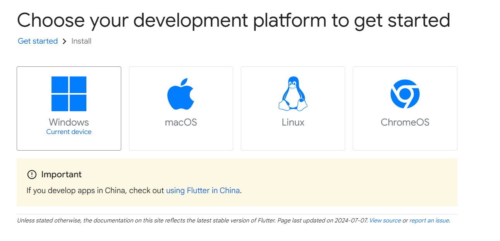
- Pilih Android karena kita akan menggunakan flutter dalam pengembangan aplikasi Android<br>

- Setelah itu download `flutter_windows_3.24.3-stable`<br>
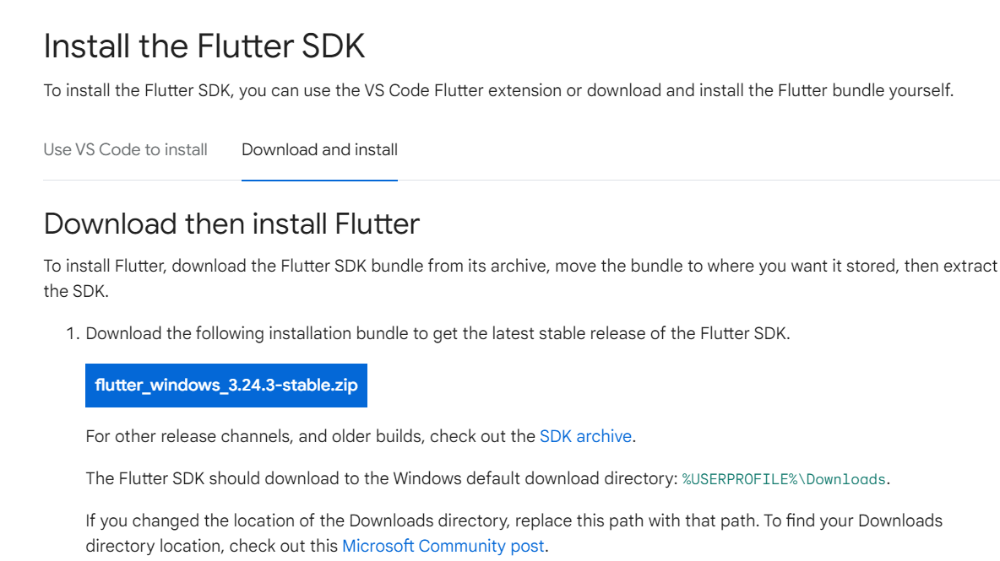
- Buat folder untuk menyimpan flutter, misalnya di dalam `C:flutter/src/`
- Pindahkan file yang sudah di-download ke dalam 
- Ekstrak file yang sudah di-download, dalam hal ini `flutter_windows_3.24.3-stable`
- Setelah ekstrak maka direktorinya menjadi seperti ini `C:flutter/src/flutter`

#### Langkah 2: Menyetel Variabel Lingkungan
- Pada menu search di taskbar, cari edit environment<br>
<br>
- Lalu pilih Edit Environment Variable<br>
<br>
- Klik Path dan edit<br>
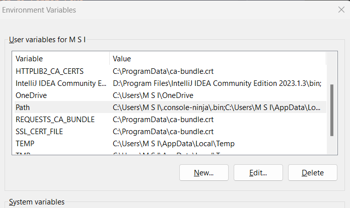
- Tambahkan `C:flutter\src\flutter\bin` ke variabel lingkungan `Path` <br>
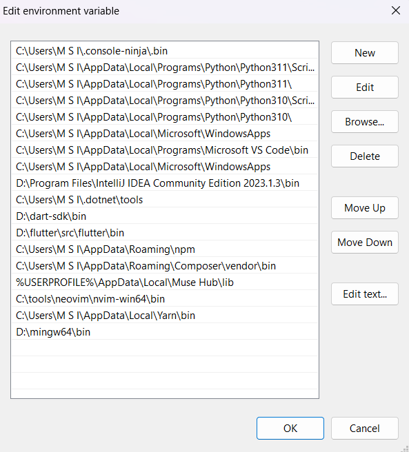<br>

#### Langkah 3: Memverifikasi Instalasi
- Jalankan perintah berikut di PowerShell untuk memverifikasi instalasi:

    ```bash
    flutter doctor
    ```

- Hasilnya akan keluar seperti ini :<br>
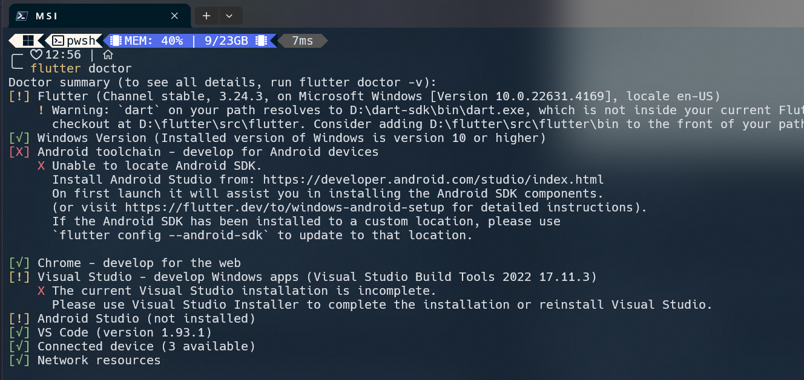<br>
- Masih ada error dan peringatan untuk mengatasi hal tersebut kita perlu menginstal Android Studio dan hal pertama yang dapat kita lakukan adalah mengatasi 
>  Flutter (Channel stable, 3.24.3, on Microsoft Windows [Version 10.0.22631.4169], locale en-US)
    ! Warning: `dart` on your path resolves to D:\dart-sdk\bin\dart.exe, which is not inside your current Flutter SDK
      checkout at D:\flutter\src\flutter. Consider adding D:\flutter\src\flutter\bin to the front of your path.
- Untuk mengatasi hal tersebut kita perlu mengubah urutan dari environment flutter agar berada di atas dari path environment dart<br>
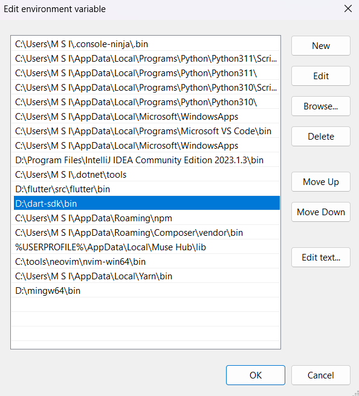<br>
#### Langkah 4: Menginstal Android Studio
- Saya mengunduh dan menginstal [Android Studio](https://developer.android.com/studio) serta menginstal plugin Flutter dan Dart.<br>
<br>
- Android Studio setelah selesai menginstal<br>
<br>
- Saya juga mengonfigurasi Android SDK.
- Karena saya mengonfigurasi Android SDK di lokasi custom maka masih terjadi error <br>
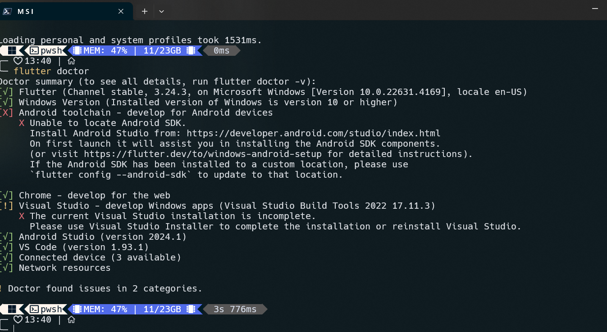<br>
- Hal tersebut terjadi karena command line tools tidak ada dalam folder. Untuk menginstalnya, berikut langkah-langkahnya:
- Buka Android Studio dan pilih seperti pada gambar.<br>
<br>
- Centang cmd tools latest untuk menginstalnya<br>
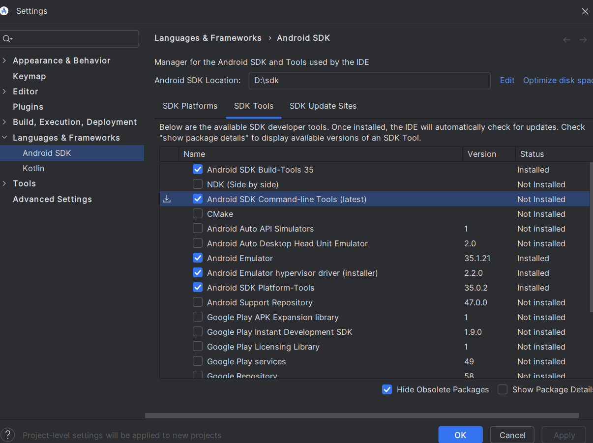<br>
- Apply lalu buka terminal anda dan run `flutter doctor`
- Kalau masih kuning dan muncul 
> Android toolchain - develop for Android devices (Android SDK version 34.0.0)
    ! Some Android licenses not accepted. To resolve this, run: flutter doctor --android-licenses
- Jalankan `flutter doctor --android-licenses` dan terima semua syarat dengan klik y dan enter.
- Untuk mengatasi bagian 'visual studio install is incomplete', maka kita harus menyelesaikan penginstalan dalam visual studio installer.
- Setelah menyelesaikan instalasi, buka terminal dan jalankan `flutter doctor` dan pastikan sudah centang semua.<br>
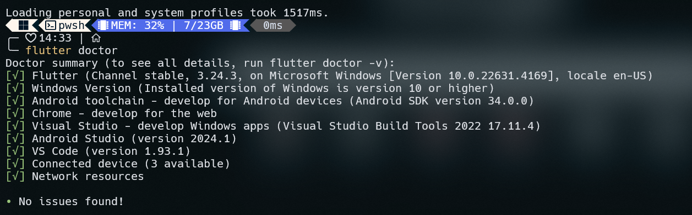

## 4. Membuat Hello World dan Penjelasanya
Berikut adalah bagaimana cara membuat program sederhana "Hello World" di beberapa bahasa pemrograman terutama flutter.
1. **Flutter**
- Buka terminal di proyek flutter dan jalankan perintah berikut:

    ```bash
    flutter create hello_world
    cd hello_world
    ```
    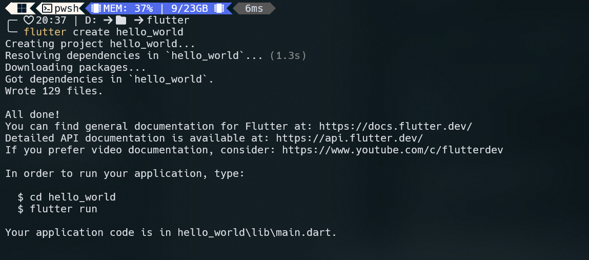
- Buka file `lib/main.dart` dan ketik kode di bawah ini:
  ```dart
    import 'package:flutter/material.dart';

    void main() {
      runApp(const MyApp());
    }

    class MyApp extends StatelessWidget {
      const MyApp({super.key});

      @override
      Widget build(BuildContext context) {
        return const MaterialApp(
          home: Scaffold(
            body: Center(
              child: Text('Hello, World!'),
            ),
          ),
        );
      }
    }
    ```
    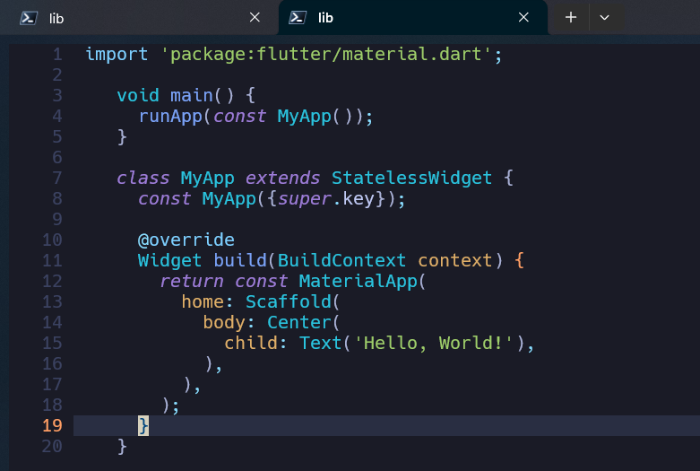
- Simpan perubahan dan jalankan aplikasi menggunakan command 
    ```bash
    flutter run
    ```
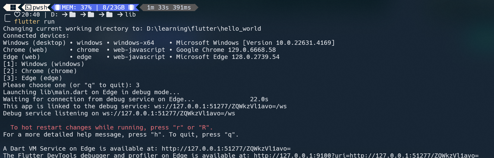
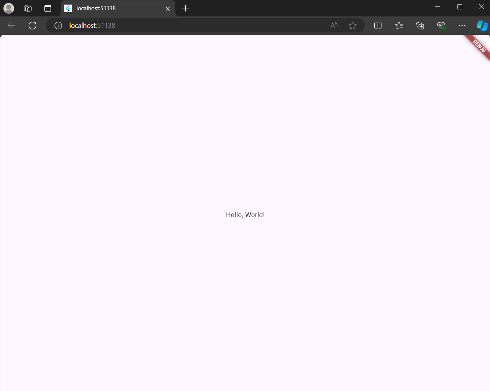

2. **Python**   

    ```python
    print("hello dunia")
    ```
    **Penjelasan :**
  - Print() adalah fungsi bawaan Python yang digunakan untuk menampilkan teks atau hasil ke terminal.
 - Teks yang ingin ditampilkan harus berada di dalam tanda kutip, seperti "hello dunia"

3. **JavaScript**
    ```javascript
    console.log("hello gais");
    ```
    **Penjelasan :**
-  Di JavaScript, untuk menampilkan output ke konsol, kita menggunakan fungsi console.log().
-  Seperti pada Python, teks harus berada di dalam tanda kutip. console.log() akan mencetak teks "hello gais" ke konsol browser atau Node.js.
4. **PHP**
    ```PHP
    <?php
    echo "Hello, World!";
    ?>
    ```
    **Penjelasan :**
- Untuk menampilkan teks di PHP, kita menggunakan perintah echo.
- Teks harus berada di dalam tanda kutip, dan setiap pernyataan diakhiri dengan titik koma.

4. **Dart**
    ```Dart
    void main(){
        print('hello dunia');
    }
    ```
    **Penjelasan :**
- Fungsi main() adalah titik masuk utama dari program Dart, dan di dalamnya kita menggunakan print() untuk menampilkan teks ke konsol.
- Teks yang ditampilkan berada di dalam tanda kutip tunggal atau ganda.