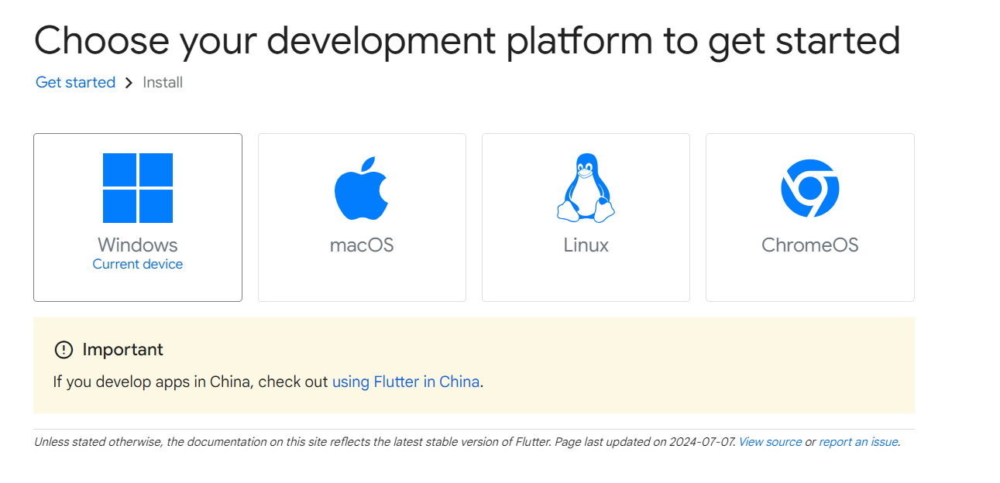
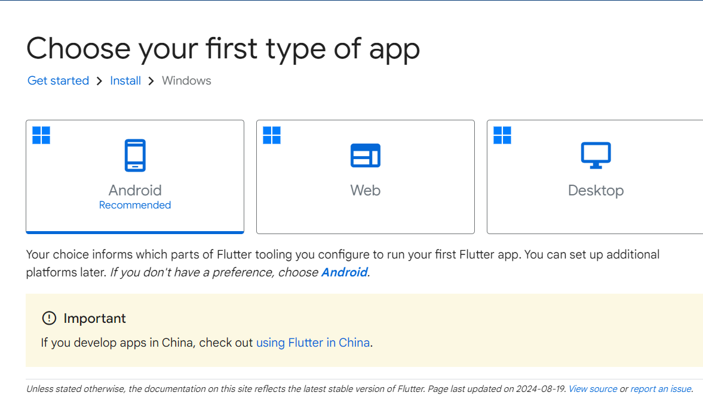
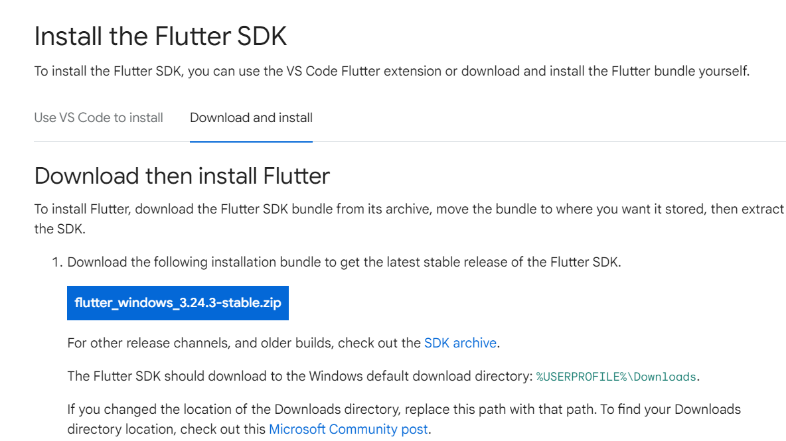
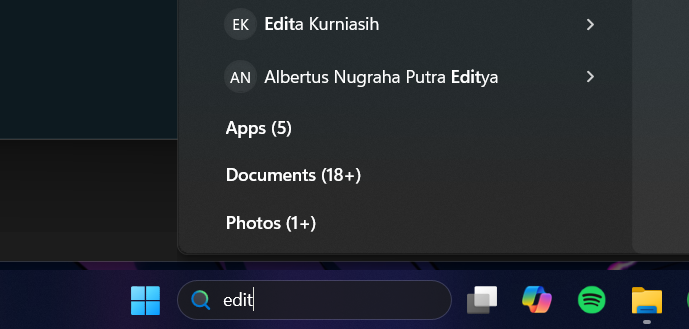
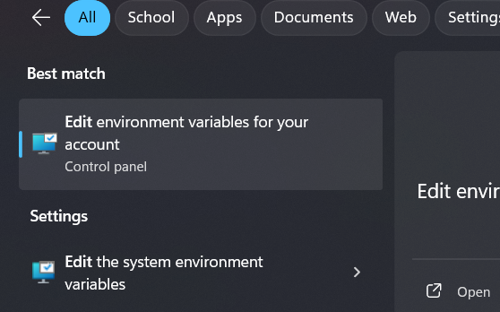
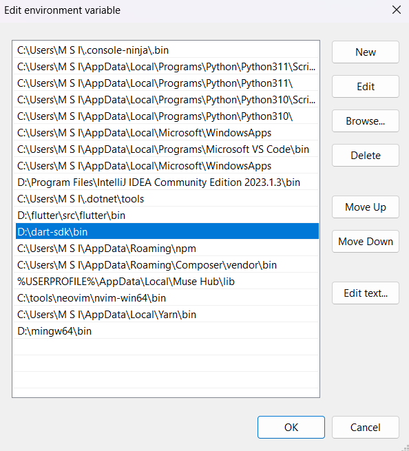
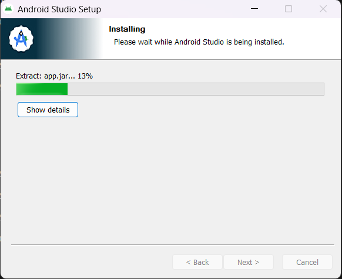
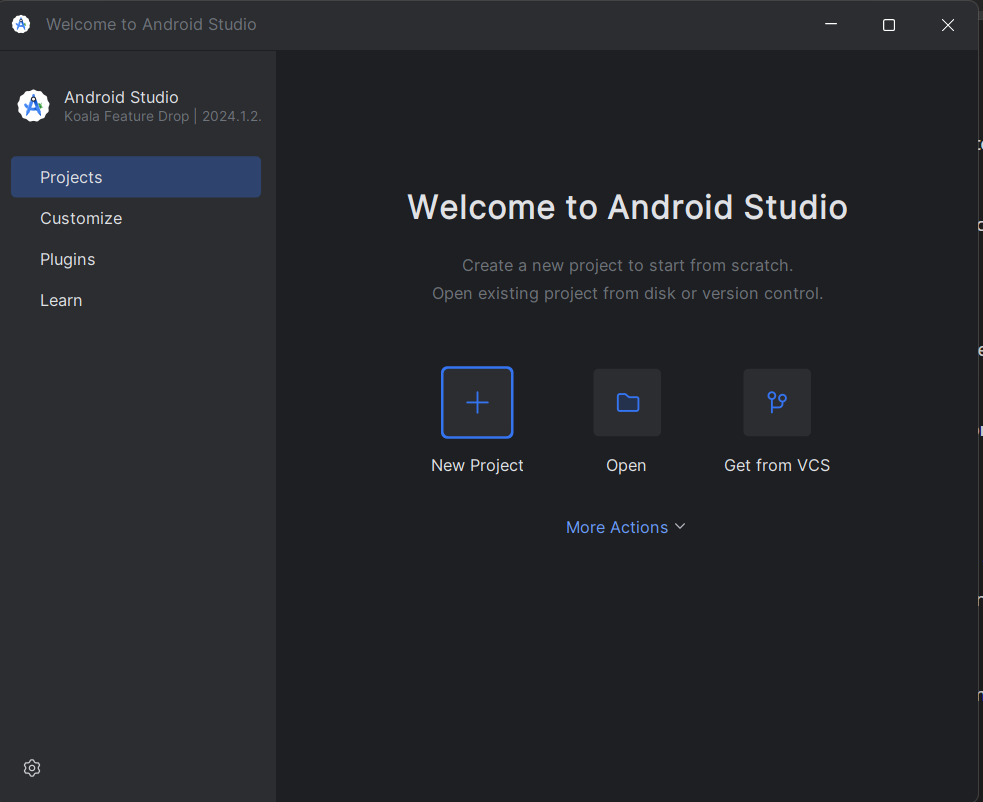
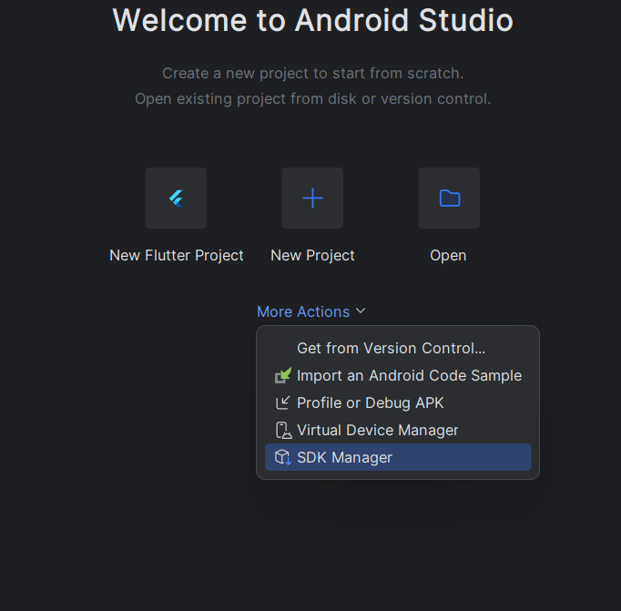

# 📝 Laporan Minggu Pertama Mobile & Web Service Praktik Kelas IX

**Nama**: Tito Zaki Saputro  
**NPM**: 5220411045

---

## 📚 1. Pendahuluan
Pada laporan minggu pertama ini, saya diinstruksikan untuk membuat dokumentasi terkait bahasa pemrograman yang telah dipelajari dan langkah-langkah instalasi Flutter. Laporan ini bertujuan untuk memberikan gambaran mengenai perjalanan saya dalam mempelajari beberapa bahasa pemrograman serta bagaimana saya mempersiapkan diri untuk pengembangan aplikasi mobile dengan Flutter.

---

## 💻 2. Bahasa Pemrograman yang Pernah Saya Pelajari

### 2.1.  **Python**   
Python merupakan bahasa pemrograman pertama yang saya pelajari. Awalnya, saya ingin mempelajari **C++**, namun saya kesulitan memahami konsep-konsepnya. Akhirnya, saya beralih ke Python, yang dikenal lebih mudah dipahami oleh pemula.

Saya mulai belajar Python ketika masih duduk di bangku SMA. Meskipun saya tidak mendalaminya secara intensif, saya memahami dasar-dasar sintaks Python seperti variabel, kondisi, dan perulangan. Pengalaman ini menjadi fondasi yang kuat untuk belajar bahasa pemrograman lain di masa depan.

---

### 2.2.  **JavaScript**
JavaScript adalah bahasa pemrograman kedua yang saya pelajari, dan saya mulai menggunakannya saat kuliah. Saya menggunakan JavaScript terutama untuk menambah interaktivitas pada halaman web, dan sejak saat itu, JavaScript menjadi bagian dari perjalanan saya dalam pengembangan web.

Selain mempelajari JavaScript murni, saya juga mempelajari beberapa **library** dan **framework** populer yang terkait dengan JavaScript:
- ***React***: Library untuk membangun UI yang dinamis dan interaktif.
- ***Next.js***: Framework berbasis React untuk pengembangan aplikasi web yang lebih efisien dan ramah SEO.
- ***Node.js***: Runtime environment yang memungkinkan penggunaan JavaScript di server-side.

Belajar JavaScript dan framework terkait ini telah membuka banyak pintu bagi saya dalam pengembangan web modern.

---

### 2.3.   **PHP**
Saya mulai mempelajari PHP pada semester 3, karena pada saat itu, saya mengikuti mata kuliah Pemrograman Web. PHP adalah bahasa pemrograman server-side yang sering digunakan untuk membangun website dinamis.

Meskipun saya tidak terlalu mendalami PHP, saya sempat mempelajari framework **Laravel** yang cukup populer dalam pengembangan aplikasi web dengan arsitektur MVC (Model-View-Controller). PHP menjadi pengalaman pertama saya dalam mengelola back-end dari sebuah aplikasi web.

---

### 2.4.  **Dart**
Saya mulai mempelajari Dart setelah semester 4 berakhir, tepatnya saat liburan semester genap. Alasan utama saya mempelajari Dart adalah untuk persiapan mata kuliah semester 5 yang akan membahas pengembangan aplikasi mobile, mengingat saya mengambil penjurusan web dan mobile.

Dart adalah bahasa pemrograman yang digunakan bersama framework **Flutter** untuk membangun aplikasi mobile lintas platform. Saat ini, saya masih mempelajari dasar-dasar sintaks Dart seperti variabel, fungsi, dan kontrol alur, sebagai persiapan untuk mendalami Flutter lebih lanjut.

---

## 3. 🚀 Menginstal Flutter di Laptop Saya

### 3.1. **Informasi Sistem**

- **Sistem Operasi**: Windows 11
- **Model Laptop**: MSI GF63 thin

### 3.2. **Proses Instalasi**

#### Langkah 1: Mengunduh Flutter SDK
- Saya mengunjungi [Website Flutter](https://docs.flutter.dev/get-started/install) 
- Pilih sistem operasi yang digunakan , saya menggunakan Windows 11<br>

- Pilih Android karena kita akan menggunakan flutter dalam pengembangan aplikasi Android<br>

- Setelah itu download `flutter_windows_3.24.3-stable`<br>

- Buat folder untuk menyimpan flutter , misalnya di dalam `C:flutter/src/`
- Pindahkan file yang sudah di downlaod ke dalam 
- Ekstrak file yang sudah di download , dalam hal ini `flutter_windows_3.24.3-stable`
- Setelah ekstrak maka direktorinya menjadi seperti ini `C:flutter/src/flutter`

#### Langkah 2: Menyetel Variabel Lingkungan
- Pada menu search di taskbar , cari edit environment<br>
<br>
- Lalu pilih Edit Environment Variable<br>
<br>
- Klik Path dan edit<br>

- Tambahkan `C:flutter\src\flutter\bin` ke variabel lingkungan `Path` <br>
<br>

#### Langkah 3: Memverifikasi Instalasi
- Jalankan perintah berikut di PowerShell untuk memverifikasi instalasi:

    ```bash
    flutter doctor
    ```

- Hasil nya akan keluar seperti ini :<br>
<br>
- Masih ada error dan peringatan untuk mengatasi hal tersebut ktia perlu menginstal android studi dan hal pertama yang dapat kita lakukan adalah mengatasi 
>  Flutter (Channel stable, 3.24.3, on Microsoft Windows [Version 10.0.22631.4169], locale en-US)
    ! Warning: `dart` on your path resolves to D:\dart-sdk\bin\dart.exe, which is not inside your current Flutter SDK
      checkout at D:\flutter\src\flutter. Consider adding D:\flutter\src\flutter\bin to the front of your path.
- untuk mengatasi hal tersebut kita perlu mengubah urutan dari environment flutter agar berada diatas dari path environment dart<br>
<br>
#### Langkah 4: Menginstal Android Studio
- Saya mengunduh dan menginstal [Android Studio](https://developer.android.com/studio) serta menginstal plugin Flutter dan Dart.<br>
<br>
- Android Studio setelah selesai menginstall<br>
<br>
- Saya juga mengonfigurasi Android SDK.
- Karena saya mengonfigurasi Android SDK di lokasi custom maka masih terjadi error <br>
<br>
- hal tersebut terjadi karena command line tools tidak ada dalam folder untuk menginstall nya berikut langkah langkahnya 
- Buka Android Studio dan pilih seperti pada gambar.<br>
<br>
- Centang cmd tools latest untuk menginstall nya<br>
<br>
- Apply lalu buka terminal anda dan run `flutter Doctor`
- Kalau masih kuning dan muncul 
> Android toolchain - develop for Android devices (Android SDK version 34.0.0)
    ! Some Android licenses not accepted. To resolve this, run: flutter doctor --android-licenses
- jalankan `flutter doctor --android-licenses` dan terima semua syarat dengan klik y dan enter
- untuk mengatasi bagian 'visual studio install is incomplete' maka kita harus modify install ulang vscode kita 


