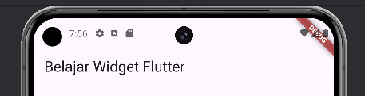
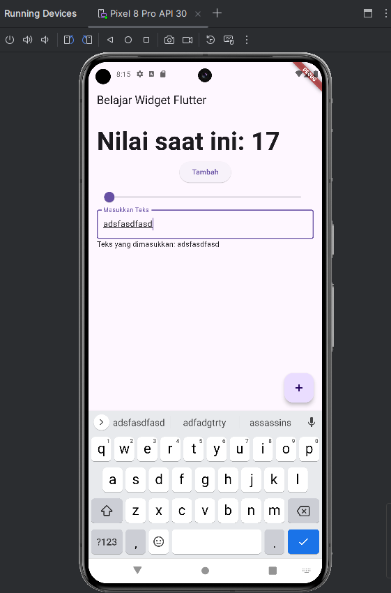

# 📝 Laporan Minggu Kedua Mobile & Web Service Praktik Kelas IX

**Nama**: Tito Zaki Saputro  
**NPM**: 5220411045


---
## Daftar Isi
- [📝 Laporan Minggu Kedua Mobile \& Web Service Praktik Kelas IX](#-laporan-minggu-kedua-mobile--web-service-praktik-kelas-ix)
  - [Daftar Isi](#daftar-isi)
- [MINGGU 2](#minggu-2)
  - [Pendahuluan](#pendahuluan)
  - [🤔 Apa itu WIDGET ?](#-apa-itu-widget-)
  - [Stateless Widget dan Stateful Widget](#stateless-widget-dan-stateful-widget)
    - [Stateless Widget 🗿](#stateless-widget-)
    - [Stateful Widget 🧩](#stateful-widget-)
    - [MaterialApp Widget 🌐](#materialapp-widget-)
    - [Scaffold Widget 🏗️](#scaffold-widget-️)
    - [AppBar 📜](#appbar-)
    - [Row \& Column 📐](#row--column-)
      - [Row](#row)
      - [Column](#column)
    - [ElevatedButton ⏫](#elevatedbutton-)
    - [Text 📝](#text-)
  - [**Contoh Implementasi dalam Aplikasi FLutter**](#contoh-implementasi-dalam-aplikasi-flutter)

---
# MINGGU 2
## Pendahuluan

Pada minggu kedua ini, saya mempelajari framework **Flutter** untuk pengembangan aplikasi mobile. untuk **IDE** yang saya gunakan adalah **Visual Studio Code** dan untuk virtual device nya saya menggunakan *Pixel 8 Pro* dari **Android Studio**

## 🤔 Apa itu WIDGET ?
Widget merupakan komponen yang sangat penting dalam Flutter. Setiap elemen dalam antarmuka pengguna Flutter adalah sebuah widget. Dari tombol sederhana hingga seluruh layar aplikasi, semuanya dibangun menggunakan widget.

## Stateless Widget dan Stateful Widget 
Ada dua widget utama di dalam flutter yaitu Stateless Widget dan Stateful Widget
###  Stateless Widget 🗿
Widget ini bersifat tidak dapat berubah atau static, artinya setelah dibangun, mereka tidak dapat mengubah tampilan mereka sebagai respons terhadap peristiwa atau interaksi pengguna. Widget ini cocok digunakan untuk komponen UI yang tidak perlu berubah secara dinamis.
### Stateful Widget 🧩
Widget ini dapat mengubah tampilan mereka sebagai respons terhadap peristiwa atau interaksi pengguna. Mereka mempertahankan status yang dapat berubah seiring waktu. Widget ini cocok untuk komponen UI yang merespons interaksi pengguna atau perubahan data.

### MaterialApp Widget 🌐
MaterialApp adalah widget inti dalam aplikasi Flutter yang menyediakan beberapa fitur penting seperti tema, routing, dan pengaturan navigasi. MaterialApp secara default mendukung Material Design, yang merupakan standar desain dari Google.
```dart
MaterialApp(
  title: 'Belajar App',
  theme: ThemeData(
    primarySwatch: Colors.blue, // Menentukan tema aplikasi
  ),
  home: const BelajarHomePage(title: 'Belajar Widget Flutter'), // Halaman utama
)

```
MaterialApp menyediakan elemen-elemen inti untuk tampilan aplikasi, termasuk tema dan navigasi halaman.
### Scaffold Widget 🏗️
Scaffold adalah widget yang menyediakan struktur dasar aplikasi, seperti bagian untuk **AppBar**, **Drawer**, dan **FloatingActionButton**. Ini sangat berguna untuk membangun tata letak aplikasi berbasis **Material Design**. dibawah ini merupakan contoh dari **Widget Scaffold**.
```dart
Scaffold(
  appBar: AppBar(
    title: Text(widget.title), // Bar atas aplikasi
  ),
  body: ListView(
    padding: const EdgeInsets.all(16.0),
    children: <Widget>[
      const Text('Isi aplikasi di sini!'), // Bagian utama aplikasi
    ],
  ),
  floatingActionButton: FloatingActionButton(
    onPressed: _incrementCounter, // Tombol aksi mengambang
    child: const Icon(Icons.add),
  ),
)
```

### AppBar 📜
**AppBar** adalah widget di bagian atas aplikasi yang biasanya berisi **judul** , **icon** , atau tindakan penting (misalnya , tombol pencarian atau menu).dibawah ini merupakan contoh dari **Widget AppBar**.

```dart
AppBar(
  title: Text('Belajar Widget Flutter'),
  actions: [
    IconButton(
      icon: const Icon(Icons.search),
      onPressed: () {
        // Tindakan pencarian
      },
    ),
  ],
)

```
<br>

### Row & Column 📐
Row dan Column adalah widget tata letak yang mengatur widget anak secara horizontal atau vertikal.
#### Row
```dart
Row(
  mainAxisAlignment: MainAxisAlignment.spaceEvenly, // Menata widget secara horizontal
  children: <Widget>[
    ElevatedButton(
      onPressed: () {},
      child: const Text('ini tombol 1'),
    ),
    ElevatedButton(
      onPressed: () {},
      child: const Text('ini tombol 2'),
    ),
  ],
)
```
#### Column
```dart
Column(
  mainAxisAlignment: MainAxisAlignment.center, // Menata widget secara vertikal
  children: <Widget>[
    const Text('teks ini berada di atas'),
    ElevatedButton(
      onPressed: () {},
      child: const Text('tombol ini dibawah'),
    ),
  ],
)

```

### ElevatedButton ⏫
**ElevatedButton** merupakan widget untuk membuat tombol yang ada bayangan dibawahnya.
```dart
ElevatedButton(
  onPressed: _incrementCounter, // Fungsi yang dijalankan saat tombol ditekan
  child: const Text('Tambah'),
)

```

### Text 📝
**Text** adalah widget untuk menampilkan teks.
```dart
Text(
  'Ini adalah teks', // Teks yang ditampilkan
  style: const TextStyle(fontSize: 18), // Menentukan gaya teks
)

```

## **Contoh Implementasi dalam Aplikasi FLutter**
```dart
import 'package:flutter/material.dart';

void main() {
  runApp(const BelajarApp());
}

class BelajarApp extends StatelessWidget {
  const BelajarApp({super.key});

  @override
  Widget build(BuildContext context) {
    return MaterialApp(
      title: 'Belajar App',
      theme: ThemeData(
        primarySwatch: Colors.red, // Warna tema aplikasi
      ),
      home: const BelajarHomePage(title: 'Belajar Widget Flutter'),
    );
  }
}

class BelajarHomePage extends StatefulWidget {
  const BelajarHomePage({super.key, required this.title});

  final String title;

  @override
  State<BelajarHomePage> createState() => _BelajarHomePageState();
}

class _BelajarHomePageState extends State<BelajarHomePage> {
  int _counter = 0; // Menyimpan nilai counter
  double _sliderValue = 0; // Menyimpan nilai slider
  String _inputText = ''; // Menyimpan teks input dari pengguna

  void _incrementCounter() {
    setState(() {
      _counter++;
    });
  }

  @override
  Widget build(BuildContext context) {
    return Scaffold(
      appBar: AppBar(
        title: Text(widget.title),
      ),
      body: Padding(
        padding: const EdgeInsets.all(16.0),
        child: ListView(
          children: <Widget>[
            Text('Nilai saat ini: $_counter',
              style: const TextStyle(fontSize: 48, fontWeight: FontWeight.bold),
            ),
            Row(
              mainAxisAlignment: MainAxisAlignment.spaceEvenly,
              children: [
                ElevatedButton(
                  onPressed: _incrementCounter,
                  child: const Text('Tambah'),
                ),
              ],
            ),
            Slider(
              value: _sliderValue,
              min: 0,
              max: 100,
              onChanged: (value) {
                setState(() {
                  _sliderValue = value;
                });
              },
            ),
            TextField(
              decoration: const InputDecoration(
                border: OutlineInputBorder(),
                labelText: 'Masukkan Teks',
              ),
              onChanged: (value) {
                setState(() {
                  _inputText = value;
                });
              },
            ),
            Text('Teks yang dimasukkan: $_inputText'),
          ],
        ),
      ),
      floatingActionButton: FloatingActionButton(
        onPressed: _incrementCounter,
        tooltip: 'Tambah Counter',
        child: const Icon(Icons.add),
      ),
    );
  }
}

```


seluruh kode akan saya berikan di dalam folder [belajar_flutter](https://github.com/eveeze/uty-mobile-web-service/tree/week2/week_2/belajar_flutter).